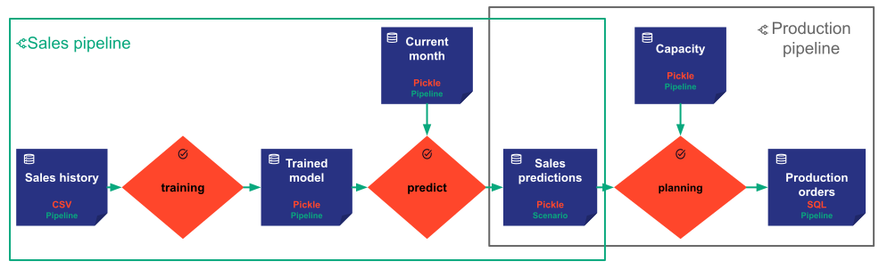
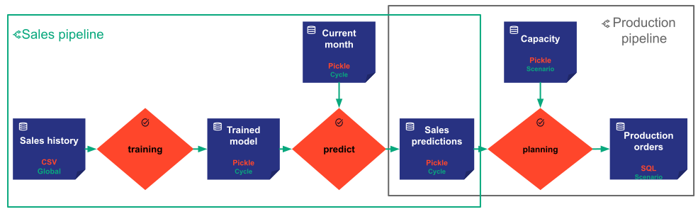

# Scope

The `Scope^` of a data node is an enum among the following values :

- `Scope.PIPELINE`
- `Scope.SCENARIO` (Default value)
- `Scope.CYCLE`
- `Scope.GLOBAL`

Each data node has a scope. It is an attribute provided by the `DataNodeConfig^` and represents the _visibility_ of
the data node in the graph of entities. The entities can be described as a graph where each node belongs to one or
several upper nodes. A data node 'belongs' to at least one pipeline, which belongs to at least one scenario, which
belongs to a single cycle.

In other words :

- A data node with the scope equals `Scope.PIPELINE`, can only be shared by multiple tasks in the same pipeline.
- A data node with the scope equals `Scope.SCENARIO`, can be shared by multiple tasks and pipelines within a unique
scenario, but it cannot belong to other tasks or pipelines from another scenario.
- A data node with the scope equals `Scope.CYCLE`, can be shared by all the tasks, pipelines, and scenarios from one
cycle but cannot be shared with tasks, pipelines, or scenarios from another cycle.
- A data node with the scope equals `Scope.GLOBAL`, can be shared by any task, pipeline, and scenario, whatever their
cycles.

!!! example

    In our example with two pipelines, we have several possibilities. The following pictures represent two examples.
    The scopes are written in green at the bottom of each data node.

    { align=left }

    The first picture represents the basic case. We let Taipy apply the default scope (`Scope.SCENARIO`) for most
    data nodes. However, as you can see, the `sales predictions` data node is shared by the two pipelines
    of my scenario. Consequently, its scope cannot be `Scope.PIPELINE`, but must be at least `Scope.SCENARIO`.
    In this case, my various scenarios do not share any data nodes.

    In the second picture, we have a second use case. In this example, several changes are made:

    - The first assumption is that the historical sales are stored in a single system of records. The sales history
    becomes a data node shared by all the tasks, pipelines, scenarios, and cycles. Its scope is `Scope.GLOBAL`. That
    means there will be only one Sales history data node, whatever the number of cycles or scenarios. All the
    scenarios will share the same data pointed by the same data node.
    - The sales pipeline execution only depends on the current month (i.e., the cycle). The `trained model`,
    the `current month`, and the `sales predictions` data nodes have a `Scope.CYCLE` scope. All the scenarios from
    the same cycle will share the three data nodes. For example, both scenarios with low and high capacity for the
    February cycle share the three data nodes. The linked tasks (training and predict) can only be executed once for
    both scenarios.
    - Finally, since there are multiple scenarios to simulate various capacities for a single cycle, the capacity
    and the production orders data nodes must have a `Scope.SCENARIO` scope so that multiple scenarios do not share
    them.

    { align=left }

[:material-arrow-right: The next section introduces the Core configuration.](../config/index.md)
