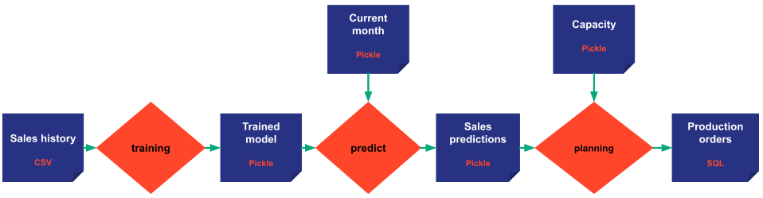

A `Task^` is a runnable python code provided by the developer user
(typically
a data scientist). It represents one step among the various data processing steps the user is working on. Concretely, a
_task_ means a python function that can be executed.

For example, a _task_ could be a pre-processing function to clean the initial dataset. It could also be a more complex
function that develops a training model using machine learning algorithms.

Since a _task_ represents a function, it can take a set of parameters as input and return a set of results as output.
Each parameter and each result is modeled as a data node.

The attributes of a task (the input data nodes, the output data nodes, the python function) are populated based on
the task configuration `TaskConfig^` that must be provided when instantiating a new task. (Please refer to the
[`configuration details`](../config/task-config) documentation for more details on configuration).

!!! example "In our example"
    We create three tasks:

    { align=left }

    The first is the training task that takes the sales history as the input data node and returns the trained model as
    the output data node.

    The second is the predicting task that takes the trained model and the current month as input and returns the sales
    predictions.

    And the third task is the production planning task that takes the capacity and the sales predictions as input data
    nodes and returns the production orders as output.

!!! Remark
    Since no  task computes them, sales history, current month, and capacity are qualified as input data nodes.
    The trained model and sales predictions' data nodes can be considered as intermediate data nodes, and the production
    orders as an output data node since no task is reading it.

[:material-arrow-right: The next section introduces the Job concept.](job.md)
