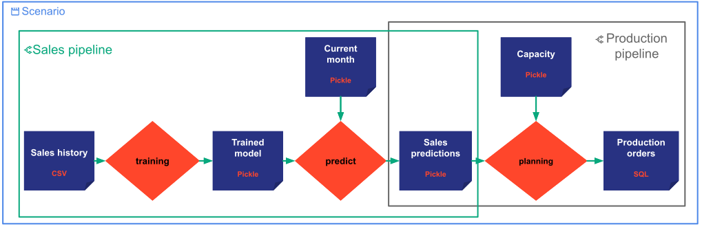

# Taipy's Core entities

This documentation focuses on providing necessary information to use the Taipy Core entities, and in particular
the capabilities related to scenario management. It is assumed that the reader already knows the [Taipy Core
concepts](../concepts/index.md) described in a previous documentation.

It is also assumed in the next sections that [`my_config.py`](../my_config.py) module contains a Taipy configuration
already implemented. This configuration corresponds to the design displayed in the following picture.

Please refer to the [configuration documentation](../config/index.md) to have information on how to configure a
Taipy application.

[:material-arrow-right: The next section presents the scenario creation](scenario-creation.md).
