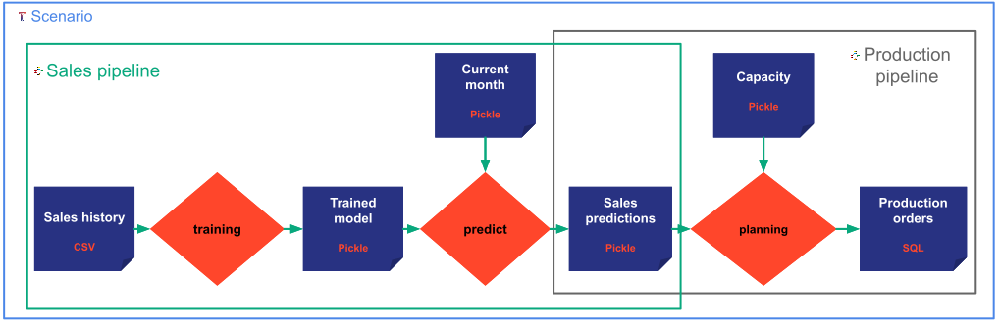

Taipy is an application builder. The purpose of configuring the application back end is to describe the user
application entities and how they behave at runtime. To get more information about the back-end core concept you can
read the [core concepts section](user_core_concepts.md)

Taipy provides four methods to configure your application :

- A default configuration
- A Python configuration
- An explicit file configuration using _TOML_ format
- An environment variable file configuration

!!! example

    Here is a typical workflow that shows how to configure a Taipy application at the various development stages.

    1. First as a developer, I want to design and develop my taipy application. I don’t really need to care about
    all configuration attributes, so I am starting with the simple default configuration.

    2. Then, I am starting to design my application by configuring new entities. I am using the Python code
    configuration for that, with just a minimal number of attributes configured. For the other attributes, I am
    relying on the default configuration.

    3. Then, I am testing the application built. At this step, I need my application to have a more realistic
    behavior like real data. For that, I need more configuration. I can specify for my
    specific input dataset what file to use. I am using the Python code configuration for that.

    4. Then, once I am happy with my application running on local, I am deploying it to a remote environment for
    testing and debugging the application. This is on a dedicated environment made for testing deployment and for
    integration testing. I can use an explicit file configuration. I can easily update the file if necessary to be
    efficient in debugging, without changing the code directly.

    5. Once the step 3 is done, I want to be able to deploy a released and tagged version of my application on
    several remote environments (e.g. pre-production, production). I am creating one file per remote environment
    with a few values that differ from the step 3, and on each environment, I am setting a different environment
    variable value to point to the right configuration file.

These methods are described below.

# Default configuration

The first method is the default configuration and is directly provided by the Taipy library. It allows you to run your
application in the most basic and standard way (running in localhost, storing data on the local file system,
executing tasks sequentially and synchronously, ....).

Here is the _TOML_ file of all (not None) default values :

```py linenums="1"

    [TAIPY]
    root_folder = "./taipy/"
    storage_folder = ".data/"

    [JOB]
    mode = "standalone"
    nb_of_workers = "1"
    hostname = "localhost:8080"

    [DATA_NODE.default]
    storage_type = "pickle"
    scope = "PIPELINE"

    [TASK.default]
    inputs = []
    outputs = []

    [PIPELINE.default]
    tasks = []

    [SCENARIO.default]
    pipelines = []

```

As you can see in the _TOML_ export, only default entities (data node, task, pipeline and scenario) are defined. At
this point, your Taipy application is empty. In order to configure new entities in your Taipy application, you can
refer to the following sections.

# Python code configuration

A code configuration can be done on a Python file directly when designing the pipelines and scenarios. This
configuration can be done by importing the [`Taipy`](../../reference/#Taipy) class and calling the various
methods. This python configuration is meant to be used during the application development phase. It overrides
the default configuration: if some values are not provided, the default configuration applies.

!!! example "Design of the application to configure"

    { align=left }

    Let's imagine I want to configure an application corresponding to the designed described in the picture. I can use
    the following python configuration code.

    ```py linenums="1"
    import taipy as tp
    from taipy import Frequency
    from taipy import Scope
    from my_functions import train, predict, plan

    # Configure all six data nodes
    sales_history_cfg = tp.configure_data_node(name="sales_history", scope=Scope.GLOBAL, storage_type="csv", path="my/file/path.csv")
    trained_model_cfg = tp.configure_data_node(name="trained_model", scope=Scope.CYCLE)
    current_month_cfg = tp.configure_data_node(name="current_month", scope=Scope.CYCLE)
    sales_predictions_cfg = tp.configure_data_node(name="sales_predictions", scope=Scope.CYCLE)
    capacity_cfg = tp.configure_data_node(name="capacity", scope=Scope.SCENARIO)
    production_orders_cfg = tp.configure_data_node(name="production_orders", scope=Scope.SCENARIO, storage_type="sql",
                                                   db_username="admin",
                                                   db_password="ENV[PWD]",
                                                   db_name="production_planning",
                                                   db_engine="mssql",
                                                   read_query="SELECT * from production_order",
                                                   write_table="production_order")

    # Configure the three tasks
    training_cfg = tp.configure_task(name="training", inputs=sales_history_cfg, train, outputs=trained_model_cfg)
    predicting_cfg = tp.configure_task(name="predicting", inputs=[trained_model_cfg, current_month_cfg], predict, outputs=sales_predictions_cfg)
    planning_cfg = tp.configure_task(name="planning", inputs=[sales_predictions_cfg, capacity], plan, outputs=[production_orders_cfg])

    # Configure the two pipelines
    sales_pipeline_cfg = tp.configure_pipeline(name="sales", tasks=[training_cfg, predicting_cfg])
    production_pipeline_cfg = tp.configure_pipeline(name="production", tasks=[planning_cfg])

    # Configure the scenario
    monthly_scenario_cfg = tp.configure_scenario(name="scenario",
                                                 pipelines=[sales_pipeline_cfg, production_pipeline_cfg])
                                                 frequency=Frequency.MONTHLY)
    ```
!!! Note
    The `train`, `predict`, and `plan` methods used on lines 21, 22, and 23 are the user functions imported on line 4
    from a fake module `my_functions` that represents a user python module.

!!! Security
    Note that on line 13, the password is not exposed. The property's value is a template referencing
    the environment variable _PWD_ that contains the value. See section
    [environment-based configuration](#attribute-in-an-environment-variable) for more details.

# Explicit TOML file configuration

Taipy also provides file configuration. Indeed, a _TOML_ file can be explicitly provided by the developer to the Taipy
application using Python coding such as :

```py
import taipy as tp

tp.load_configuration("folder/config.toml")
```

This file configuration overrides the attributes in the code configuration (and the default configuration).
Here is an example of a _TOML_ file overriding the code configuration provided above as an example :

```toml linenums="1"
    [JOB]
    mode = "standalone"
    nb_of_workers = 5

    [DATA_NODE.sales_history]
    storage_type="csv"
    path="./path/to/my/file.csv"

```
Two behaviors will change using the previous TOML file as file configuration. First, the Taipy application
will now have five workers (By default, the number of workers is 1). Then, the sales_history data node will
now be a CSV data node pointing to the file `./path/to/my/file.csv`


# Environment variable file configuration

Finally, if the environment variable TAIPY_CONFIG_PATH is defined with the path of a _TOML_ config, Taipy will
automatically load the file and override the previous configurations (explicit file configuration, code configuration
and default configuration).

This functionality can be handy to change the configuration of a Taipy application without having to restart it.


# Attribute in an environment variable

Configuration can be set dynamically using environment variables through the syntax `ENV[MY_VARIABLE]`.
At runtime, Taipy will search `MY_VARIABLE` in the environment variables then use it.

This is especially useful if you want to use secret strings such as host names, usernames or passwords.
For example, if you are using Airflow as Taipy scheduler, you can hide the password from the configuration
file using an environment variable.

You can export the PWD variable with the following command line
````commandline
export PWD=MySeCrEtPaSsWoRd
````
```
[JOB]
airflow_password = "ENV[PWD]"
```

# Exporting configuration

Taipy also provides a method to export the configuration applied after the compilation of all the configurations
(default, Python code, explicit file, and environment variable configurations) which is the result of the overwriting.

```python
import taipy as tp

tp.export_configuration("config.toml")
```
