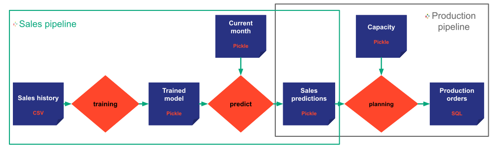
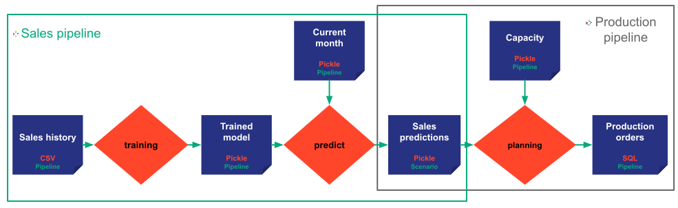

Taipy core is made for data scientists to turn their algorithms into real applications. Taipy core provides
the necessary concepts for modeling, executing, and monitoring such algorithms.

In this section, the following concepts are defined:

- [Data node](#data-node)
- [Task](#task)
- [Job](#job)
- [Pipeline](#pipeline)
- [Scenario](#Scenario)
- [Cycle](#Cycle)
- [Scope](#Scope)

!!! definition "Config vs Entities"
    Among the previous concepts, the data nodes, the tasks, the pipelines, and the scenarios are created by providing
    configuration objects.

    To differentiate the configuration objects from their runtime concepts, they are named **_configs_**
    (`DataNodeConfig`, `TaskConfig`, `PipelineConfig`, and `ScenarioConfig`) while the runtime objects
    (`DataNode`, `Task`, `Pipeline`, and `Scenario`) are called **_entities_**.

    On this page, we provide information on the **_entities_**. More details on how the configuration objects
    are available on the [configuration documenation](user_core_configuration.md).

# Data node

A _data node_ is one of the most important concepts in Taipy core. It does not contain the data itself, but it holds all
the necessary information to read and write the actual data. It can be seen as a dataset descriptor or as a data
reference.

A _data node_ can reference any data. It could be a text, a numeric value, a list of parameters, a custom
python object, the content of a JSON or a CSV file, the content of one or multiple database table(s), or any other data.
It is made to model any type of data: Input, intermediate, or output data, internal or external data, local or remote
data, historical data, set of parameters, trained model, etc.

The _data node_ information depends on the data itself, its exposed format, and its storage type. For instance, if the
data is stored in an SQL database, the corresponding _data node_ should contain the username, password, host, and port,
but also the queries to read and write the data as well as the python class used for the deserialization. On another use
case, if the data is stored in a CSV file, the corresponding _data node_ should contain for instance, the path to the
file and the python class used for the deserialization.

!!! example "Let's take an example."

    Let's assume we want to build an application to predict some sales demand every month in
    order to adjust a production planning constrained by some capacity.

    For that purpose, we may have six data nodes to model the various data. One for the sales history, one for the
    trained model, one for the current month, one for the sales predictions, one for the capacity of production,
    and one for the production orders.

The various attributes that depend on the storage type (like sql query, file path, credentials, ...) are populated based
on the data node configuration ([`DataNodeConfig`](../../reference/#taipy.config.data_node_config.DataNodeConfig)) that
must be provided when instantiating a new data node. (Please refer to the
[`configuration details`](user_core_configuration.md#data-node-configuration) documentation for more
details on configuration).

## Storage type
Taipy proposes various predefined _data nodes_ corresponding to the most popular _storage types_. Thanks to predefined
_data nodes_, the data scientist developer does not need to spend much time configuring the _storage types_ or the
_query system_. Most of the time, a predefined _data node_ corresponding to a basic and standard use case satisfies
the user's need.

Here is the list of predefined _data nodes storage types_:

- [Pickle](../../reference/#taipy.data.pickle.PickleDataNode) (Default storage type)
- [CSV](../../reference/#taipy.data.csv.CSVDataNode)
- [Excel](../../reference/#taipy.data.excel.ExcelDataNode)
- [Generic](../../reference/#taipy.data.generic.GenericDataNode)
- [In memory](../../reference/#taipy.data.in_memory.InMemoryDataNode) (For synchronous job execution only. Not
recommended in a production environment)
- [SQL](../../reference/#taipy.data.sql.SQLDataNode)

The various predefined _storage types_ are mainly used for input data. Indeed, the input data is usually provided by an
external component, and the data scientist user does not control the format.

However, in most cases, particularly for intermediate or output _data nodes_, it is not relevant to prefer one _storage
type_. The end-user wants to manipulate the corresponding data within the Taipy application. Still, the user does not
have any particular specifications regarding the _storage type_. In such a case, the data scientist developer does not
need to spend time configuring the _storage type_. Taipy recommends using the default _storage type_ pickle that does
not require any configuration.

!!! example "In our example"

    The sales history comes from our company record system, so we do not control its storage type. We got the data as
    a CSV file. We can use a predefined CSV _data node_ to model the sales history.

    Concerning the production orders _data node_, we want to write the data into a database shared by other company
    components. We can use an SQL _data node_ to model the production orders.

    We have no particular specification for the other data nodes. We can use the default storage type: Pickle.

In case a more specific method to store, read and write the data is needed by the user, Taipy proposes a _Generic data
node_ that can be used for any _storage type_ or any kind of _query system_. The user only needs to provide two python
functions, one for reading and one for writing the data.

## Exposed type
As explained before, a _data node_ may represent any data. For _data nodes_ representing a collection of entities
(like CSV file, SQL table, Excel sheet), the default _exposed type_ is pandas dataframe. A numpy format is also
available.

If needed, the user can specify a Python _Custom Class_ as _exposed type_. When reading the data, Taipy will return
the entities as a _Custom Class_ list.

For example, in the case of a CSV file, each line of the CSV file corresponds to an instance of a _Custom Class_
object. Then, the complete CSV file data corresponds to a _Custom Class_ list.

# Task

A [Task](../../reference/#taipy.task.task.Task) is a runnable python code provided by the developer user (typically
a data scientist). It represents one step among the various data processing steps the user is working on. Concretely, a
_task_ means a python function that can be executed.

For example, a _task_ could be a preprocessing step to prepare some data. It could also be a more complex step that
computes a whole training model using a machine learning algorithm.

Since a _task_ represents a function, it can take a set of parameters as input and return a set of results as output.
Each parameter and each result is modeled as a data node.

The attributes of a task (the input data nodes, the output data nodes, the python function) are populated based on
the task configuration ([`TaskConfig`](../../reference/#taipy.config.task_config.TaskConfig)) that
must be provided when instantiating a new task. (Please refer to the
[`configuration details`](user_core_configuration.md#task-configuration) documentation for more
details on configuration).

!!! example "In our example"
    We create three tasks:

    { align=left }

    The first is the training task that takes the sales history as the input data node and returns the trained model as
    the output data node.

    The second is the predicting task that takes the trained model and the current month as input and returns the sales
    predictions.

    And the third task is the production planning task that takes the capacity and the sales predictions as input data
    nodes and returns the production orders as output.

!!! Remark
    Since no task computes them, we can consider sales history, current month, and capacity as input data nodes.
    The data nodes trained model and sales predictions can be considered as intermediate data nodes, and the
    production orders as an output data node since no task is reading it.

# Job

A [Job](../../reference/#taipy.job.job.Job) represents a unique execution of a task. Each time a task is submitted for
execution, a new _job_ is created. A _job_ holds all the information related to its task execution, including the
creation date, the execution [Status](../../reference/#taipy.job.status.Status), the user function log messages, and the
eventual exception raised.

# Pipeline

A [Pipeline](../../reference/#taipy.pipeline.pipeline.Pipeline) is made to model an algorithm. It represents a direct
acyclic graph of input, intermediate, and output data nodes linked together by tasks. A _pipeline_ is a set of connected
tasks that the user wants to run together for functional reasons. It then represents an execution graph as a consistent
set of tasks.

In a typical machine learning application, we can have a _pipeline_ dedicated to preprocessing and preparing data, a
_pipeline_ for computing a training model, and a _pipeline_ dedicated to scoring.

!!! example "In the example"

    We want to have two pipelines.

    A first sales pipeline (boxed in the green on the picture) is made of training and predict tasks.
    A second production pipeline (in the dark grey rectangle on the picture) made of the planning task.
    Indeed, the two pipelines could represent two different workflows that can be run
    independently, on different schedule or by different users.

    { align=left }

Note that the various pipelines do not require to be disjointed.

The attributes of a pipeline (the set of tasks) are populated based on the pipeline configuration
([`PipelineConfig`](../../reference/#taipy.config.pipeline_config.PipelineConfig)) that
must be provided when instantiating a new pipeline. (Please refer to the
[`configuration details`](user_core_configuration.md#pipeline-configuration) documentation for more
details on configuration).

# Scenario

A [Scenario](../../reference/#taipy.scenario.scenario.Scenario) is made to model a business concept. It represents an
instance of a business problem to solve on consistent data and parameter sets. In other words, when an end user select
a _scenario_, he/she should have access to all the information and data needed to understand the business case he/she
is working on and to make the right decisions.

!!! example "In the example"

    In our example, we want our scenario to have the two pipelines described before. The external blue frame represents
    my scenario that contains both pipelines.

    { align=left }

A scenario represents one instance of a business problem to solve. In other words, each new business problem instance
is represented by a new scenario. The end user can manage the various multiple scenarios in the same Taipy application.
He or she can retrieve, edit and execute the various existing scenarios.

!!! example

    Suppose we want to build an application to predict demand every month and compute production orders.
    In that case, we can create the first scenario for January. It must contain everything we need to understand
    the January case, access input data, compute predictions, visualize our forecast algorithm
    results, make production decisions, and publish January production orders.

    Then we can create another scenario for the February production planning. And so on.

Two _scenarios_ can also be used to represent the same instance of a business problem but with two different
assumptions.

!!! example

    Now, we want to perform some simulation on the impact of our capacity data on our production planning.
    We want to create two scenarios for the same February use case.

    The first scenario can forecast demand and compute production orders with a low capacity.

    In contrast, the second scenario assumes a high capacity value.

# Cycle and Master scenario

Business problems are often recurrent. A _cycle_ (or work cycle) represents an iteration of such a recurrent work
pattern. Each _cycle_ has a start date and a duration that depends on the frequency on which a user must publish
a scenario in production. In Taipy, a _cycle_ duration depends on the
[Frequency](../../reference/#taipy.common.frequency.Frequency) of the scenarios, which is among :

- `Frequency.DAILY`
- `Frequency.WEEKLY`
- `Frequency.MONTHLY`
- `Frequency.QUATERLY`
- `Frequency.YEARLY`

Each recurrent scenario is attached to a _cycle_. In other words, each _cycle_ contains multiple scenarios. At the end
of a cycle (start date + duration), only one of the scenarios can be applied in production. This scenario is
called _master scenario_. There is only one _master scenario_ per cycle.

!!! example

    The user must publish production orders every month. Each month is
    modeled as a cycle in Taipy, and each cycle contains one or multiple scenarios.

    Depending on the simulation we ran, we may have one unique scenario (a master one) for the January cycle and two
    scenarios for the February cycle (one with the low capacity assumption and one with the high capacity assumption).
    As a user of the application, I can decide to apply the low capacity scenario in production for February.
    For that, I promote my low capacity scenario as master for the February cycle.

    The tree of entities resulting from the various scenarios created is represented on the following picture.
    { width="250" }

The attributes of a scenario (the set of pipelines, the cycle, ... ) are populated based on the scenario configuration
([`ScenarioConfig`](../../reference/#taipy.config.scenario_config.ScenarioConfig)) that
must be provided when instantiating a new scenario. (Please refer to the
[`configuration details`](user_core_configuration.md#scenario-configuration) documentation for more
details on configuration).

# Scope

The [Scope](../../reference/#taipy.data.scope.Scope) of a data node is an enum among the following values :

- `Scope.PIPELINE`
- `Scope.SCENARIO` (Default value)
- `Scope.CYCLE`
- `Scope.GLOBAL`

Each data node has a scope. It is an attribute provided by the
([`DataNodeConfig`](../../reference/#taipy.config.data_node_config.DataNodeConfig)).
It represents the _visibility_ of the data node in the graph of entities. Indeed,
the entities can be represented as a graph where each node belongs to one or multiple upper nodes. A data node 'belongs'
to at least one task which belongs to at least one pipeline which belongs to at least one scenario which belongs to a
single cycle.

In other words :

- A data node with the scope equals to `Scope.PIPELINE`, can only be shared by multiple tasks among the same pipeline.
- A data node with the scope equals to `Scope.SCENARIO`, can be shared by multiple tasks and pipelines within a unique
scenario, but it cannot belong to other tasks or pipelines from another scenario.
- A data node with the scope equals to `Scope.CYCLE`, can be shared by all the tasks, pipelines and scenarios from one
cycle, but cannot be shared with tasks, pipelines, scenarios from another cycle.
- A data node with the scope equals to `Scope.GLOBAL`, can be shared by any task, pipeline, scenario, whatever their
cycles.

!!! example

    In our example with two pipelines, we have multiple possibilities. The following pictures represent two examples.
    The scopes are written in green at the bottom of each data node.

    { align=left }

    The first picture represents the basic case. We let Taipy apply the default scope (`Scope.PIPELINE`) for most
    data nodes. However, as you can see, the `sales predictions` data node is shared by the two pipelines
    of my scenario. Consequently, its scope cannot be __pipeline__, but must be at least __scenario__.
    In this case, my various scenarios do not share any data node.

    In the second picture, we have a second use case. In this example, we make several changes :

    - The first assumption is that the historical sales are stored in a single system of records. The sales history
    becomes a data node shared by all the tasks, pipelines, scenarios, and cycles. Its scope is `Scope.GLOBAL`. That
    means there will be only one Sales history data node, whatever the number of cycles or scenarios. All the
    scenarios will share the same data pointed by the same data node.
    - The sales pipeline execution only depends on the current month (i.e., the cycle). The `trained model`,
    the `current month`, and the `sales predictions` data nodes have a `Scope.CYCLE` scope. In other words, all the
    scenarios from the same cycle will share the three data nodes. For example, for the February cycle, both
    scenarios with low capacity and high capacity share the three data nodes. The linked tasks (training and predict)
    can only be executed once for both scenarios.
    - Finally, since I have multiple scenarios to simulate various capacities for a single cycle, the capacity
    and the production orders data nodes must have a `Scope.SCENARIO` scope, so multiple scenarios do not share them.

    { align=left }
