# Creating Charts

In this section, we will create a custom visual element that displays a chart. Charts will be implemented using the [Plotly](https://plotly.com) library.

## Installing Plotly packages

Go to the `[your_extension_directory]/demo_lib/frontend` directory and install the following Plotly packages:

```bash
npm install --save-dev plotly.js
npm install --save-dev react-plotly.js
npm install --save-dev @types/react-plotly.js
```

Also don't forget to increase size limit and add the following in `webpack.config.js`:

```javascript
module.exports = {
    ...
    performance: {
			hints: false,
			maxAssetSize: 50000,
			maxEntrypointSize: 50000,
	},
    plugins: [
			...
			new webpack.optimize.LimitChunkCountPlugin({
				maxChunks: 1,
			}),
	],
    ...
}
```

## Defining the chart element properties

```python
class DemoLibrary(ElementLibrary):
    elts = {
        "chart": Element(
            "data",
            {
                "data": ElementProperty(PropertyType.dict),
                "layout": ElementProperty(PropertyType.dict),
                "config": ElementProperty(PropertyType.dict),
            },
            react_component="DemoChart", # <--- This is the component's name that we will create.
        ),
    }

    def get_name(self) -> str:
        return "demo_library"

    def get_elements(self) -> dict:
        return DemoLibrary.elts

    def get_scripts(self) -> list[str]:
        # Only one JavaScript bundle for this library.
        return ["demo_lib/frontend/dist/demo.js"]
```

-   `data`: The data to display in the chart. This is a dictionary type that is passed to the `data` prop of the `Plot` component.

-   `layout`: The layout of the chart. This is a dictionary type that is passed to the `layout` prop of the `Plot` component.

-   `config`: The configuration of the chart. This is a dictionary type that is passed to the `config` prop of the `Plot` component.

-   `type`: defines overall default type of the chart

## Creating the React component

```tsx
const Plot = lazy(() => import("react-plotly.js"));

interface DemoChartProps {
    data?: string;
    defaultData: string;
    layout?: string;
    type?: PlotType;
    config?: string;
}

export default function DemoChart(props: DemoChartProps) {
    const plotlyMain = useMemo(() => {
        const data: Data[] = JSON.parse(props?.data || props.defaultData).map((d: Data) => {
            return {
                ...d,
                // if overall chart type is not specified, use the type of the data in the data series
                type: props?.type || d.type,
            };
        });
        const layout: Partial<Layout> = JSON.parse(props?.layout || "{}");
        const config: Partial<Config> = JSON.parse(props?.config || "{}");

        return { data, layout, config };
    }, [props.data, props.layout, props.config]);

    const { data, layout, config } = plotlyMain;

    return (
        <Suspense fallback={<p>Loading...</p>}>
            <Plot data={data} layout={layout} config={config} />
        </Suspense>
    );
}
```

As you can see we are parsing incoming props before passing them to our `Plot` component. This is because `dict` types come as strings. We are also using `Suspense` in order to show a loading message while the component is being loaded. This is a good practice when using `lazy` components.

## Chart Usage

Now we can use our chart element in our application. Let's create different types of charts.

### Line Chart

```python
trace1 = {"x": [1, 2, 3, 4], "y": [10, 15, 13, 17], "mode": "markers"}

trace2 = {"x": [2, 3, 4, 5], "y": [16, 5, 11, 9], "mode": "lines"}

trace3 = {"x": [1, 2, 3, 4], "y": [12, 9, 15, 12], "mode": "lines+markers"}

layout = {"title": "Line and Scatter Plot"}

data = [trace1, trace2, trace3]

md = """
# Line chart
<|{data}|demo_library.chart|layout={layout}|>
"""
```

-   since we provided `data` as the default property we don't need specify the name of the property when using the element.

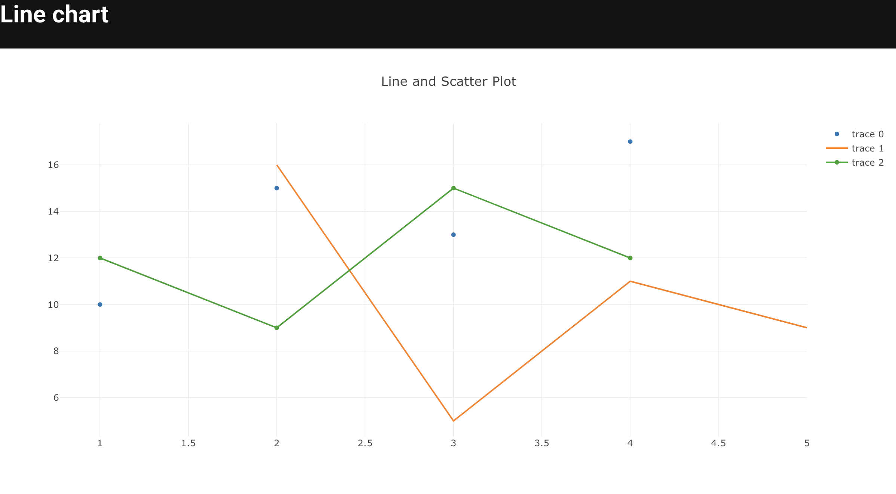
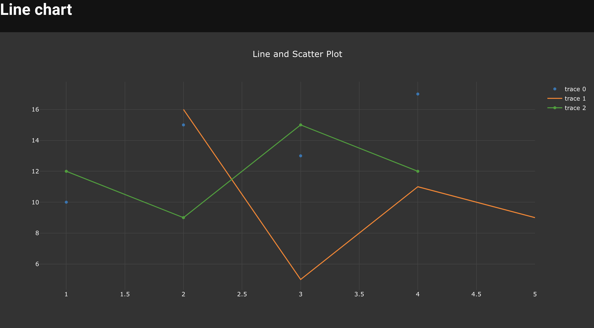

### Bar Chart

```python
trace1 = {
    "x": ["giraffes", "orangutans", "monkeys"],
    "y": [20, 14, 23],
    "name": "SF Zoo",
    "type": "bar",
}


trace2 = {
    "x": ["giraffes", "orangutans", "monkeys"],
    "y": [12, 18, 29],
    "name": "LA Zoo",
    "type": "bar",
}


data = [
    trace1,
    trace2,
]

layout = {
    "barmode": "group",
}

md = """
# Bar chart

<|{data}|demo_library.chart|layout={layout}|>
"""
```

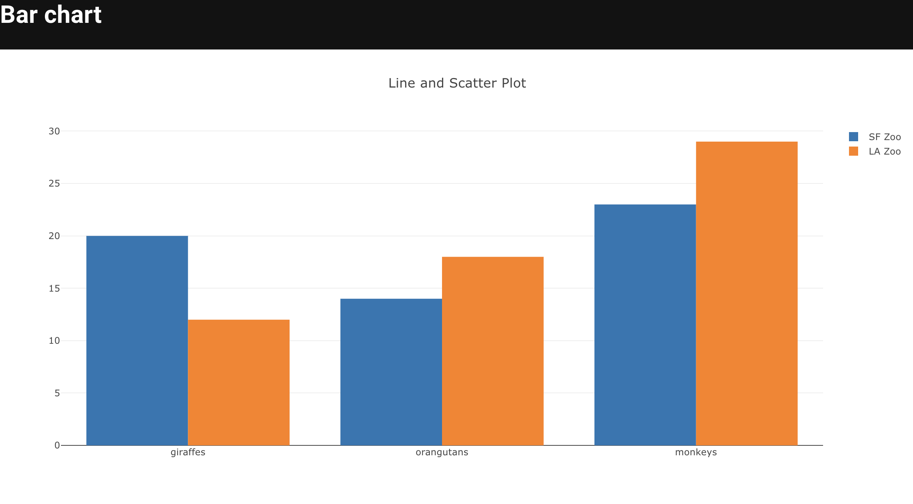
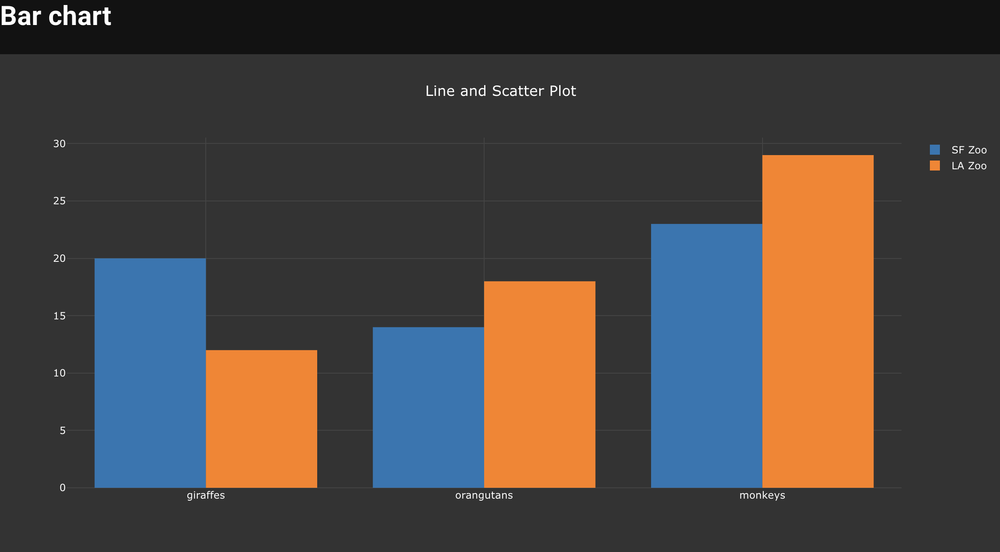

### Pie Chart

```python
data = [
    {
        "type": "pie",
        "values": [2, 3, 4, 4],
        "labels": ["Wages", "Operating expenses", "Cost of sales", "Insurance"],
        "textinfo": "label+percent",
        "textposition": "outside",
        "automargin": True,
    }
]


layout = {
    "width": 500,
    "height": 500,
    "margin": {"t": 0, "b": 0, "l": 0, "r": 0},
    "showlegend": False
}

md = """
# Pie Chart

<|{data}|demo_library.chart|layout={layout}|>
"""
```

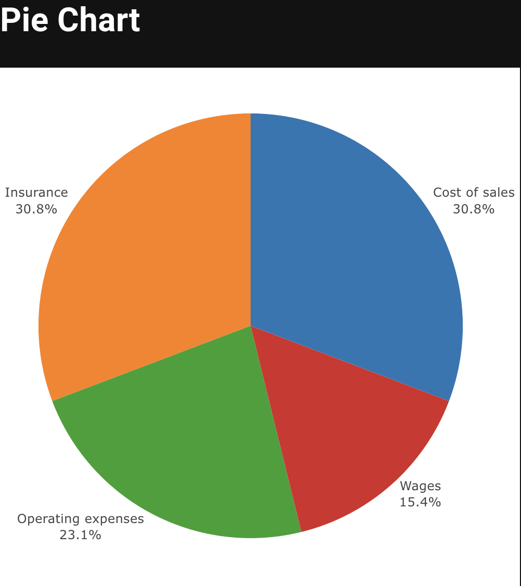
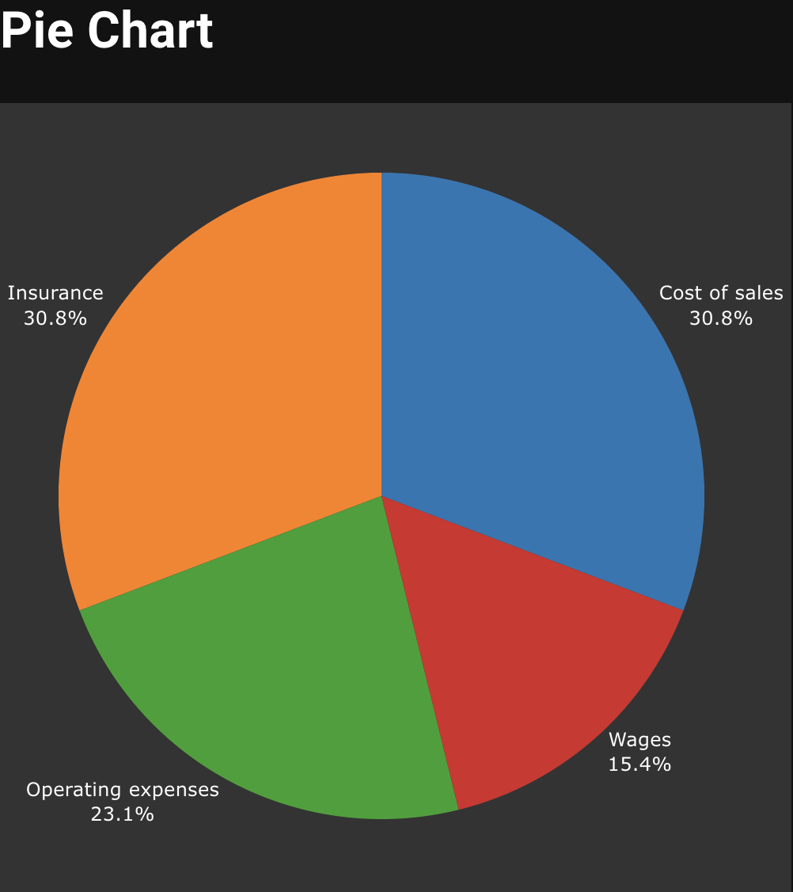

### Bubble Chart

```python
trace1 = {
    "x": [1, 2, 3, 4],
    "y": [10, 11, 12, 13],
    "mode": "markers",
    "marker": {
        "color": [
            "rgb(93, 164, 214)",
            "rgb(255, 144, 14)",
            "rgb(44, 160, 101)",
            "rgb(255, 65, 54)",
        ],
        "opacity": [1, 0.8, 0.6, 0.4],
        "size": [40, 60, 80, 100],
    },
}


data = [
    trace1,
]

layout = {
    "title": "Marker Size and Color",
}

md = """
# Bubble chart

<|{data}|demo_library.chart|layout={layout}|>
"""
```

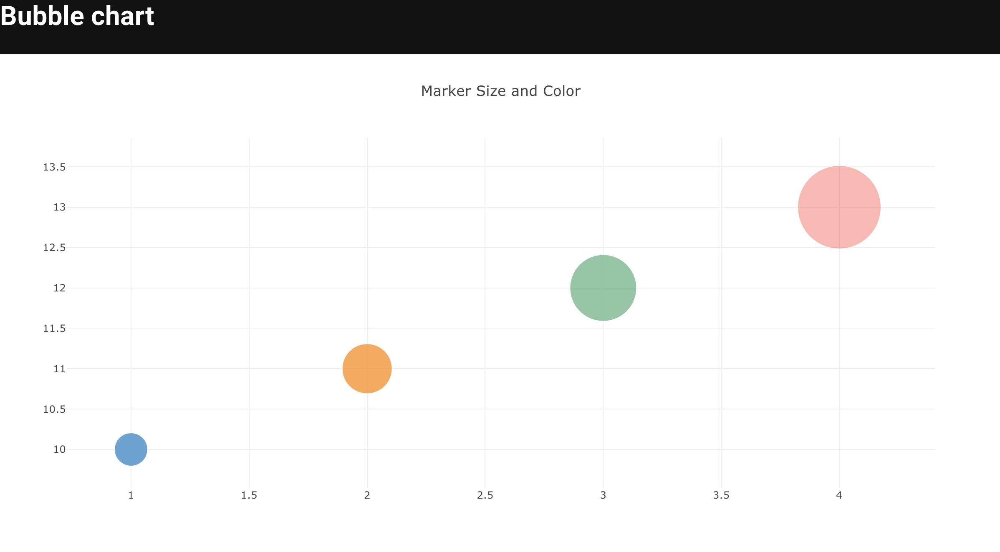
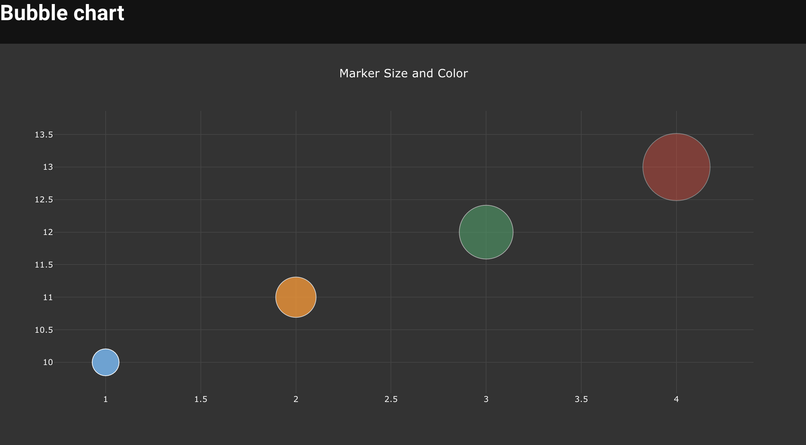

## Histogram Chart

```python
trace1 = {
    "x": [random.random() for i in range(500)],
    "type": "histogram",
}

trace2 = {
    "x": [random.random() for i in range(500)],
    "type": "histogram",
}


data = [
    trace1,
    trace2,
]

layout = {
    "barmode": "stack",
}

md = """
# Histogram chart

<|{data}|demo_library.chart|layout={layout}|>
"""
```

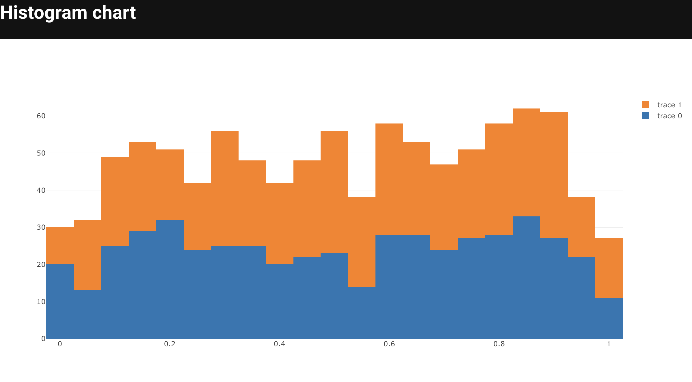
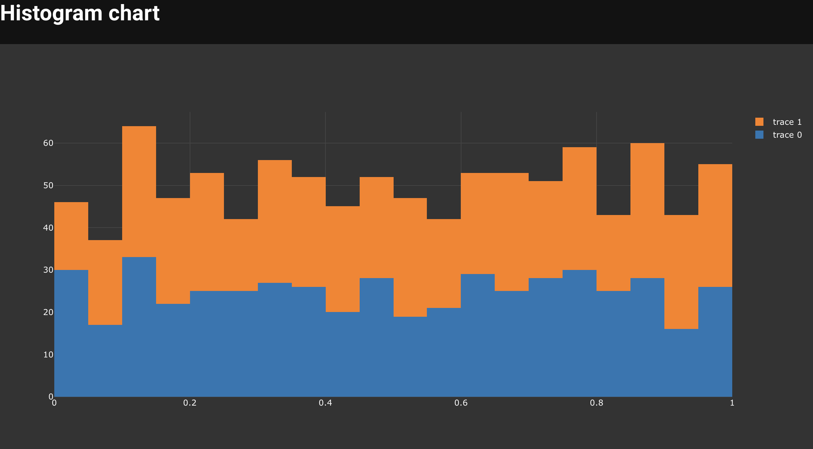

## Box Plots

```python
trace1 = {
    "x": [random.random() for i in range(50)],
    "type": "box",
}

trace2 = {
    "x": [random.random() + 1 for i in range(50)],
    "type": "box",
}


data = [
    trace1,
    trace2,
]

md = """
# Box plot

<|{data}|demo_library.chart|>
"""
```

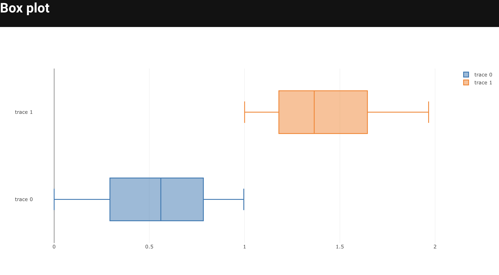
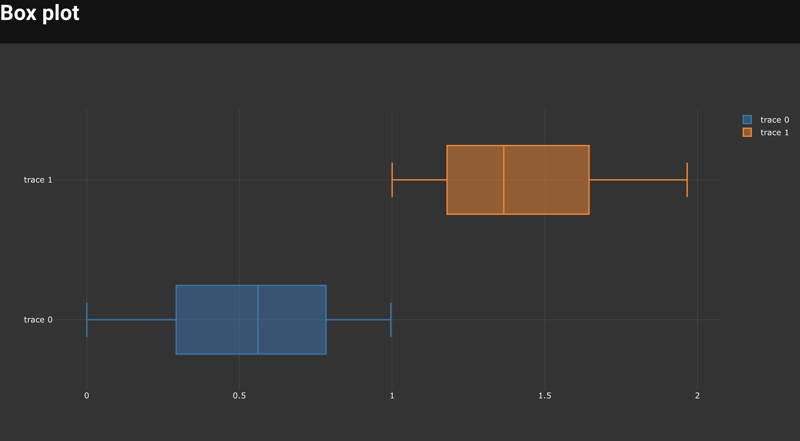

## Gantt Chart

```python
ganttdata = [
    {
        "x": ["Task 1", "Task 2", "Task 3"],
        "y": [1, 2, 3],
        "type": "bar",
        "name": "Tasks",
        "marker": {"color": "rgb(55, 83, 109)"},
        "orientation": "h",
    }
]

ganttlayout = {
    "xaxis": {
        "ticktext": ["Task 1", "Task 2", "Task 3"],
        "tickvals": [1, 2, 3],
        "showgrid": True,
        "zeroline": True,
    },
    "yaxis": {"title": "Duration (days)", "showgrid": True, "zeroline": True},
}

md = """
# Gantt chart

<|{ganttdata}|demo_library.chart|layout={ganttlayout}|>
"""
```

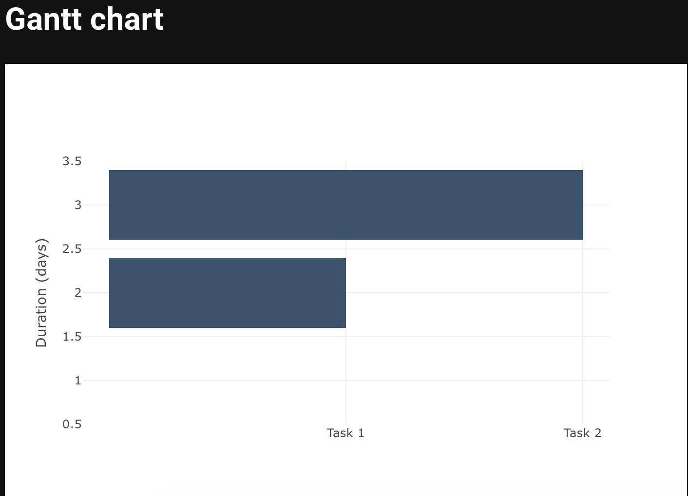
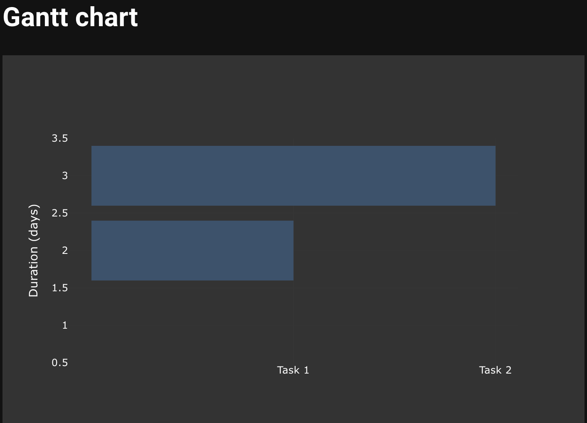

You can find more of these examples in the in [Plotly's Website](https://plotly.com/javascript/)
