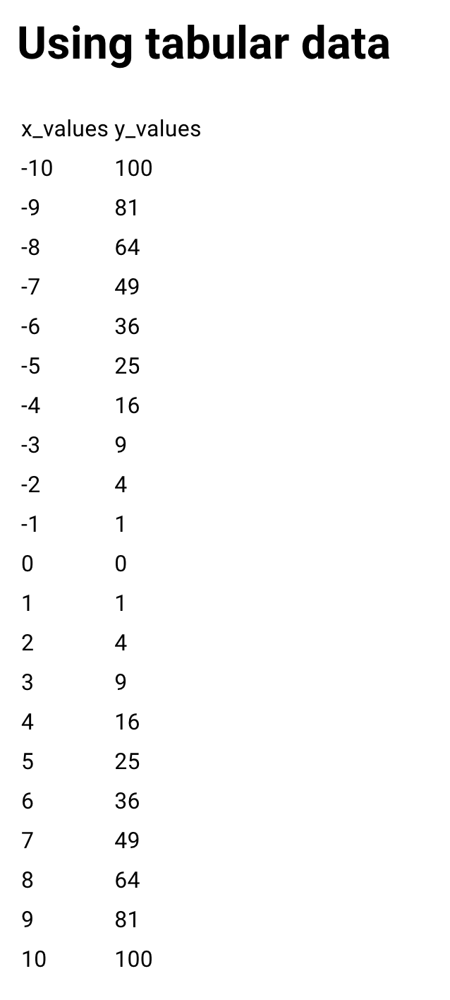

# Using tabular data

There are some cases where you need to use tabular data to represent your data. For example, you may want to display a table of data of a specific type. In this case you can define your custom table element with taipy.

## Declaring the element

```py
class DemoLibrary(ElementLibrary):
    elts = {
        "table": Element(
            "data",
            {
                "data": ElementProperty(PropertyType.data),
                "id": ElementProperty(PropertyType.string),
                "columns": ElementProperty(PropertyType.dict),
                "active": ElementProperty(PropertyType.dynamic_boolean, True),
            },
            react_component="DemoTable",
        ),
    }

    def get_name(self) -> str:
        return "demo_library"

    def get_elements(self) -> dict:
        return DemoLibrary.elts

    def get_scripts(self) -> list[str]:
        # Only one JavaScript bundle for this library.
        return ["demo_lib/frontend/dist/demo.js"]
```

- `data` field has the property type `data` which is used to define the data that will have various data types
  
- `columns` field has the `dict` property type  which is used to define dictionary type data

- `active` field has the `dynamic_boolean` property type which is dynamically changed boolean. We also set the default value to `True`

- `id` field has the `string` property type which is used to define string type data

## Defining the React component
First of all let's define our variables and types for the component.


```ts
interface FredTableProps {
    id?: string;
    data: Record<string, Record<string, unknown>>;
    updateVarName: string;
    updateVars: string;
    active?: boolean;
    defaultActive?: boolean;
    columns: string;
}

const DemoTable = (props: FredTableProps) => {
     const { id, updateVarName, updateVars } = props;
    const [value, setValue] = useState<Record<string, unknown>>({});
    const dispatch = useDispatch();
    const pageKey = useRef("no-page");

    const refresh = props.data === null;
    const active = useDynamicProperty(props.active, props.defaultActive, true);
}
```
- `value` state will be used to store the parsed data from the `data` prop
- `dispatch` is used to dispatch the action to update the data
- `refresh` is the flag to check if the page is refreshed or not
- `active` is the dynamic boolean to check if the element is active or not
- `pageKey` will store our first property key inside the `data` prop

Now we also gotta define our columns inside `DemoTable` component.

```ts
const [colsOrder, columns] = useMemo(() => {
        if (props.columns) {
            try {
                const columns = (
                    typeof props.columns === "string" ? JSON.parse(props.columns) : props.columns
                ) as Record<string, ColumnDesc>;
                const colsOrder = Object.keys(columns);
                return [colsOrder, columns];
            } catch (e) {
                console.info("PTable.columns: " + ((e as Error).message || e));
            }
        }
        return [[], {}];
    }, [active, props.columns]);
```
as you can see we are using `useMemo` hook to memoize the columns and columns order. We are using `JSON.parse` to parse the `columns` prop to JSON object because it might be coming as a string. We are also using `active` and `props.columns` as dependencies for the hook in case of any changes in those props.

Since we set our variables and types for the component, now we can assign proper values to them.

```tsx
    useDispatchRequestUpdateOnFirstRender(dispatch, id, updateVars);

    useEffect(() => {
        if (props.data && props.data[pageKey.current] !== undefined) {
            setValue(props.data[pageKey.current]);
        }
    }, [props.data]);

    useEffect(() => {
        const cols = colsOrder.map((col) => columns[col].dfid);
        pageKey.current = `${cols.join()}`;
        if (refresh || !props.data || props.data[pageKey.current] === undefined) {
            dispatch(
                createRequestDataUpdateAction(
                    updateVarName,
                    id,
                    cols,
                    pageKey.current,
                    {},
                    true,
                    "DemoLibrary"
                )
            );
        } else {
            setValue(props.data[pageKey.current]);
        }
        // eslint-disable-next-line react-hooks/exhaustive-deps
    }, [refresh, colsOrder, columns, updateVarName, id, dispatch]);
```

- `useDispatchRequestUpdateOnFirstRender` as the name suggests, it dispatches the action to update the data on first render. It takes 4 arguments;
  - `dispatch` The React dispatcher associated to TaipyContext.

  - `id` The identifier of the element.

  - `updateVars` The content of the property updateVars.

  - `varName` The default property backend provided variable (through property updateVarName).

- In line 3 if `data` prop and `data` prop's first key is not undefined, then we set the `value` state to the `data` prop's inner value
- In line 9 first we get the column titles then join them with `,` to set the `pageKey` to the joined string which used for the `value` state. Lastly we check if page's refreshed or data is defined in order to dispatch the action with the new column data. 

Let's not forget to define our `rows` data
```tsx
   const rows = useMemo(() => {
        const rows: RowType[] = [];
        if (value) {
            colsOrder.forEach(col => value[col] && (value[col] as RowValue[]).forEach((val, idx) => (rows[idx] = rows[idx] || {}) && (rows[idx][col] = val)));
        }
        return rows;
    }, [value, colsOrder]);
```
Whenever `value` and `colsOrder` changes, we will update the `rows` by spreading the `value`'s values according to the each column in `colsOrder`.

Since we have our data ready, now we can render our table.
```tsx
 return (
        <table>
            <thead>
                {colsOrder.map((col, idx) => (
                    <td key={col + idx}>{columns[col].title === undefined ? columns[col].dfid : columns[col].title}</td>
                ))}
            </thead>
            <tbody>
                {rows.map((row, index) => (
                    <tr key={"row" + index}>
                        {colsOrder.map((col, cidx) => (
                            <td key={"val" + index + "-" + cidx}>{row[col]}</td>
                        ))}
                    </tr>
                ))}
            </tbody>
        </table>
    );
```
## Using the element in the application
Last but not least, we gotta use our table element in our page.
```py
x_range = range(-10, 11)
range2 = range(0, 22)

data = {"x_values": [x for x in x_range], "y_values": [x * x for x in x_range]}

cols = {"x_values": {"dfid": "x_values"}, "y_values": {"dfid": "y_values"}}

page = """
# Using tabular data

<|{data}|demo_library.table|columns={cols}|>
"""
```

As you can see we have our rendered table with all the columns and rows we defined.

