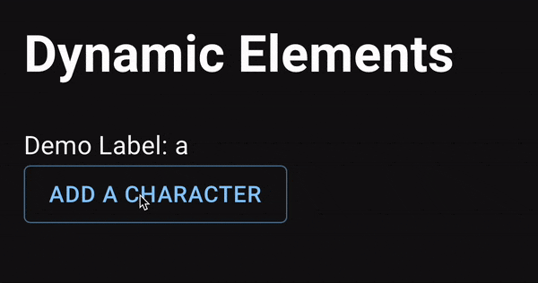

# Dynamic elements

The [previous section on static elements](extension_static_element.md) exposes
how element libraries and elements are defined. A major limitation with
static elements is that you cannot change their property values at run-time.
In Taipy GUI, you can [bind Python variables or expressions](binding.md)
to properties so that when the application changes the value of a
variable, it can be immediately reflected in the user interface.<br/>

Custom elements that allow for variable binding are called *dynamic elements*
in Taipy GUI.

Dynamic elements use [TypeScript](https://www.typescriptlang.org/) and
[JavaScript](https://www.javascript.com/) code to dynamically generate HTML code to
produce the pages that can be displayed in a browser. Taipy GUI actually relies
on the [React](https://reactjs.org/) JavaScript library to simplify the
development of graphical components.

## Declaring a dynamic element

```py
class DemoLibrary(ElementLibrary):
    elts = {
        "label": Element(
            "value",
            {"value": ElementProperty(PropertyType.dynamic_string)}, # <--- This is the property we are interested in.
            react_component="DemoLabel",
        ),
    }

    def get_name(self) -> str:
        return "demo_library"

    def get_elements(self) -> dict:
        return DemoLibrary.elts

    def get_scripts(self) -> list[str]:
        # Only one JavaScript bundle for this library.
        return ["demo_lib/frontend/dist/demo.js"]
```

The `ElementProperty` type of the `value` property is `PropertyType.dynamic_string`. This
means that the value of the property will be dynamically generated.

## Creating the React component

```tsx
import { useDynamicProperty } from "taipy-gui";

interface DemoLabelProps {
  value?: string;
  defaultValue?: string;
  }

export default function DemoLabel(props:DemoLabelProps) {
  const value = useDynamicProperty(props.value, props.defaultValue, "");
  return (
    <label>Demo Label: {value}</label>
  )
}
```

The `useDynamicProperty` function is used to retrieve the value of the dynamic property and returns latest updated value. It takes three parameters:

- `value` The bound value.

- `defaultValue` The default value.

- `defaultStatic` The default static value.

## Using the element in the application

```py
import random
import string

value = "a"

page = """
# Dynamic Elements

<|{value}|demo_library.label|>

<|Add a character|button|>
"""


def on_action(state):
    state.value = state.value + random.choice(string.ascii_letters)
```

The `value` property is bound to the `value` variable. The `value` variable is updated when the button is clicked. <br/>
`on_action` is called when the button is clicked. The `state` parameter is the state of the application which contains the `value` variable.

Let's see what happens when the button is clicked:


