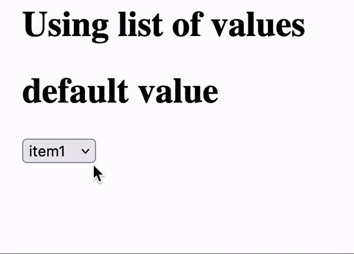

# Using list of values
If you want use an array in your application. You can use `lov` property type in your element. 

list of values gets an array of values(`lov`) and a default value(`defaultLov`). The default value is used when the value is not set.


## Declaring a dynamic element
```py
# demo_lib/demo_library.py file

class DemoLibrary(ElementLibrary):
    elts = {
        "list": Element(
            "value",
            {
                "value": ElementProperty(PropertyType.lov_value),
                "lov": ElementProperty(PropertyType.lov),
            },
            react_component="DemoList",
        ),
    }

    def get_name(self) -> str:
        return "demo_library"

    def get_elements(self) -> dict:
        return DemoLibrary.elts

    def get_scripts(self) -> list[str]:
        # Only one JavaScript bundle for this library.
        return ["demo_lib/frontend/dist/demo.js"]
```
Property type of the `value` property is `PropertyType.lov_value`. This means that the value of the property will be dynamically generated.

Property type of the `lov` property is `PropertyType.lov`. This means that the value of the property will be an array.

## Creating the React component
```ts
// demo_lib/frontend/src/DemoList.tsx

interface FredListProps {
    value?: string;
    defaultValue?: string;
    lov?: LoV;
    defaultLov?: string;
}
const DemoList = (props: FredListProps) => {
    const {defaultLov = "",lov, value, defaultValue} = props;
    const defaultValueParsed = JSON.parse(defaultValue || "[null]")
    const [lovValue, setLovValue] = useState(value || defaultValueParsed[0]);


    const lovList = useLovListMemo(lov, defaultLov);
 
    const handleChange = (event: React.ChangeEvent<HTMLSelectElement>) => setLovValue(event.target.value)


    return (
        <>
        <h1>
            {lovValue}
        </h1>
        <select
            value={value}
            onChange={handleChange}
        >
            {lovList.map((elt) => (
                <option
                    key={elt.id}
                    value={elt.id}
                >{elt.item as string}</option>
            ))}
        </select>
        </>
    );
};
```

`useLovListMemo` is used to retrieve the value of the dynamic property and returns latest updated value. It takes 3 parameters:
- `lov` The bound value.
- `defaultLov` The default value. It is a stringified array of values. And the default value is used when the value is not set.
- `tree` This boolean flag indicates if the LoV list is a tree or a flat list (default is false).

## Using the element in the application
```py
# demo-init.py

value = "default value"

page = """
# Using list of values

<|{value}|demo_library.list|lov=item1;item 2;item 3;item 4|>
"""
```
`lov` property is used to set the list of values. The values are separated by `;`.


<b>Let's see the result</b>

