# Styling

As mentioned several times, page content is parsed and converted to be sent
to the user's browser. The final page content actually is pure HTML that one can apply
some style to, providing the best user experience.

Styling involves some knowledge of [Cascading Style Sheets](https://www.w3.org/Style/CSS/).
This section describes what sort of styling you may want to apply, in different situations.

Taipy GUI comes with a set of stylesheets that give applications an homogeneous and solid
look and feel. This set of stylesheet is grouped in what is called the *Stylekit*.<br/>
The Stylekit is easy to customize and provides few utility CSS classes that accelerates the
development of specific styles to apply to pages.<br/>
The Stylekit is documented in the [Stylekit section](stylekit.md) of this documentation,
where you can find all the information on how to use and customize it.

## Style sheets

There are two ways you can apply a stylesheet to your application:

- Global style sheet.<br/>
  The *css_file* parameter of the [`Gui` constructor](Gui.__init__()^) lets you
  specify a CSS file that your application will use for every page. The default value
  for this parameter is a file located next to your main Python script, with the
  same name except for the extension that must be '.css'.

- Page-specific style.<br/>
  The method `Gui.add_page()^` has a *style* parameter that can be set to CSS content.
  This additional style is applied to the page and **only** this page.

Beside explicit style sheets, you can also modify the global theme, as
described in the [section on Themes](#themes).

## Applying style

Once the style sheets are set for the application, you can start learning about
how styles can be applied to pages.

### Global styles

As in any Web application, the root element (`:root`) is available for global
style settings.<br/>
For example, if you want to make your application bigger by enlarging the
font size, you could write:
```css
:root {
  font-size: 2rem;
}
```
And all pages will appear twice as big.


### Styling Markdown

Thanks to the [*Attribute Lists*](https://python-markdown.github.io/extensions/attr_list/)
extension, the Markdown text can hold attributes used for styling.

If, for example, your Markdown content is the following:
```
Un-styled text line.

Styled text line.
{: .blue }
```

and a stylesheet used by the application defined the *blue* CSS class:
```css
.blue {
  color: blue;
}
```
then the text line is displayed in blue:

<figure>
  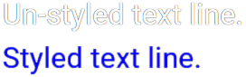
  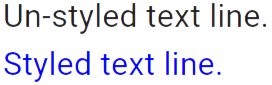
  <figcaption>Styling paragraphs</figcaption>
</figure>

That would apply to the entire preceding paragraph.

If you want to set the style for an inline element of the text (such as a
bold section identified by the "\*\*" markers), you can use the same
attribute syntax, right after the text fragment, without any space
character.<br/>
The following Markdown content:
```
A text that has a **specific**{: .blue } style.
```
will apply the *blue* class to the bold text fragment:
<figure>
  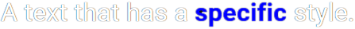
  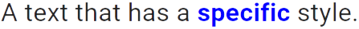
  <figcaption>Styling fragments</figcaption>
</figure>

Note that to style a heading, the syntax is slightly different: right after the text of the heading,
you must insert a white space, as many sharp (#) characters as the heading uses, another white
space, then the style construct.<br/>
Here is an example that works properly.
```
## My heading ## {: .my-style }
```

Please check the documentation for the *Attribute Lists* extension for more information.

!!! note "div vs. p"
    Instead of generating &lt;p&gt; HTML tags for lines of text, Taipy
    uses &lt;div&gt; tags. This allows more complex structures in pages,
    such as elements within elements.

### Main page style

The top-most element of the generated page is a &lt;div&gt; element with
the 'id' attribute set to "root".

If you need to reference the top-most element of your page, you 
can select it in your CSS stylesheets using the selector: `div#root`.

### Visual elements-specific styles

You can apply some style to any visual element you have added to
your pages.

#### Using CSS classes

Every visual element is assigned a CSS class that depends on the type
of the element.<br/>
The default associated class name is made of the string *"taipy-"* followed
by the type of element: all Taipy buttons, for example, have the CSS
class name: *"taipy-button"*.

You can therefore create a weird-looking button displayed in an
oval by setting a style sheet that contains:
```css
.taipy-button {
  border-radius: 50%;
}
```
Now all the buttons of your application will look the same, with an oval
shape instead of a rectangle with rounded corners.

If your Markdown page contains the following control:
```
<|Click me|button|>
```

The CSS rule above will impact your display this way:

<div style="display: flex">
  <figure>
    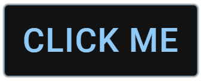
    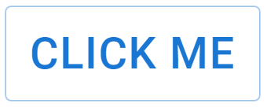
    <figcaption>Regular button</figcaption>
    </figure>
  <figure>
    
    
    <figcaption>Rounded button</figcaption>
    </figure>
  </div>

You can also add CSS class names of your choice using the *class_name*
property of all visual elements. If you need to assign more than one
class to an element, you can separate each individual class name with
a space character:
```
<|Click me|button|class_name=option testing|>
```
This Markdown fragment gets converted into an HTML element with three CSS classes
assigned: *taipy-button*, *option*, and *testing*.

#### Using the HTML 'id' attribute

You can use the *id* property of all visual elements to generate an
HTML id that can be used by CSS styling.

For example, if your Markdown page contains the following control:

```
<|Click me|button|id=my_button|>
```

You can change the style of that button using a CSS selector that
relies on the id of the button:
```css
#my_button {
  text-transform: none;
}
```
Now the button shows the text 'Click me' instead of 'CLICK ME': the default
in Material UI (which is the components library Taipy GUI relies on) is to
capitalize the text of buttons.

<div style="display: flex">
  <figure>
    
    
    <figcaption>Regular button</figcaption>
    </figure>
  <figure>
    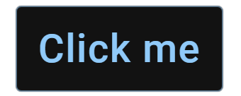
    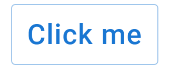
    <figcaption>Uncapitalized button</figcaption>
    </figure>
  </div>


## Themes

The visual elements that Taipy GUI generates are extensions of
[Material UI](https://mui.com/) components. This components library has great
support for theming, so you can customize how things will look across all components.

Material UI exposes the full API for handling themes, which you can find
on the [MUI Theming](https://mui.com/customization/theming/) page.

To change the theme of your application, you must use the *theme* configuration
parameter (for example in the `Gui.run()` method) as explained in the
[Configuration](configuration.md) section. You could also impact only the *light*
or the *dark* theme using the *light_theme* or *dark_theme* configuration settings.

Here is how you would change the general theme if you wanted the background
color to be a neutral gray color (#808080 in CSS) and make the primary color
an orange-looking color instead of the default blue color.<br/>
In your Python code, you would create a theme dictionary and provide it as
the value of the *theme* parameter of the method `Gui.run()`:

```py
...
my_theme = {
  "palette": {
    "background": {"default": "#808080"},
    "primary": {"main": "#a25221"}
  }
}
...
gui.run(theme=my_theme)
```

See the impact of setting this custom theme:

<div style="display: flex">
  <figure>
    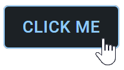
    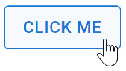
    <figcaption>Regular button</figcaption>
    </figure>
  <figure>
    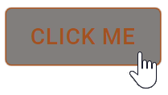
    <figcaption>Themed button</figcaption>
    </figure>
  </div>


