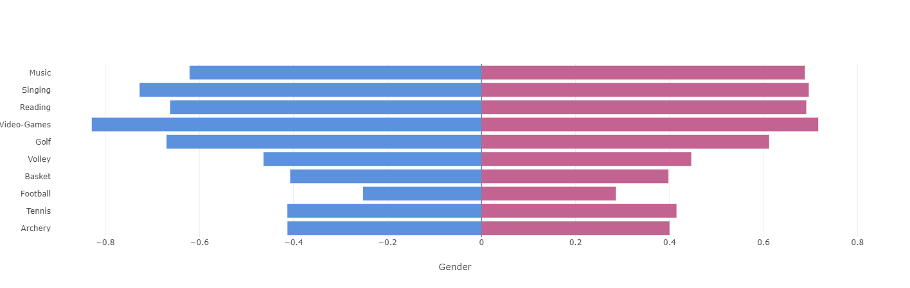
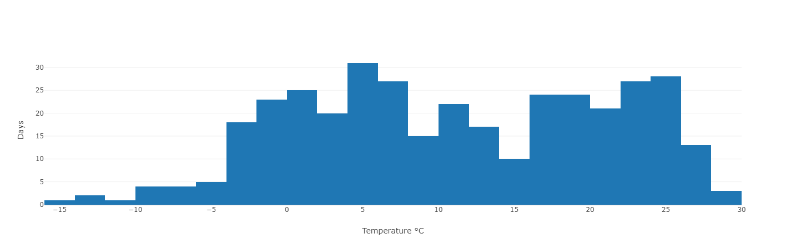

## Bar charts

Bar charts can be handy when you need to compare data points
next to one another and look at a global change over time.

### Simple bar chart

Here is an example of how to use bar charts in an application.

You want to display the popular vote percentage for every presidential
election in the US since 1852 (source
[Wikipedia](https://en.wikipedia.org/wiki/List_of_United_States_presidential_elections_by_popular_vote_margin])).

The Python code will look like this:
```py
percentages=[(1852,50.83), (1856,45.29), ..., (2016,46.09), (2020,51.31)]
data = pd.DataFrame(percentages, columns= ["Year", "%"])
```

A Pandas DataFrame is built from a list of tuples that hold the election year
and the percentage of votes the winner has received globally.

The definition of a bar chart that represents this data will look like this:

!!! example "Page content"

    === "Markdown"

        ```
        <|{data}|chart|type=bar|x=Year|y=%|>
        ```
  
    === "HTML"

        ```html
        <taipy:chart type="bar" x="Year" y="%">{data}</taipy:chart>
        ```

All we did is set the _type_ property to "bar", and the following chart
is displayed on the page (the blue color is not related to what party the
elected president belongs to - it is just the default color that Plotly
has picked up):


!!! note "Faint bars"
    Plotly gives bars a low opacity unless they are selected. If you
    want to override that behavior and force a higher opacity, you
    can use the following rule in your CSS style sheet:
    ```css
    .cartesianlayer .plot path {
        opacity: 0.8 !important;
    }
    ```

### Multiple data sets

Say you want to display the score of the winning side next to the
score of the losing side.

Starting with the same data set as above, you can write:
```py
percentages=[(1852,50.83), (1856,45.29), ..., (2016,46.09), (2020,51.31)]
data = pd.DataFrame(percentages, columns= ["Year", "Won"])
data["Lost"] = [100-t[1] for t in percentages]
```

We add a new column to the DataFrame _data_, which is the complement to 100
of _percentages_.

To represent it, we will change the definition of the cart control:

!!! example "Page content"

    === "Markdown"

        ```
        <|{data}|chart|type=bar|x=Year|y[1]=Won|y[2]=Lost|>
        ```
  
    === "HTML"

        ```html
        <taipy:chart type="bar" x="Year" y[1]="Won" y[2]="Lost">{data}</taipy:chart>
        ```


Here is how this new data set is represented:


### Stacked bar chart

When different data sets are available from the same set of _x_ values, it
may be relevant to stack those values in the same bar.

We are reusing the same DataFrame as in the example above.

To indicate that we want a stacked representation, you must
create a _layout_ dictionary:
```py
layout={ "barmode": "stack" }
```

And use this dictionary in the definition of the chart:

!!! example "Page content"

    === "Markdown"

        ```
        <|{data}|chart|type=bar|x=Year|y[1]=Won|y[2]=Lost|layout={layout}|>
        ```
  
    === "HTML"

        ```html
        <taipy:chart type="bar" x="Year" y[1]="Won" y[2]="Lost" layout="{layout}">{data}</taipy:chart>
        ```

Here is the resulting image:


And each bar adds up to 100, as expected.

### Facing bar charts

It's sometimes helpful to display two bar charts facing each other,
so comparing data is more manageable.

This example creates a chart that shows the ratio of men and women
practicing certain activities as hobbies. We want a vertical scale
representing the different hobbies and the proportion of individuals
enjoying that activity on each side of a common vertical axis, represented
as two horizontal bars facing each other.

We have a DataFrame that holds the information we want to represent:
```py
data = pd.DataFrame({
    "Hobbies": [
        "Archery", "Tennis", "Football", "Basket", "Volley",
        "Golf", "Video-Games", "Reading", "Singing", "Music" ],
    "Female": [0.4, ..., 0.63],
    "Male":   [-0.39, ..., -0.6]
})
```
Note how we negated the values for the Male data, so they are properly
located on the _x_ axis.

The chart control definition for this example is slightly more complex than
for the previous examples. It is clearer to store the properties and their
values in a dictionary, which we will later use as the value for the
_properties_ control property.

Here is our property dictionary:
```py
properties = {
    "y":              "Hobbies",
    "x[1]":           "Female",
    "color[1]":       "#c26391",
    "orientation[1]": "h",
    "x[2]":           "Male",
    "color[2]":       "#5c91de",
    "orientation[2]": "h",
    "layout": {
        "barmode": "overlay",
        "xaxis": { "title": "Gender" },
        "showlegend": False
    }
}
```
Note how to define our two _x_ sets of values (in _x[1]_ and _x[2]_). The
_orientation[]_ property is used to change the orientation of the bars in
our chart.

Also, note that the _layout_ property is set as well: We indicate in its
_barmode_ property that the two charts should be displayed next to each
other, and we hide the legend using the _showlegend_ property.

Now let's use this dictionary in the definition of the chart:

!!! example "Page content"

    === "Markdown"

        ```
        <|{data}|chart|type=bar|properties={properties}|>
        ```
  
    === "HTML"

        ```html
        <taipy:chart type="bar" properties="{properties}">{data}</taipy:chart>
        ```

Here is the result:



### Histogram

A histogram shows how often different values occur in a data set. Histograms
are used to see the shape of the data's distribution.

This example will show the histogram of temperature samples taken every
day in a given location.

A DataFrame column holds a temperature for each day:
```py
data = pd.DataFrame({ "Days" : [-11.3,-6,-0.1,...,-8.1,1.6,-4.8] })
```

And a _layout_ dictionary decorates the _x_ axis:
```py
layout = { "xaxis"  : { "title": "Temperature °C"} }
```

The chart control definition uses the "histogram" value for the _type_
property:

!!! example "Page content"

    === "Markdown"

        ```
        <|{data}|chart|type=histogram|y[1]=Days|layout={layout}|>
        ```
  
    === "HTML"

        ```html
        <taipy:chart type="histogram" y[1]="Days" layout="{layout}">{data}</taipy:chart>
        ```

Here is how the histogram is displayed:



### Comparing histograms

You want to compare two histograms next to
each other, sharing the same _x_ axis.

Imagine you have a daily sample of the temperatures in two cities. Showing
their histogram next to each other can immediately help understand the
difference between the two data sets.

In this situation, you need to split your data sets into two distinct data
frames, one for each city. Each DataFrame contains a column holding a
temperature for each day. The two DataFrames are stored in an array:
```py
data = [
    pd.DataFrame({ "City A" : [-11.3,-6,-0.1,...,-8.1,1.6,-4.8]}),
    pd.DataFrame({ "City B" : [-7.1,5.1,11.8,...,3.4,13.1,-0.5]})
]
```

Besides the label of the _x_ axis, the _layout_ dictionary must indicate
that both data sets must share the same _x_ axis:
```py
layout = {
    "barmode": "overlay",
    "xaxis"  : { "title": "Temperature °C"}
}
```

The chart control definition is the following:

!!! example "Page content"

    === "Markdown"

        ```
        <|{data}|chart|type=histogram|y[1]=0/City A|y[2]=1/City B|layout={layout}|>
        ```
  
    === "HTML"

        ```html
        <taipy:chart type="histogram" y[1]="0/City A" y[2]="1/City B" layout="{layout}">{data}</taipy:chart>
        ```

Note how you indicate which data set must be used in the chart: When dealing
with arrays of DataFrames, the syntax is '_index_/_column_' where _index_
indicates the index in the _data_ array where the DataFrame holding the
column _column_ is located.

The resulting display will be:


