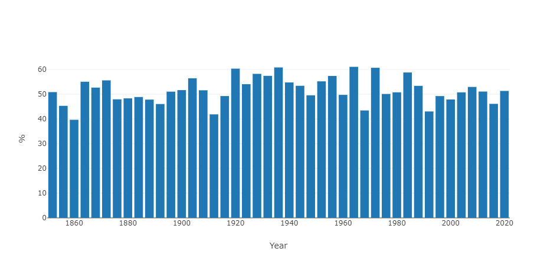
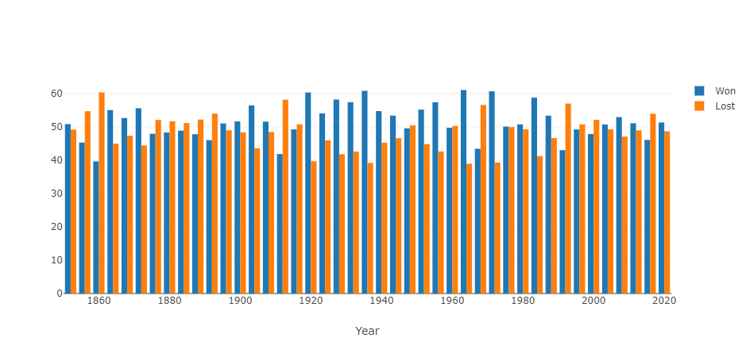
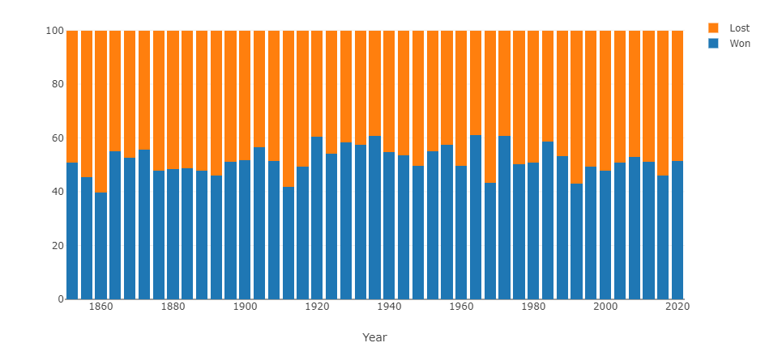

## Bar charts

Bar charts can be handy when you need to compare data point
next to one another, as well as looking at a global change
over time.

### Simple bar chart

Here is an example of how to use bar charts in an application.

You want to display the popular vote percentage for every presidential
election in the US since 1852 (source
[Wikipedia](https://en.wikipedia.org/wiki/List_of_United_States_presidential_elections_by_popular_vote_margin])).

The Python code will look like this:
```py
percentages=[(1852,50.83), (1856,45.29), ..., (2016,46.09), (2020,51.31)]
data = pd.DataFrame(percentages, columns= ['Year','%'])
```

A Pandas DataFrame is built from a list of tuples that hole the election year,
and the percentage of vote the winner has received globally.

The definition of a bar chart that represents this data will look like this:

!!! example "Page content"

    === "Markdown"

        ```
        <|{data}|chart|type=bar|x=Year|y=%|>
        ```
  
    === "HTML"

        ```html
        <taipy:chart type="bar" x="Year" y="%">{data}</taipy:chart>
        ```

All we did is set the _type_ property to "bar", and the following chart
is displayed in the page (the blue color is not related to what party the
elected president belongs to - it is just the default color that Plotly
has picked up):



!!! note "Faint bars"
    Plotly gives bars a low opacity unless they are selected. If you
    want to override that behavior and force a higher opacity, you
    can use the following rule in your CSS style sheet:
    ```css
    .cartesianlayer .plot path {
        opacity: 0.8 !important;
    }
    ```

### Multiple data sets

Say you want to display the score of the winning side next to the
score of the losing side.

Starting with the same data set as above, you can write:
```py
percentages=[(1852,50.83), (1856,45.29), ..., (2016,46.09), (2020,51.31)]
data = pd.DataFrame(percentages, columns= ['Year','Won'])
lost=[100-t[1] for t in percentages]
data['Lost'] = lost
```

We add a new column to the _data_ DataFrame.

In order to represent it, we will change the definition of the cart control:

!!! example "Page content"

    === "Markdown"

        ```
        <|{data}|chart|type=bar|x=Year|y[1]=Won|y[2]=Lost|>
        ```
  
    === "HTML"

        ```html
        <taipy:chart type="bar" x="Year" y[1]="Won" y[2]="Lost">{data}</taipy:chart>
        ```


Here is how this new data set is represented:




### Stacked bar chart

When different data sets are available from the same set of _x_ values, it
may be useful to stack those values in the same bar.

We are reusing the same DataFrame as in the example above.

In order to indicate that we want a stacked representation, you must
create a _layout_ dictionary:
```py
layout={'barmode':'stack'}
```

And use this dictionary in the definition of the chart:

!!! example "Page content"

    === "Markdown"

        ```
        <|{data}|chart|type=bar|x=Year|y[1]=Won|y[2]=Lost|layout={layout}|>
        ```
  
    === "HTML"

        ```html
        <taipy:chart type="bar" x="Year" y[1]="Won" y[2]="Lost" layout="{layout}">{data}</taipy:chart>
        ```

Here is the resulting image:



And each bar adds up to 100, as expected.
