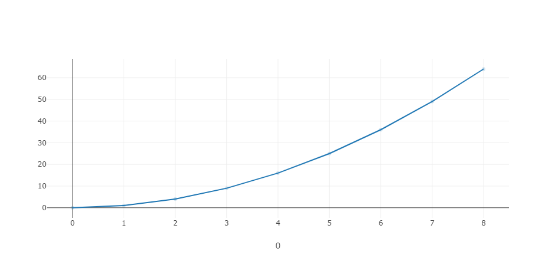
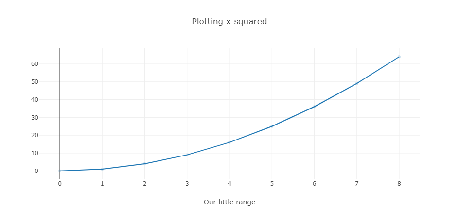
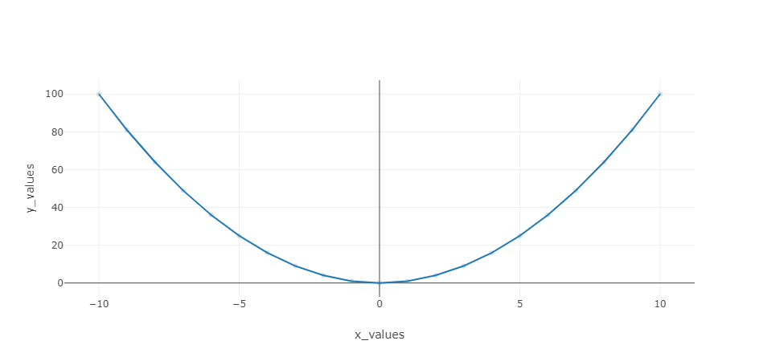
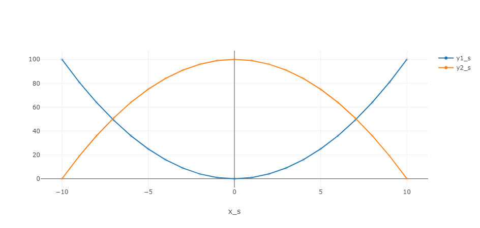
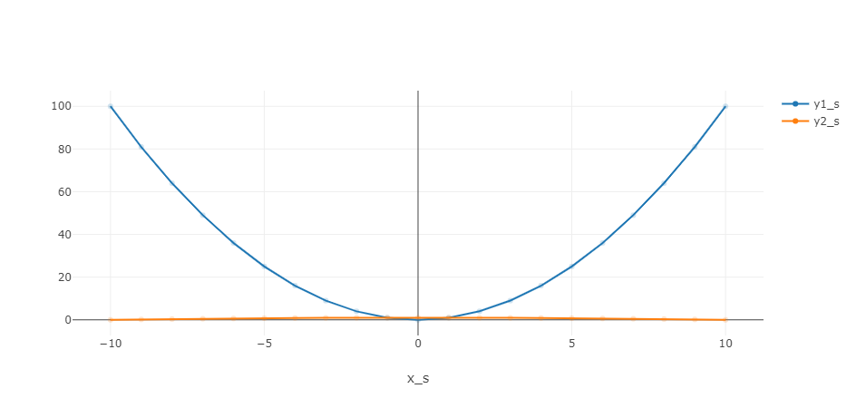
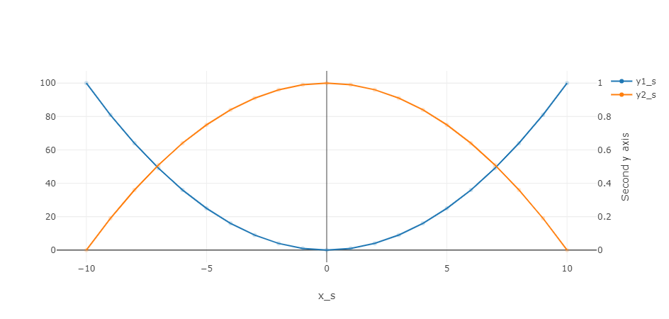
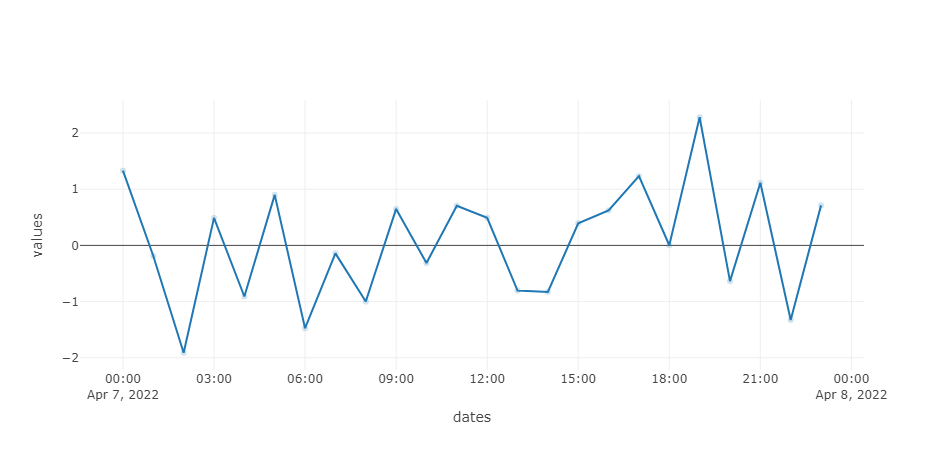

## Basic concepts

This section explains how data can be used by the chart control in
different situations, as well as basic customization hints.

### Tracing a series of values

Say you want to create a line chart connecting a series of values.<br/>
The _x_ values will be the index of each plotted value.

Our example would plot the function _y = x * x_ on a small range of _x_ values.
We can do that using inline Python code in the page definition:

!!! example "Page content"

    === "Markdown"

        ```
        <|{[x*x for x in range(0, 9)]}|chart|>
        ```
  
    === "HTML"

        ```html
        <taipy:chart>{[x*x for x in range(0, 9)]}</taipy:chart>
        ```

Here is how this chart is displayed:



### Decorating a chart

In our previous example, you may have noticed the '0' sitting under
the _x_ axis. This is the 'name' of the axis. Because we are not using
any DataFrame from which column names could be used, Taipy uses the index
of the data series, which is 0, since we only have one dimension in
our data.

Let's make the chart slightly nicer by adding a real name to the axis.
This involve the use of the _layout_ property of the chart control. This
property must be set to a dictionary (see the
[Plotly Reference](https://plotly.com/javascript/reference/layout/) for
all the details) defined as follows:

```py
layout={
  "xaxis": {
    "title": "Our little range"
  }
}
```

There are several settings that apply to axis. However in our case, we will
only use the _title_ property.

The control definition is modified to use that dictionary:
!!! example "Page content"

    === "Markdown"

        ```
        <|{[x*x for x in range(0, 9)]}|chart|title=Plotting x squared|layout={layout}|>
        ```
  
    === "HTML"

        ```html
        <taipy:chart title="Plotting x squared" layout="{layout}">
          {[x*x for x in range(0, 9)]}
          </taipy:chart>
        ```

As you can see, we also added a title to the chart.

The result is the following:



### Defining the _x_ axis

So far the examples did not explicitly define a _x_ axis: we have used
the index of the _y_ value in the input array.

Let us create a dictionary that holds data for our two series: the
_x_ and the _y_ values:

```py
x_range = range(-10, 11)
data = {
  "x_values": [x for x in x_range],
  "y_values": [x*x for x in x_range]
}
```

!!! example "Page content"

    === "Markdown"

        ```
        <|{data}|chart|x=x_values|y=y_values|>
        ```
  
    === "HTML"

        ```html
        <taipy:chart x="x_values" y="y_values">{data}</taipy:chart>
        ```

Taipy internally transforms _data_ to a Pandas DataFrame.
The _x_ property indicates the name of the DataFrame column ("x_values") that holds
the _x_ axis values and the _y_ values come from the the column "y_values".

The result is the following:



Note that the axis can now have relevant names.

### Adding a trace

You will often want to display several traces in the same chart control.

For each data series, we can add a column to the DataFrame and indicate
which series to display:

```py
import pandas as pd

x_range = range(-10, 11)
data = pd.DataFrame({
  "x_s": [x for x in x_range],
  "y1_s": [x*x for x in x_range],
  "y2_s": [100-x*x for x in x_range]
})
```

!!! example "Page content"

    === "Markdown"

        ```
        <|{data}|chart|x=x_s|y[1]=y1_s|y[2]=y2_s|>
        ```
  
    === "HTML"

        ```html
        <taipy:chart x="x_s" y[1]="y1_s" y[2]="y2_s">{data}</taipy:chart>
        ```
        Note that 'y[1]' or 'y[2]' are not valid HTML attribute names.
        Taipy allows this syntax nevertheless.

And now our chart can display two traces, one for each _y_ series:



A legend is automatically added to the chart to indicate which trace
represents which series.

If you want to change the color of a trace, you can use the _color_ property:
setting _color[2]_ to _red_ will impact the color of the second trace so it is
displayed in red.

### Adding a _y_ axis

Let us look at a situation where the two _y_ series use ranges that are very
different:

```py
data = pd.DataFrame({
  "x_s": [x for x in x_range],
  "y1_s": [x*x for x in x_range],
  "y2_s": [(100-x*x)/100 for x in x_range]
})
```

Compared to the previous example, we have divided all the values of the second
_y_ series by 100, so that the trace is not readable any more:



The chart control lets you define a second _y_ axis that the second _y_ series
that use to make more sense of the data. To do this, you need to add the definition
of a _layout_ that describes this second axis:

```py
layout = {
    "yaxis2": {"overlaying": "y", "side": "right", "title": "Second y axis"}
}
```

So this axis will be in the 'y' direction, to the right of the graph, and
will have a title.

To attach our second trace to that axis, we need to change our control definition:

!!! example "Page content"

    === "Markdown"

        ```
        <|{data}|chart|x=x_s|y[1]=y1_s|y[2]=y2_s|yaxis[2]=y2|layout={layout}|>
        ```
  
    === "HTML"

        ```html
        <taipy:chart x="x_s" y[1]="y1_s" y[2]="y2_s" yaxis[2]="y2" layout="{layout}">{data}</taipy:chart>
        ```

See how we leverage the property _yaxis_, indicating that the indexed trace (2) relies on the axis
we have created in the chart layout.

The resulting plot is far more relevant:



### Using a time series

Many charts will represent data that is based on a timeline. Taipy allows you
to define an _x_ axis that represents a time range.

Here is how you could display data based on time. In our example, we will use one
random value for each hour of a given day:

```py
import pandas as pd
import numpy as np

data = pd.DataFrame({
  "dates": pd.date_range("2022-04-07", periods=24, freq="H"),
  "values": pd.Series(np.random.randn(24))
})
```

Creating a chart that relies on the time series (in the _dates_
column of the DataFrame) is pretty straightforward:

!!! example "Page content"

    === "Markdown"

        ```
        <|{data}|chart|x=dates|y=values|>
        ```
  
    === "HTML"

        ```html
        <taipy:chart x="dates" y="values">{data}</taipy:chart>
        ```

And the result is exactly what you expect:


