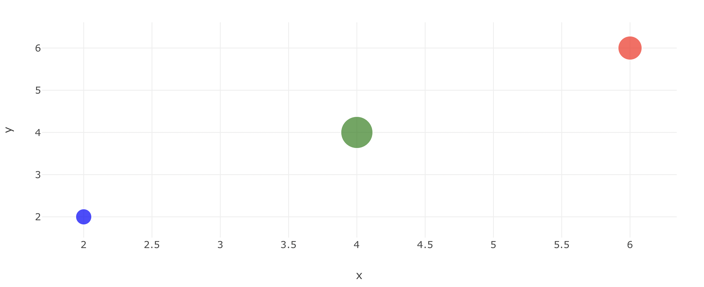
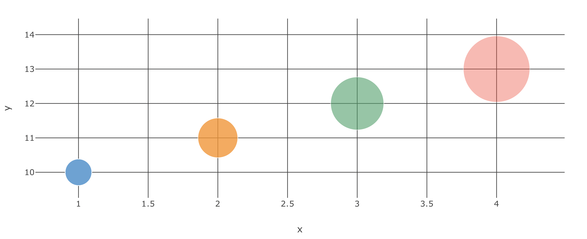
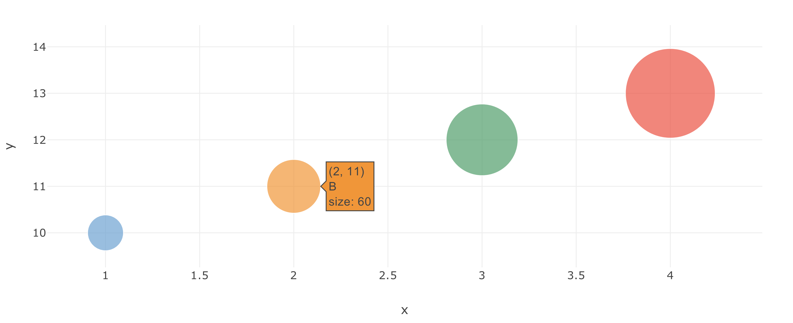
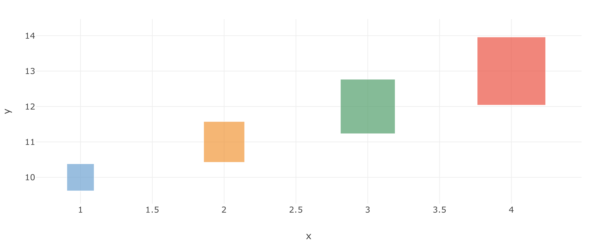
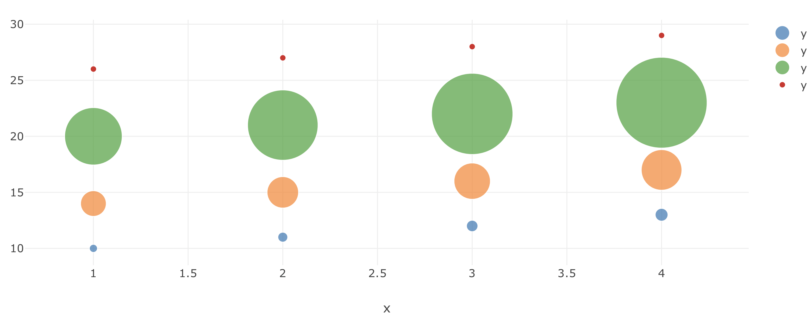
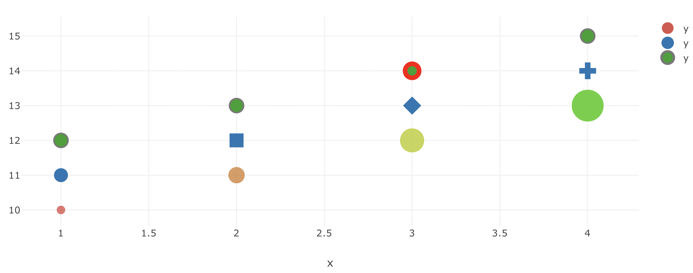

# Bubble Charts

Bubble charts are a type of scatter charts where sizes and colors change depending on the data.

Columns of the data frame will be used to change colors and sizes of the bubbles. The marker parameter is the one giving this information to TaiPy.

## Bubble Chart Key Parameters <a id="table"></a>
Explanation of parameters and options relevant to candlestick charts can be found [here](#table). Full details for the Taipy Chart control can be found in the Chart Control section of the [Taipy GUI User Manual](https://docs.taipy.io/en/latest/manuals/gui/viselements/chart/)

| Parameter       | Value Options             | Location           |
| --------------- | ------------------------- | ------------------ |
| mode          | markers          | Control definition |
| x          | Values to plot          | Control definition |
| y          | Values to plot          | Control definition |
| size | Column names or int (ex 30) | Marker |
| color | Column names or string (ex ‘red’) | Marker |
| symbol | ‘circle’, ‘square’, ‘diamond’, ‘cross’ | Marker |

## Simple Bubble Chart with Pandas

```py
import pandas as pd
from taipy.gui import Gui

data = pd.DataFrame(
    {
        "x": [2, 4, 6],
        "y": [2, 4, 6],
        "mode": "markers",
        "Colors": ["blue", "green", "red"],
        "Sizes": [20, 40, 30],
    }
)
marker = {"size": "Sizes", "color": "Colors"}

md = """
<|{data}|chart|x=x|y=y|marker={marker}|mode=markers|>
"""

Gui(md).run()
```



## Marker Size on Bubble Charts

```py
data = pd.DataFrame(
    {
        "x": [1, 2, 3, 4],
        "y": [10, 11, 12, 13],
        "mode": "markers",
        "Colors": [
            "rgb(93, 164, 214)",
            "rgb(255, 144, 14)",
            "rgb(44, 160, 101)",
            "rgb(255, 65, 54)",
        ],
        "Opacity": [1, 0.8, 0.6, 0.4],
        "Sizes": [40, 60, 80, 100],
    }
)
marker = {"size": "Sizes", "color": "Colors", "opacity": "Opacity"}

layout = {
    "showLegend": False,
    "yaxis": {"gridcolor": "#444"},
    "xaxis": {"gridcolor": "#444"},
}


md = """
<|{data}|chart|x=x|y=y|marker={marker}|mode=markers|layout={layout}|>
"""
```



## Hover Text on Bubble Charts

```py
data = pd.DataFrame(
    {
        "x": [1, 2, 3, 4],
        "y": [10, 11, 12, 13],
        "text": ["A<br>size: 40", "B<br>size: 60", "C<br>size: 80", "D<br>size: 100"],
        "Colors": [
            "rgb(93, 164, 214)",
            "rgb(255, 144, 14)",
            "rgb(44, 160, 101)",
            "rgb(255, 65, 54)",
        ],
        "Opacity": [1, 0.8, 0.6, 0.4],
        "Sizes": [40, 60, 80, 100],
    }
)


marker = {
    "size": "Sizes",
    "color": "Colors",
}

layout = {
    "showLegend": False,
}


md = """
<|{data}|chart|x=x|y=y|marker={marker}|mode=markers|layout={layout}|text=text|>
"""
```



## Bubble Chart with Symbols

```py
data = pd.DataFrame(
    {
        "x": [1, 2, 3, 4],
        "y": [10, 11, 12, 13],
        "Colors": [
            "rgb(93, 164, 214)",
            "rgb(255, 144, 14)",
            "rgb(44, 160, 101)",
            "rgb(255, 65, 54)",
        ],
        "Opacity": [1, 0.8, 0.6, 0.4],
        "Sizes": [40, 60, 80, 100],
    }
)


marker = {
    "size": "Sizes",
    "color": "Colors",
    "symbol": "square",
}

layout = {
    "showLegend": False,
}


md = """
<|{data}|chart|x=x|y=y|marker={marker}|mode=markers|layout={layout}|>
"""
```



## Bubble Size Scaling on Charts

```py
desired_maximum_marker_size = 40
size = [400, 600, 800, 1000]

data = [
    pd.DataFrame(
        {
            "x": [1, 2, 3, 4],
            "y": [10, 11, 12, 13],
        }
    ),
    pd.DataFrame(
        {
            "x": [1, 2, 3, 4],
            "y": [14, 15, 16, 17],
        }
    ),
    pd.DataFrame(
        {
            "x": [1, 2, 3, 4],
            "y": [20, 21, 22, 23],
        }
    ),
    pd.DataFrame(
        {
            "x": [1, 2, 3, 4],
            "y": [26, 27, 28, 29],
        }
    ),
]


opts1 = {
    "marker": {
        "size": [40, 60, 80, 100],
        "sizemode": "area",
    }
}

opts2 = {
    "marker": {
        "size": [400, 600, 800, 1000],
        "sizemode": "area",
    }
}

opts3 = {"marker": {"size": [400, 600, 800, 1000], "sizeref": 0.2, "sizemode": "area"}}

opts4 = {
    "size": size,
    "sizeref": 2.0 * max(size) / (desired_maximum_marker_size**2),
    "sizemode": "area",
}

props = {
    "options[1]": opts1,
    "options[2]": opts2,
    "options[3]": opts3,
    "options[4]": opts4,
}

layout = {
    "showLegend": False,
}


md = """
<|{data}|chart|mode=markers|layout={layout}|properties={props}|>
"""
```



## Marker Size, Color, and Symbol as an Array

```py
data = [
    pd.DataFrame(
        {
            "x": [1, 2, 3, 4],
            "y": [10, 11, 12, 13],
        }
    ),
    pd.DataFrame(
        {
            "x": [1, 2, 3, 4],
            "y": [11, 12, 13, 14],
        }
    ),
    pd.DataFrame(
        {
            "x": [1, 2, 3, 4],
            "y": [12, 13, 14, 15],
        }
    ),
]


opts1 = {
    "marker": {
        "color": [
            "hsl(0,100,40)",
            "hsl(33,100,40)",
            "hsl(66,100,40)",
            "hsl(99,100,40)",
        ],
        "size": [12, 22, 32, 42],
        "opacity": [0.6, 0.7, 0.8, 0.9],
    }
}

opts2 = {
    "marker": {
        "color": "rgb(31, 119, 180)",
        "size": 18,
        "symbol": ["circle", "square", "diamond", "cross"],
    },
}

opts3 = {
    "marker": {
        "size": 18,
        "line": {
            "color": [
                "rgb(120,120,120)",
                "rgb(120,120,120)",
                "red",
                "rgb(120,120,120)",
            ],
            "width": [2, 2, 6, 2],
        },
    },
}


props = {
    "options[1]": opts1,
    "options[2]": opts2,
    "options[3]": opts3,
}

layout = {
    "showLegend": False,
}


md = """
<|{data}|chart|type=scatter|mode=markers|layout={layout}|properties={props}|>
"""
```

