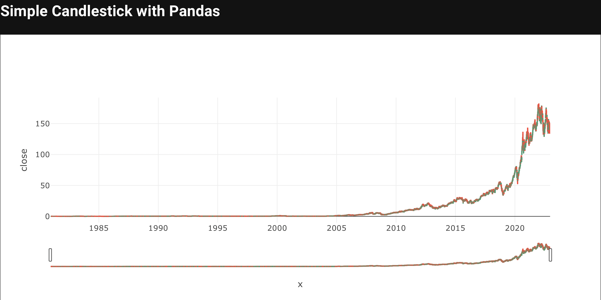
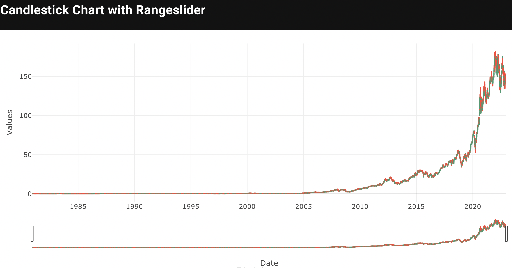
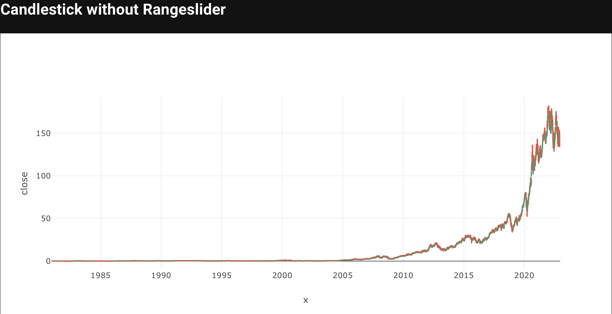
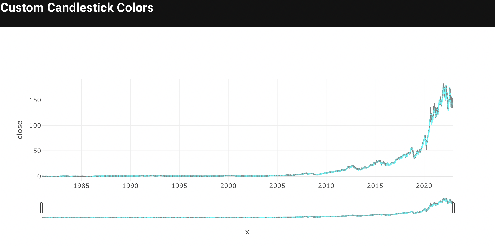
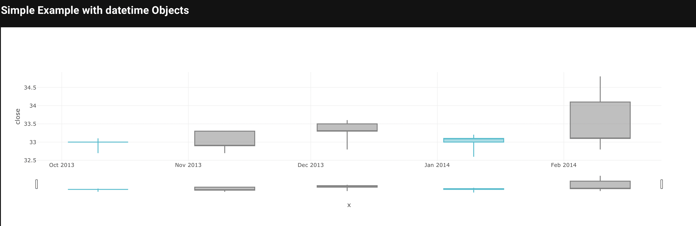

# Candlestick Chart

A variation of a bar chart in which the open and close prices are represented as the top and bottom of a rectangle surrounding a vertical line connecting the high and low prices.

## Candlestick Chart Key Parameters <a id="table"></a>
Explanation of parameters and options relevant to candlestick charts can be found [here](#table). Full details for the Taipy Chart control can be found in the Chart Control section of the [Taipy GUI User Manual](https://docs.taipy.io/en/latest/manuals/gui/viselements/chart/)

| Parameter       | Value Options             | Location           |
| --------------- | ------------------------- | ------------------ |
| Type          | "candlestick"          | Control definition |
| high,low,open,close | Values to plot | Control definition |
| rangeslider | dict of parameters in axis layout | layout |

## Simple Candlestick with Pandas

```sh
pipenv install yfinance
```

```py
from taipy.gui import Gui
import yfinance as yf
import pandas as pd

df = yf.Ticker("AAPL").history(interval="1d", period="50Y")

data = pd.DataFrame(
    {
        "x": df.index,
        "close": df["Close"],
        "high": df["High"],
        "low": df["Low"],
        "open": df["Open"],
    }
)

md = """
## Simple Candlestick with Pandas
 
<|{data}|chart|type=candlestick|x=x|close=close|open=open|low=low|high=high|>
"""

Gui(md).run()
```



## Candlestick Chart with Rangeslider

```sh
pipenv install yfinance
```

```py
from taipy.gui import Gui
import pandas as pd
import yfinance as yf

df = yf.Ticker("AAPL").history(interval="1d", period="50Y")

data = pd.DataFrame(
    {
        "x": df.index,
        "close": df["Close"],
        "high": df["High"],
        "low": df["Low"],
        "open": df["Open"],
    }
)

options = {
    "decreasing": {"line": {"color": "#7F7F7F"}},
    "increasing": {"line": {"color": "#17BECF"}},
    "line": {"color": "rgba(31,119,180,1)"},
}
layout = {
    "dragmode": "zoom",
    "margin": {"r": 10, "t": 25, "b": 40, "l": 60},
    "showlegend": False,
    "xaxis": {
        "autorange": True,
        "domain": [0, 1],
        "range": ["2017-01-03 12:00", "2017-02-15 12:00"],
        "rangeslider": {"range": ["2017-01-03 12:00", "2017-02-15 12:00"]},
        "title": "Date",
        "type": "date",
    },
    "yaxis": {
        "title": "Values",
        "autorange": True,
        "domain": [0, 1],
        "range": [114.609999778, 137.410004222],
        "type": "linear",
    },
}

md = """
## Candlestick Chart with Rangeslider
 
<|{data}|chart|type=candlestick|layout={layout}|x=x|close=close|open=open|low=low|high=high|options={options}|>
"""

Gui(md).run()
```



## Candlestick without Rangeslider

```sh
pipenv install yfinance
```

```py
from taipy.gui import Gui
import pandas as pd
import yfinance as yf

df = yf.Ticker("AAPL").history(interval="1d", period="50Y")

data = pd.DataFrame(
    {
        "x": df.index,
        "close": df["Close"],
        "high": df["High"],
        "low": df["Low"],
        "open": df["Open"],
    }
)

options = {
    "decreasing": {"line": {"color": "#7F7F7F"}},
    "increasing": {"line": {"color": "#17BECF"}},
    "line": {"color": "rgba(31,119,180,1)"},
}


layout = {
    "dragmode": "zoom",
    "showlegend": False,
    "xaxis": {
        "rangeslider": {"visible": False},
    },
}


md = """
## Simple Candlestick with Pandas
 
<|{data}|chart|type=candlestick|x=x|close=close|open=open|low=low|high=high|layout={layout}|options={options}|>
"""

Gui(md).run()
```



## Adding Customized Text and Annotations

```sh
pipenv install yfinance
```

```py
from taipy.gui import Gui
import pandas as pd
import yfinance as yf

df = yf.Ticker("AAPL").history(interval="1d", period="50Y")

data = pd.DataFrame(
    {
        "x": df.index,
        "close": df["Close"],
        "high": df["High"],
        "low": df["Low"],
        "open": df["Open"],
    }
)

options = {
    "decreasing": {"line": {"color": "#7F7F7F"}},
    "increasing": {"line": {"color": "#17BECF"}},
    "line": {"color": "rgba(31,119,180,1)"},
}


layout = {
    "title": "The Great Recession",
    "yaxis": {"title": "AAPL Stock"},
    "dragmode": "zoom",
    "showlegend": False,
    "shapes": [
        dict(
            x0="2016-12-09",
            x1="2016-12-09",
            y0=0,
            y1=1,
            xref="x",
            yref="paper",
            line_width=2,
        )
    ],
    "annotations": [
        dict(
            x="2016-12-09",
            y=0.05,
            xref="x",
            yref="paper",
            showarrow=False,
            xanchor="left",
            text="Increase Period Begins",
        )
    ],
}


md = """
## Adding Customized Text and Annotations
 
<|{data}|chart|type=candlestick|x=x|close=close|open=open|low=low|high=high|layout={layout}|options={options}|>
"""

Gui(md).run()
```


## Custom Candlestick Colors

```sh
pipenv install yfinance
```

```py
from taipy.gui import Gui
import pandas as pd
import yfinance as yf

df = yf.Ticker("AAPL").history(interval="1d", period="50Y")

data = pd.DataFrame(
    {
        "x": df.index,
        "close": df["Close"],
        "high": df["High"],
        "low": df["Low"],
        "open": df["Open"],
    }
)

options = {
    "decreasing": {"line": {"color": "gray"}},
    "increasing": {"line": {"color": "cyan"}},
}


md = """
## Custom Candlestick Colors
 
<|{data}|chart|type=candlestick|x=x|close=close|open=open|low=low|high=high|options={options}|>
"""

Gui(md).run()
```



## Simple Example with datetime Objects

```py
from taipy.gui import Gui

import pandas as pd
from datetime import datetime

open_data = [33.0, 33.3, 33.5, 33.0, 34.1]
high_data = [33.1, 33.3, 33.6, 33.2, 34.8]
low_data = [32.7, 32.7, 32.8, 32.6, 32.8]
close_data = [33.0, 32.9, 33.3, 33.1, 33.1]
dates = [
    datetime(year=2013, month=10, day=10),
    datetime(year=2013, month=11, day=10),
    datetime(year=2013, month=12, day=10),
    datetime(year=2014, month=1, day=10),
    datetime(year=2014, month=2, day=10),
]

data = pd.DataFrame(
    {
        "x": dates,
        "close": close_data,
        "high": high_data,
        "low": low_data,
        "open": open_data,
    }
)

options = {
    "decreasing": {"line": {"color": "#7F7F7F"}},
    "increasing": {"line": {"color": "#17BECF"}},
    "line": {"color": "rgba(31,119,180,1)"},
}

md = """
## Simple Example with datetime Objects
 
<|{data}|chart|type=candlestick|x=x|close=close|open=open|low=low|high=high|options={options}|>
"""

Gui(md).run()
```


