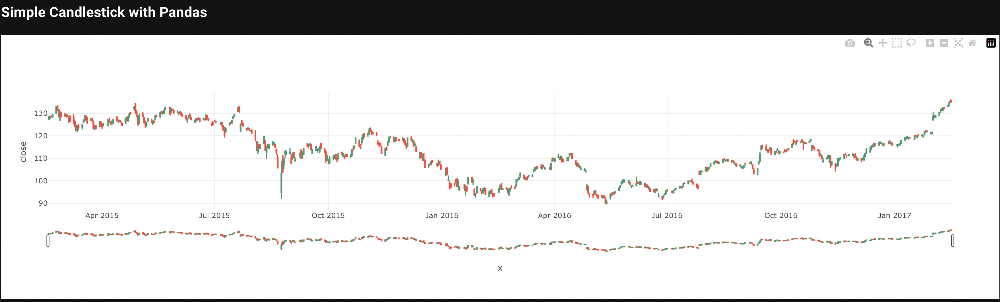
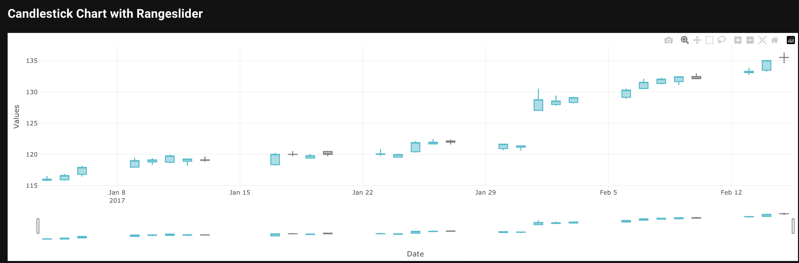
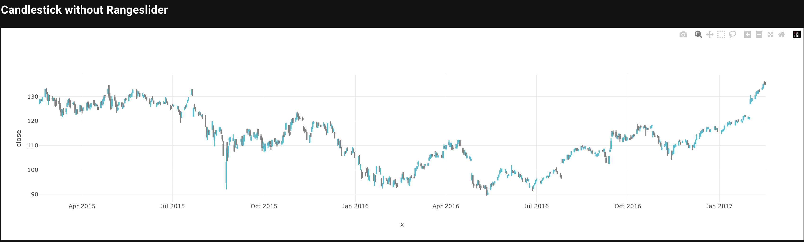
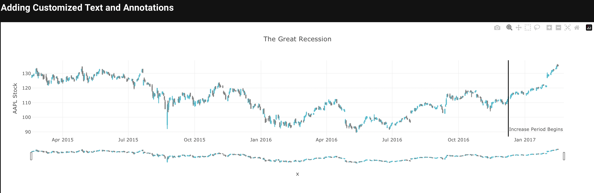
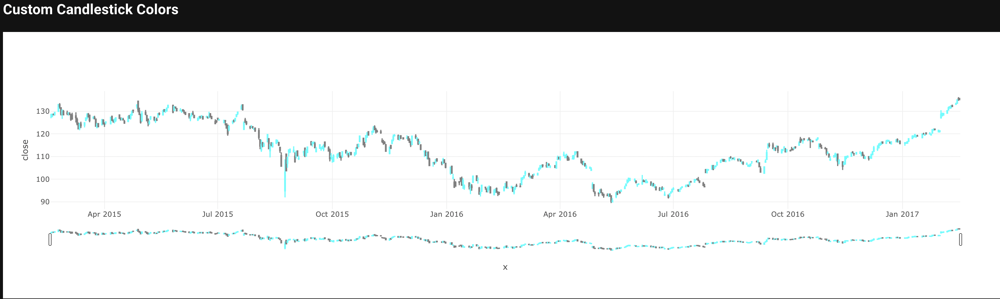
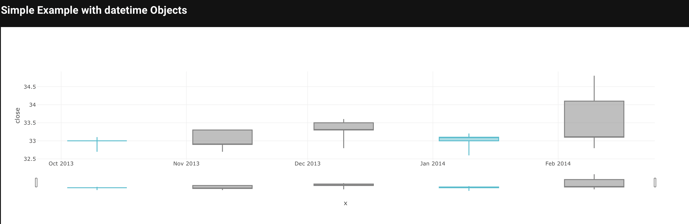

# Candlestick Chart

A variation of a bar chart in which the open and close prices are represented as the top and bottom of a rectangle surrounding a vertical line connecting the high and low prices.

## Candlestick Chart Key Parameters <a id="table"></a>
Explanation of parameters and options relevant to candlestick charts can be found [here](#table). Full details for the Taipy Chart control can be found in the Chart Control section of the [Taipy GUI User Manual](https://docs.taipy.io/en/latest/manuals/gui/viselements/chart/)

| Parameter       | Value Options             | Location           |
| --------------- | ------------------------- | ------------------ |
| Type          | "candlestick"          | Control definition |
| high,low,open,close | Values to plot | Control definition |
| rangeslider | dict of parameters in axis layout | layout |

## Simple Candlestick with Pandas

```py
from taipy.gui import Gui
import pandas as pd

df = pd.read_csv(
    "https://raw.githubusercontent.com/plotly/datasets/master/finance-charts-apple.csv"
)


data = pd.DataFrame(
    {
        "x": df["Date"],
        "close": df["AAPL.Close"],
        "high": df["AAPL.High"],
        "low": df["AAPL.Low"],
        "open": df["AAPL.Open"],
    }
)


md = """
## Simple Candlestick with Pandas
 
<|{data}|chart|type=candlestick|x=x|close=close|open=open|low=low|high=high|>
"""

Gui(md).run()
```



## Candlestick Chart with Rangeslider

```py
from taipy.gui import Gui
import pandas as pd

data = pd.DataFrame(
    {
        "x": [
            "2017-01-04",
            "2017-01-05",
            "2017-01-06",
            "2017-01-09",
            "2017-01-10",
            "2017-01-11",
            "2017-01-12",
            "2017-01-13",
            "2017-01-17",
            "2017-01-18",
            "2017-01-19",
            "2017-01-20",
            "2017-01-23",
            "2017-01-24",
            "2017-01-25",
            "2017-01-26",
            "2017-01-27",
            "2017-01-30",
            "2017-01-31",
            "2017-02-01",
            "2017-02-02",
            "2017-02-03",
            "2017-02-06",
            "2017-02-07",
            "2017-02-08",
            "2017-02-09",
            "2017-02-10",
            "2017-02-13",
            "2017-02-14",
            "2017-02-15",
        ],
        "close": [
            116.019997,
            116.610001,
            117.910004,
            118.989998,
            119.110001,
            119.75,
            119.25,
            119.040001,
            120,
            119.989998,
            119.779999,
            120,
            120.080002,
            119.970001,
            121.879997,
            121.940002,
            121.949997,
            121.629997,
            121.349998,
            128.75,
            128.529999,
            129.080002,
            130.289993,
            131.529999,
            132.039993,
            132.419998,
            132.119995,
            133.289993,
            135.020004,
            135.509995,
        ],
        "high": [
            116.510002,
            116.860001,
            118.160004,
            119.43,
            119.379997,
            119.93,
            119.300003,
            119.620003,
            120.239998,
            120.5,
            120.089996,
            120.449997,
            120.809998,
            120.099998,
            122.099998,
            122.440002,
            122.349998,
            121.629997,
            121.389999,
            130.490005,
            129.389999,
            129.190002,
            130.5,
            132.089996,
            132.220001,
            132.449997,
            132.940002,
            133.820007,
            135.089996,
            136.270004,
        ],
        "low": [
            115.75,
            115.809998,
            116.470001,
            117.940002,
            118.300003,
            118.599998,
            118.209999,
            118.809998,
            118.220001,
            119.709999,
            119.370003,
            119.730003,
            119.769997,
            119.5,
            120.279999,
            121.599998,
            121.599998,
            120.660004,
            120.620003,
            127.010002,
            127.779999,
            128.160004,
            128.899994,
            130.449997,
            131.220001,
            131.119995,
            132.050003,
            132.75,
            133.25,
            134.619995,
        ],
        "open": [
            115.849998,
            115.919998,
            116.779999,
            117.949997,
            118.769997,
            118.739998,
            118.900002,
            119.110001,
            118.339996,
            120,
            119.400002,
            120.449997,
            120,
            119.550003,
            120.419998,
            121.669998,
            122.139999,
            120.93,
            121.150002,
            127.029999,
            127.980003,
            128.309998,
            129.130005,
            130.539993,
            131.350006,
            131.649994,
            132.460007,
            133.080002,
            133.470001,
            135.520004,
        ],
    }
)

options = {
    "decreasing": {"line": {"color": "#7F7F7F"}},
    "increasing": {"line": {"color": "#17BECF"}},
    "line": {"color": "rgba(31,119,180,1)"},
}
layout = {
    "dragmode": "zoom",
    "margin": {"r": 10, "t": 25, "b": 40, "l": 60},
    "showlegend": False,
    "xaxis": {
        "autorange": True,
        "domain": [0, 1],
        "range": ["2017-01-03 12:00", "2017-02-15 12:00"],
        "rangeslider": {"range": ["2017-01-03 12:00", "2017-02-15 12:00"]},
        "title": "Date",
        "type": "date",
    },
    "yaxis": {
        "title": "Values",
        "autorange": True,
        "domain": [0, 1],
        "range": [114.609999778, 137.410004222],
        "type": "linear",
    },
}

md = """
## Candlestick Chart with Rangeslider
 
<|{data}|chart|type=candlestick|layout={layout}|x=x|close=close|open=open|low=low|high=high|options={options}|>
"""

Gui(md).run()
```



## Candlestick without Rangeslider

```py
from taipy.gui import Gui
import pandas as pd

df = pd.read_csv(
    "https://raw.githubusercontent.com/plotly/datasets/master/finance-charts-apple.csv"
)


data = pd.DataFrame(
    {
        "x": df["Date"],
        "close": df["AAPL.Close"],
        "high": df["AAPL.High"],
        "low": df["AAPL.Low"],
        "open": df["AAPL.Open"],
    }
)

options = {
    "decreasing": {"line": {"color": "#7F7F7F"}},
    "increasing": {"line": {"color": "#17BECF"}},
    "line": {"color": "rgba(31,119,180,1)"},
}


layout = {
    "dragmode": "zoom",
    "showlegend": False,
    "xaxis": {
        "rangeslider": {"visible": False},
    },
}


md = """
## Simple Candlestick with Pandas
 
<|{data}|chart|type=candlestick|x=x|close=close|open=open|low=low|high=high|layout={layout}|options={options}|>
"""

Gui(md).run()
```



## Adding Customized Text and Annotations

```py
from taipy.gui import Gui
import pandas as pd

df = pd.read_csv(
    "https://raw.githubusercontent.com/plotly/datasets/master/finance-charts-apple.csv"
)


data = pd.DataFrame(
    {
        "x": df["Date"],
        "close": df["AAPL.Close"],
        "high": df["AAPL.High"],
        "low": df["AAPL.Low"],
        "open": df["AAPL.Open"],
    }
)

options = {
    "decreasing": {"line": {"color": "#7F7F7F"}},
    "increasing": {"line": {"color": "#17BECF"}},
    "line": {"color": "rgba(31,119,180,1)"},
}


layout = {
    "title": "The Great Recession",
    "yaxis": {"title": "AAPL Stock"},
    "dragmode": "zoom",
    "showlegend": False,
    "shapes": [
        dict(
            x0="2016-12-09",
            x1="2016-12-09",
            y0=0,
            y1=1,
            xref="x",
            yref="paper",
            line_width=2,
        )
    ],
    "annotations": [
        dict(
            x="2016-12-09",
            y=0.05,
            xref="x",
            yref="paper",
            showarrow=False,
            xanchor="left",
            text="Increase Period Begins",
        )
    ],
}


md = """
## Adding Customized Text and Annotations
 
<|{data}|chart|type=candlestick|x=x|close=close|open=open|low=low|high=high|layout={layout}|options={options}|>
"""

Gui(md).run()
```



## Custom Candlestick Colors

```py
from taipy.gui import Gui
import pandas as pd

df = pd.read_csv(
    "https://raw.githubusercontent.com/plotly/datasets/master/finance-charts-apple.csv"
)


data = pd.DataFrame(
    {
        "x": df["Date"],
        "close": df["AAPL.Close"],
        "high": df["AAPL.High"],
        "low": df["AAPL.Low"],
        "open": df["AAPL.Open"],
    }
)

options = {
    "decreasing": {"line": {"color": "gray"}},
    "increasing": {"line": {"color": "cyan"}},
}


md = """
## Custom Candlestick Colors
 
<|{data}|chart|type=candlestick|x=x|close=close|open=open|low=low|high=high|options={options}|>
"""

Gui(md).run()
```



## Simple Example with datetime Objects

```py
from taipy.gui import Gui

import pandas as pd
from datetime import datetime

open_data = [33.0, 33.3, 33.5, 33.0, 34.1]
high_data = [33.1, 33.3, 33.6, 33.2, 34.8]
low_data = [32.7, 32.7, 32.8, 32.6, 32.8]
close_data = [33.0, 32.9, 33.3, 33.1, 33.1]
dates = [
    datetime(year=2013, month=10, day=10),
    datetime(year=2013, month=11, day=10),
    datetime(year=2013, month=12, day=10),
    datetime(year=2014, month=1, day=10),
    datetime(year=2014, month=2, day=10),
]

data = pd.DataFrame(
    {
        "x": dates,
        "close": close_data,
        "high": high_data,
        "low": low_data,
        "open": open_data,
    }
)

options = {
    "decreasing": {"line": {"color": "#7F7F7F"}},
    "increasing": {"line": {"color": "#17BECF"}},
    "line": {"color": "rgba(31,119,180,1)"},
}

md = """
## Simple Example with datetime Objects
 
<|{data}|chart|type=candlestick|x=x|close=close|open=open|low=low|high=high|options={options}|>
"""

Gui(md).run()
```


