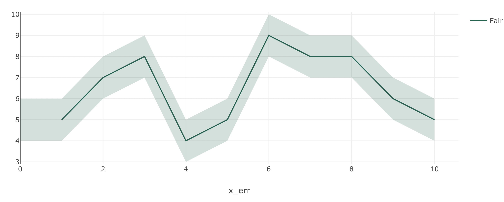
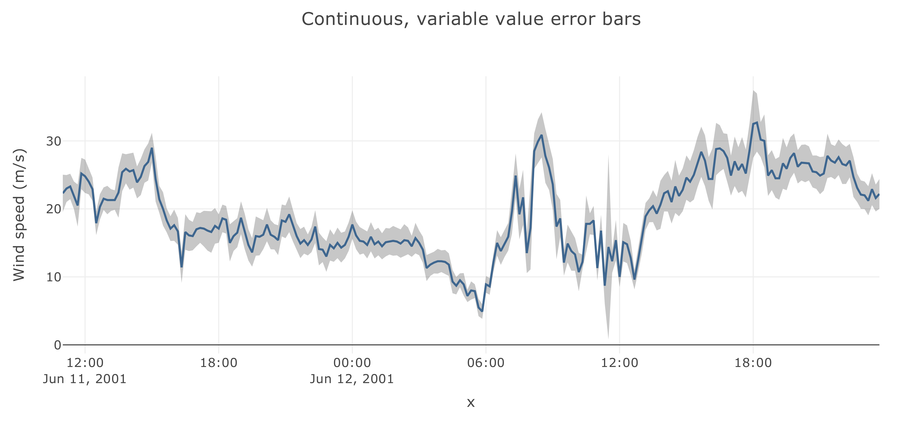

# Continuous Error Charts 
Continuous error charts show lines charts with an error area for the whole line

## Continuous Error Charts Key Parameters <a id="table"></a>
Explanation of parameters and options relevant to continuous error charts can be found [here](#table). Full details for the Taipy Chart control can be found in the Chart Control section of the [Taipy GUI User Manual](https://docs.taipy.io/en/latest/manuals/gui/viselements/chart/)

| Parameter       | Value Options             | Location           |
| --------------- | ------------------------- | ------------------ |
| type          | "scatter"          | Control definition |
| x | Values to plot | Control definition |
| y | Values to plot | Control definition |
| color | String (‘transparent’,...) | Control definition |
| fill | ["none", "tozeroy", "tozerox" , "tonexty", "tonextx", "toself", "tonext"](https://plotly.com/javascript/reference/scatter/#scatter-fill) | Options |
| fillcolor | String | Options |
| showlegend | Boolean | Options |


## Single-trace continuous error chart

```py
import pandas as pd
from taipy.gui import Gui

data = pd.DataFrame(
    {
        "x": [1, 2, 3, 4, 5, 6, 7, 8, 9, 10],
        "y1": [5, 7, 8, 4, 5, 9, 8, 8, 6, 5],
    }
)
err_data = pd.DataFrame(
    {
        "x_err": [1, 2, 3, 4, 5, 6, 7, 8, 9, 10, 10, 9, 8, 7, 6, 5, 4, 3, 2, 1],
        "y1_err": (data["y1"] + 1).tolist() + (data["y1"].iloc[::-1] - 1).tolist(),
    }
)

properties = {
    "type": "scatter",
    "x[1]": "0/x_err",
    "y[1]": "0/y1_err",
    "x[2]": "1/x",
    "y[2]": "1/y1",

    "options[1]": {
        "fill": "tozerox",
        "showlegend": False,
        "fillcolor": "rgba(0,100,80,0.2)",
    },
    "color[1]": "transparent",
    "name[1]": "Fair",

    "color[2]": "rgb(0,100,80)",
    "mode[2]": "lines",
    "name[2]": "Fair",
}


md = "<|{[err_data, data]}|chart|properties={properties}|>"

Gui(md).run()
```



## Multi-traces continuous error chart

```py
dict_1 = {
    "options[1]": {
        "fill": "tozerox",
        "showlegend": False,
        "fillcolor": "rgba(0,100,80,0.2)",
    },
    "color[1]": "transparent",
    "name[1]": "Fair",
}
dict_2 = {
    "options[2]": {
        "fill": "tozerox",
        "showlegend": False,
        "fillcolor": "rgba(0,176,246,0.2)",
    },
    "color[2]": "transparent",
    "name[2]": "Premium",
}
dict_3 = {
    "options[3]": {
        "fill": "tozerox",
        "showlegend": False,
        "fillcolor": "rgba(231,107,243,0.2)",
    },
    "color[3]": "transparent",
    "name[3]": "Fair",
}
dict_4 = {
    "color[4]": "rgb(0,100,80)",
    "mode[4]": "lines",
    "name[4]": "Fair",
}
dict_5 = {"color[5]": "rgb(0,176,246)", "mode[5]": "lines", "name[5]": "Premium"}

dict_6 = {
    "color[6]": "rgb(231,107,243)",
    "mode[6]": "lines",
    "name[6]": "Ideal",
}

data = pd.DataFrame(
    {
        "x": [1, 2, 3, 4, 5, 6, 7, 8, 9, 10],
        "y1": [5, 7, 8, 4, 5, 9, 8, 8, 6, 5],
        "y2": [1, 2, 3, 4, 4, 6, 7, 8, 9, 10],
        "y3": [7, 8, 9, 6, 5, 4, 7, 4, 3, 1],
    }
)
err_data = pd.DataFrame(
    {
        "x_err": [1, 2, 3, 4, 5, 6, 7, 8, 9, 10, 10, 9, 8, 7, 6, 5, 4, 3, 2, 1],
        "y1_err": (data["y1"] + 1).tolist() + (data["y1"].iloc[::-1] - 1).tolist(),
        "y2_err": (data["y2"] + 1).tolist() + (data["y2"].iloc[::-1] - 1).tolist(),
        "y3_err": (data["y3"] + 1).tolist() + (data["y3"].iloc[::-1] - 1).tolist(),
    }
)


properties = {
    "type": "scatter",
    "x[1]": "0/x_err",
    "x[2]": "0/x_err",
    "x[3]": "0/x_err",
    "y[1]": "0/y1_err",
    "y[2]": "0/y2_err",
    "y[3]": "0/y3_err",
    "x[4]": "1/x",
    "x[5]": "1/x",
    "x[6]": "1/x",
    "y[4]": "1/y1",
    "y[5]": "1/y2",
    "y[6]": "1/y3",
}

properties.update(dict_1)
properties.update(dict_2)
properties.update(dict_3)
properties.update(dict_4)
properties.update(dict_5)
properties.update(dict_6)


md = "<|{[err_data, data]}|chart|properties={properties}|>"
```


## Asymmetric Error Bars with a Constant Offset

```py
df = pd.read_csv(
    "https://raw.githubusercontent.com/plotly/datasets/master/wind_speed_laurel_nebraska.csv"
)

dict_1 = {
    "name[1]": "Measurement",
    "options[1]": {
        "line": {
            "color": "rgb(31, 119, 180)",
        },
    },
}

dict_2 = {
    "name[2]": "Upper Bound",
    "options[2]": {
        "line": {
            "width": 0,
        },
    },
    "color[2]": "transparent",
}

dict_3 = {
    "name[3]": "Lower Bound",
    "options[3]": {
        "marker": {"color": "#444"},
        "line": {
            "width": 0,
        },
        "fillcolor": "rgba(68, 68, 68, 0.3)",
        "fill": "tonexty",
    },
    "color[3]": "transparent",
}

trace1 = {
    "x": df["Time"],
    "y": df["10 Min Sampled Avg"],
}


trace2 = {
    "x": df["Time"],
    "y": df["10 Min Sampled Avg"] + df["10 Min Std Dev"],
}


trace3 = {
    "x": df["Time"],
    "y": df["10 Min Sampled Avg"] - df["10 Min Std Dev"],
}


data = [
    pd.DataFrame(trace1),
    pd.DataFrame(trace2),
    pd.DataFrame(trace3),
]


layout = {
    "showlegend": False,
    "hovermode": "x",
    "title": "Continuous, variable value error bars",
    "yaxis": {"title": "Wind speed (m/s)"},
}

properties = {
    "type": "scatter",
    "mode": "lines",
}

properties.update(dict_1)
properties.update(dict_2)
properties.update(dict_3)

md = "<|{data}|chart|properties={properties}|layout={layout}|>"
```




