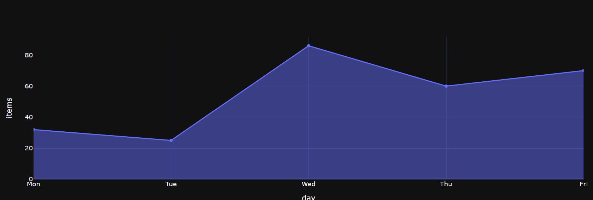
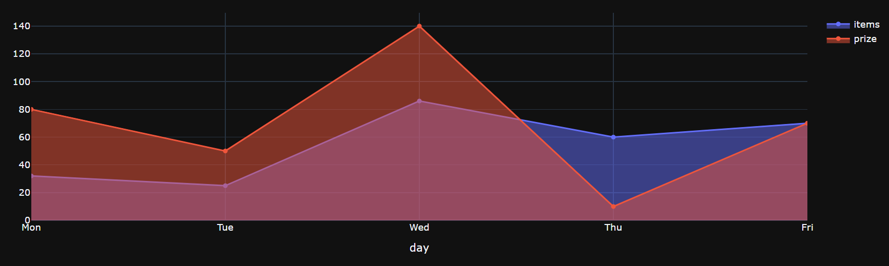
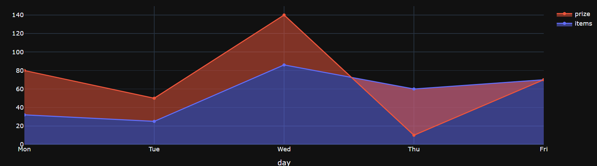
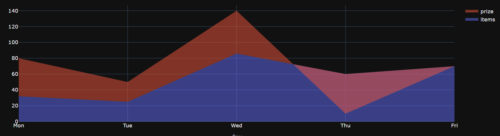
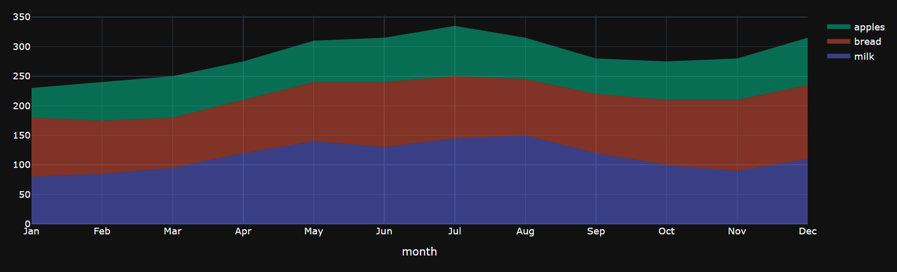
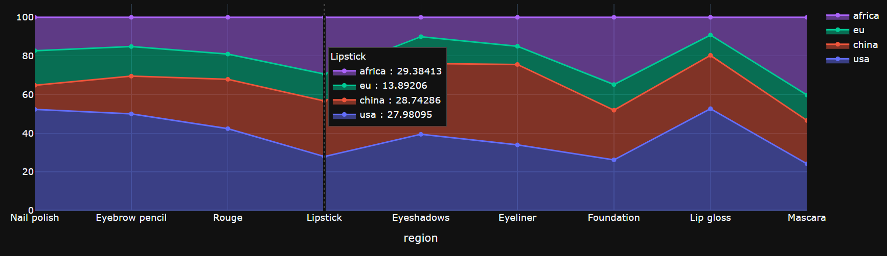
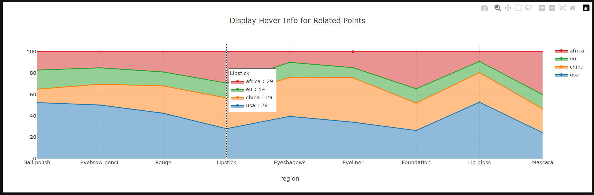

## Filled Area Charts

An area chart displays a solid colored area between the traces of a graph.

You can create a filled plot by using a scatter chart type, and specifying the fill option of the chart options dictionary.

This value can be one of "none", "tozeroy", "tozerox" , "tonexty", "tonextx", "toself", and "tonext", as indicated in the [Plotly documentation](https://plotly.com/javascript/reference/scatter/#scatter-fill "Scatter fill").

### Simple example
The simplest example is where you have a single dataset to represent.

Here is how we can represent the number of items sold every weekday:
```py
options = {"fill":"tozeroy"}
 
data = {
  "day": ['Mon', 'Tue','Wed','Thu','Fri'],
  "items": [32, 25, 86, 60, 70],
 }
```
!!! example "Page content"

    === "Markdown"

        ```
        <|{data}|chart|x=day|y=items|type=scatter|options={options}|>
        ```
  
    === "HTML"

        ```html
        <taipy:chart type="scatter" x="day" y="items" options="options">{data}</taipy:chart>
        ```
<figure>
    
    
    <figcaption>Simple example</figcaption>
</figure>
### Overlay of Area Charts
With above example, we want to add one more trace to visualize the total price (x 1000$) per day.

```py
options = {"fill":"tozeroy"}
 
data = {
  "day": ['Mon', 'Tue','Wed','Thu','Fri'],
  "items": [32, 25, 86, 60, 70],
  "prize": [80, 50, 140, 10, 70],
 }
```
!!! example "Page content"

    === "Markdown"

        ```
        <|{data}|chart|x=day|y[1]=items|y[2]=prize|type=scatter|options={options}|>
        ```
  
    === "HTML"

        ```html
        <taipy:chart type="scatter" x="day" y[1]="items" y[2]="prize" options="options">{data}</taipy:chart>
        ```
<figure>
    
    
    <figcaption>Overlay of Area Charts</figcaption>
</figure>
It is not perfect, isn't it. So we have to define 2 types of fill option for "items" and "prize"

```py
opts_item = {"fill": "tozeroy"}
opts_prize = {"fill": "tonexty"}
```
!!! example "Page content"

    === "Markdown"

        ```
        <|{data}|chart|x=day|y[1]=items|y[2]=prize|type=scatter|options[1]={opts_item}|options[2]={opts_prize}|>
        ```
  
    === "HTML"

        ```html
        <taipy:chart type="scatter" x="day" y[1]="items" y[2]="prize" options[1]="opts_item" options[2]="opts_prize">{data}</taipy:chart>
        ```
<figure>
    
    
    <figcaption>Overlay of Area Charts with different options</figcaption>
</figure>
Great, it is better now, however we don't want to see the lines. Just add mode "none" to the chart.
!!! example "Page content"

    === "Markdown"

        ```
        <|{data}|chart|x=day|y[1]=items|y[2]=prize|type=scatter|mode=none|options[1]={opts_item}|options[2]={opts_prize}|>
        ```
  
    === "HTML"

        ```html
        <taipy:chart type="scatter" x="day" y[1]="items" y[2]="prize" options[1]="opts_item" options[2]="opts_prize" mode="none">{data}</taipy:chart>
        ```
<figure>
    
    
    <figcaption>Overlay of Area Charts without boundary lines</figcaption>
</figure>
### Stacked Area Chart
A stacked area chart is a variation of an area chart. It visualized the evolution of multiple data series (value of several groups) over time.

This example will show the income (x 1000$) of each products per month.

```py
opts_milk = {"stackgroup": "one"}
opts_bread = {"stackgroup": "one"}
opts_apple = {"stackgroup": "one"}

data = {
    "month": ["Jan", "Feb", "Mar", "Apr", "May", "Jun", "Jul", "Aug", "Sep", "Oct", "Nov", "Dec"],
    "milk": [80, 85, 95, 120, 140, 130, 145, 150, 120, 100, 90, 110],
    "bread": [100, 90, 85, 90, 100, 110, 105, 95, 100, 110, 120, 125],
    "apples": [50, 65, 70, 65, 70, 75, 85, 70, 60, 65, 70, 80],
}
```
!!! example "Page content"

    === "Markdown"

        ```
        <|{data}|chart|x=month|y[1]=milk|y[2]=bread|y[3]=apples|type=scatter|mode=none|options[1]={opts_milk}|options[2]={opts_bread}|options[3]={opts_apple}|>
        ```
  
    === "HTML"

        ```html
        <taipy:chart type="scatter" x="month" y[1]="milk" y[2]="bread" y[3]="apples" options[1]="opts_milk" options[2]="opts_bread" options[3]="opts_apple" mode="none">{data}</taipy:chart>
        ```
<figure>
    
    
    <figcaption>Stacked Area Chart</figcaption>
</figure>
### Normalized Stacked Area Chart

A percentage stacked area chart is very close to a classic stacked area chart. However, values are normalised to make in sort that the sum of each group is 100 at each position on the X axis.

Now we want to show the ratio of cosmetic products sales between each regions.
```py
opts_usa = {"stackgroup": "one", "groupnorm": "percent"}
opts_china = {"stackgroup": "one"}
opts_eu = {"stackgroup": "one"}
opts_africa = {"stackgroup": "one"}

data = {
    "region": ["Nail polish", "Eyebrow pencil", "Rouge", "Lipstick", "Eyeshadows", "Eyeliner", "Foundation", "Lip gloss", "Mascara"],
    'usa': [12814, 13012, 11624, 8814, 12998, 12321, 10342, 22998, 11261],
    'china': [3054, 5067, 7004, 9054, 12043, 15067, 10119, 12043, 10419],
    'eu': [4376, 3987, 3574, 4376, 4572, 3417, 5231, 4572, 6134],
    'africa': [4229, 3932, 5221, 9256, 3308, 5432, 13701, 4008, 18712],
}

layout={
    # Show all value of cosmetic products when hovering on a region
    'hovermode': 'x unified',
}
```
!!! example "Page content"

    === "Markdown"

        ```
        <|{data}|chart|x=region|y[1]=usa|y[2]=china|y[3]=eu|y[4]=africa|type=scatter|options[1]={opts_usa}|options[2]={opts_china}|options[3]={opts_eu}|options[4]={opts_africa}|layout={layout}|>
        ```
  
    === "HTML"

        ```html
        <taipy:chart type="scatter" x="region" y[1]="usa" y[2]="china" y[3]="eu" y[4]="africa" options[1]="opts_usa" options[2]="opts_china" options[3]="opts_eu" options[4]="opts_africa" layout="layout">{data}</taipy:chart>
        ```
<figure>
    
    
    <figcaption>Normalized Stacked Area Chart</figcaption>
</figure>