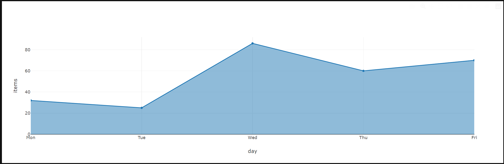
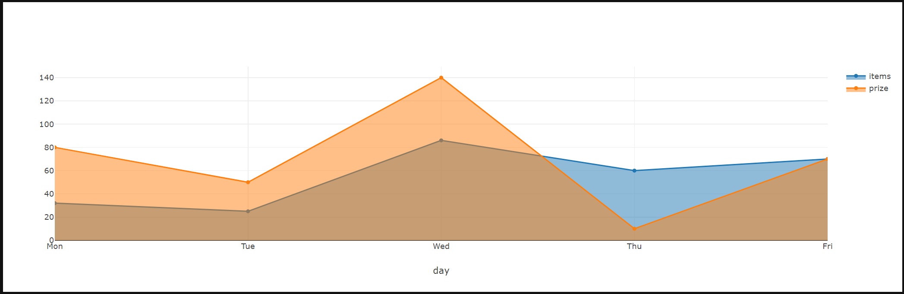
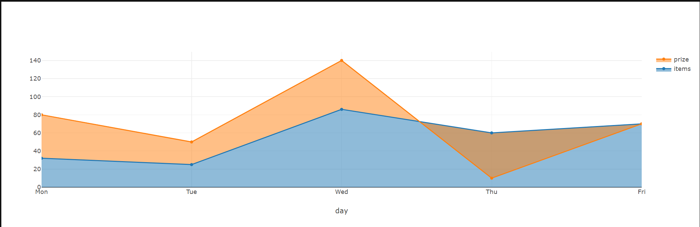
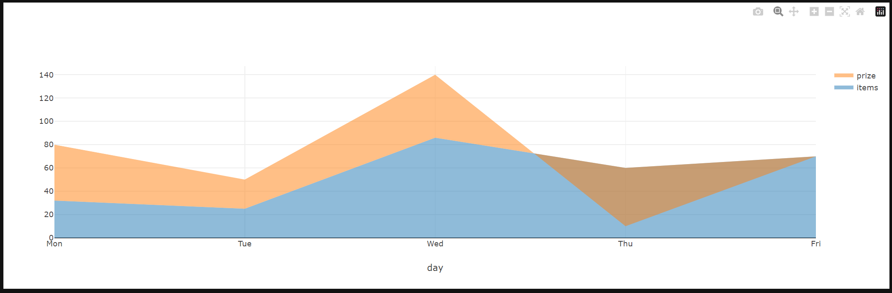
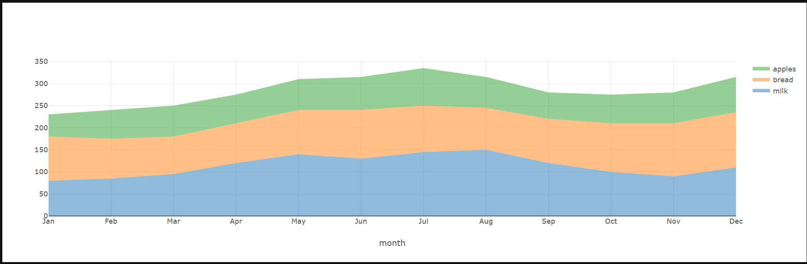

## Filled Area Plots

An area chart displays a solid color between the traces of a graph. It is an option on scatter charts. Areas will be filled according to the ‘fill’ option ("none", "tozeroy", "tozerox" , "tonexty", "tonextx", "toself", and "tonext")

### Simple example
This example shows the number of sold items per day (The shop closes on Weekend :) ).
```py

from taipy.gui import Gui
import pandas as pd
 
options = {"fill":"tonextx"}
 
data = {
  "day": ['Mon', 'Tue','Wed','Thu','Fri'],
  "items": [32, 25, 86, 60, 70],
 }
 
 
md = "<|{data}|chart|x=day|y=items|type=scatter|options={options}|>"
 
Gui(md).run()
```


### Basic Overlaid Area Chart
With above example, we want to add one more trace to visualize the total price (x 1000$) per day.

```py

from taipy.gui import Gui
import pandas as pd
 
options = {"fill":"tonextx"}
 
data = {
  "day": ['Mon', 'Tue','Wed','Thu','Fri'],
  "items": [32, 25, 86, 60, 70],
  "prize": [80, 50, 140, 10, 70],
 }
 
 
md = "<|{data}|chart|x=day|y[1]=items|y[2]=prize|type=scatter|options={options}|>"
 
Gui(md).run()
```


It is not perfect, isn't it. So we have to define 2 types of fill option for "items" and "prize"

```py

from taipy.gui import Gui
import pandas as pd
 
optionsItem = {"fill": "tozeroy"}
optionsPrize = {"fill": "tonexty"}
 
data = {
  "day": ['Mon', 'Tue','Wed','Thu','Fri'],
  "items": [32, 25, 86, 60, 70],
  "prize": [80, 50, 140, 10, 70],
 }
 
 
md = "<|{data}|chart|x=day|y[1]=items|y[2]=prize|type=scatter|options[1]={optionsItem}|options[2]={optionsPrize}|>"
 
Gui(md).run()
```


Great, it is better now, however we don't want to see the lines.
```py
from src.taipy.gui import Gui
import pandas as pd

optionsItem = {"fill": "tozeroy"}
optionsPrize = {"fill": "tonexty"}

mode = "none"

data = {
    "day": ['Mon', 'Tue', 'Wed', 'Thu', 'Fri'],
    "items": [32, 25, 86, 60, 70],
    "prize": [80, 50, 140, 10, 70],
}


md = "<|{data}|chart|x=day|y[1]=items|y[2]=prize|type=scatter|mode={mode}|options[1]={optionsItem}|options[2]={optionsPrize}|>"

Gui(md).run()
```


### Stacked Area Chart
```py
from src.taipy.gui import Gui
import pandas as pd

options4Milk = {"stackgroup": "one"}
options4Bread = {"stackgroup": "one"}
options4Apples = {"stackgroup": "one"}

mode = "none"

data = {
    "month": ["Jan", "Feb", "Mar", "Apr", "May", "Jun", "Jul", "Aug", "Sep", "Oct", "Nov", "Dec"],
    "milk": [80, 85, 95, 120, 140, 130, 145, 150, 120, 100, 90, 110],
    "bread": [100, 90, 85, 90, 100, 110, 105, 95, 100, 110, 120, 125],
    "apples": [50, 65, 70, 65, 70, 75, 85, 70, 60, 65, 70, 80],
}


md = "<|{data}|chart|x=month|y[1]=milk|y[2]=bread|y[3]=apples|type=scatter|mode={mode}|options[1]={options4Milk}|options[2]={options4Bread}|options[3]={options4Apples}|>"

Gui(md).run()
```
