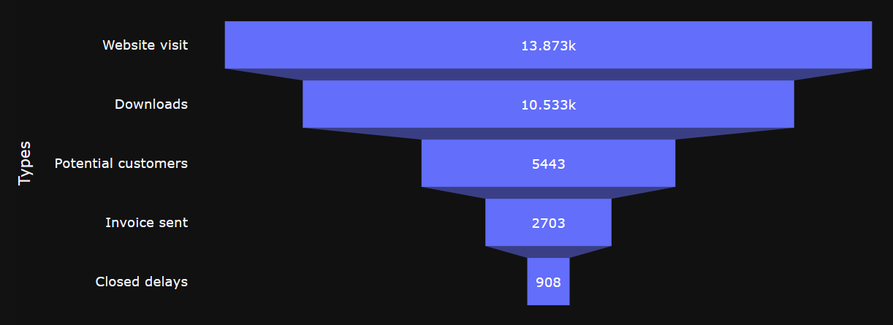
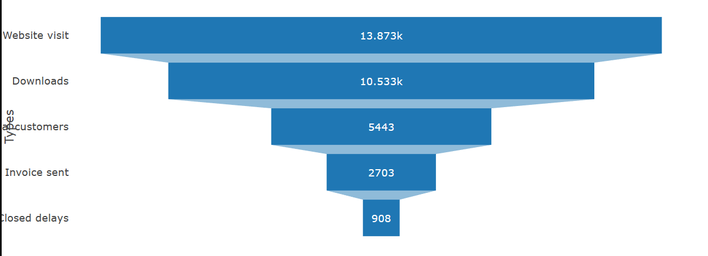
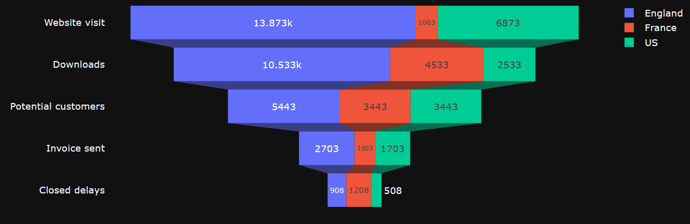
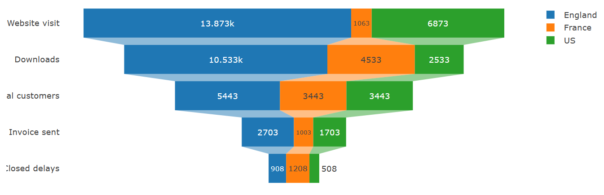
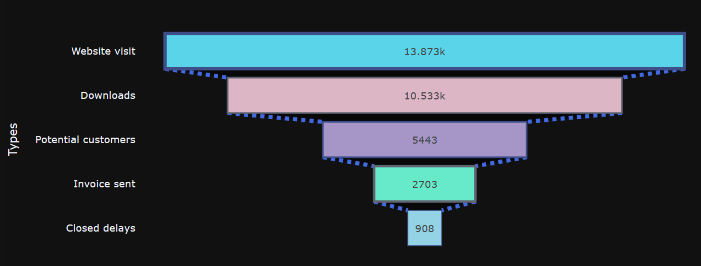
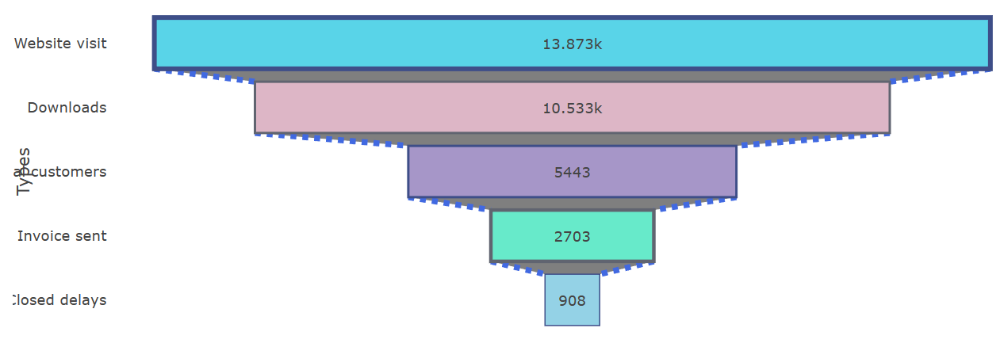
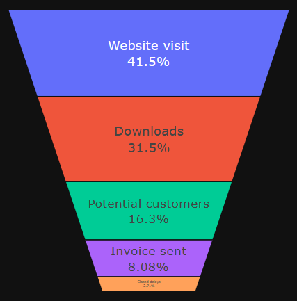
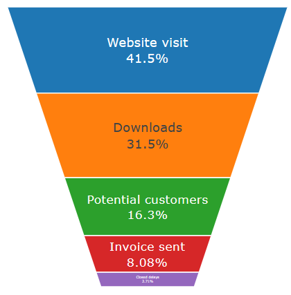
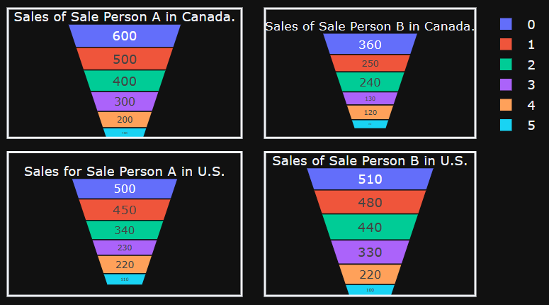
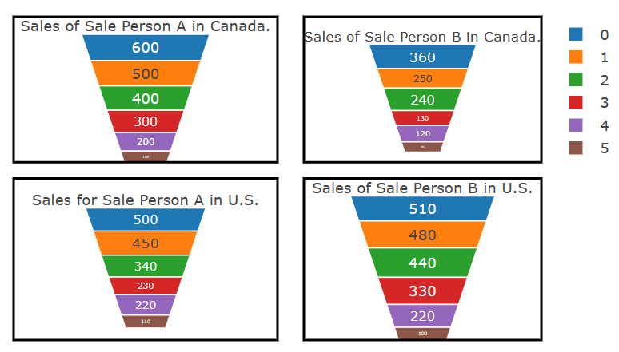

## Funnel charts

Funnel charts represent a succession of values correlated between each other according to a certain order.

### Typical use of headmaps
- The data is sequential and moves through at least 4 stages. If you have less than 4, you can use pie chart or stacked bar chart.
- The number of "items" in the first stage is expected to be greater than the number in the final stage.
- To calculate potential (revenue/sales/deals/etc.) by stages.
- To calculate and track conversion and retention rates.
- To reveal bottlenecks in a linear process.
- To track a shopping cart workflow.
- To track the progress and success of click-through advertising/marketing campaigns.
- And more

In order to create a funnel chart in Taipy, you must set the property type of the chart control to "funnel".
### Basic Funnel chart

Here is an example of how to use a visits funnel that counts number of visits through stages: "Website visit" > "Downloads" > "Potential customers" > "Invoice sent" > "Closed delays".

```py
data = {
        "Visits": [13873, 10533, 5443, 2703, 908],
        "Types": ["Website visit", "Downloads", "Potential customers", "Invoice sent", "Closed delays"],
    }
```
- The main value is referenced by x property, in this example, we focus on the number of visits.
- The axis label is referenced by y property.

!!! example "Page content"

    === "Markdown"

        ```
        <|{data}|chart|x=Visits|y=Types|type=funnel|>
        ```
  
    === "HTML"

        ```html
        <taipy:chart type="funnel" x="Visits" y="Types">{data}</taipy:chart>
        ```
<figure>
    
    
    <figcaption>Basic Funnel chart</figcaption>
</figure>

### Funnel chart with multi traces

With above example, we want to know where the number of visits comes from. 
We assume that the visits come from England, France and US. So we create data for each country.
```py
data = {
        # Data for England
        "Visit_fr_eng": [13873, 10533, 5443, 2703, 908],
        # Data for France
        "Visit_fr_fra": [7063, 4533, 3443, 1003, 1208],
        # Data for US
        "Visit_fr_us": [6873, 2533, 3443, 1703, 508],
        "Types": ["Website visit", "Downloads", "Potential customers", "Invoice sent", "Closed delays"],
    }
```
- x[index] stands for each country data.
- y for the type that we want to filter
- name[index] is the label of each country that is shown on the chart.
!!! example "Page content"

    === "Markdown"

        ```
        <|{data}|chart|x[1]=Visit_fr_eng|x[2]=Visit_fr_fra|x[3]=Visit_fr_us|y=Types|name[1]=England|name[2]=France|name[3]=US|type=funnel|>
        ```
  
    === "HTML"

        ```html
        <taipy:chart type="funnel" x[1]="Visit_fr_fra" x[2]="Visit_fr_eng" x[3]="Visit_fr_us" y="Types" name[1]="England" name[2]="France" name[3]="US">{data}</taipy:chart>
        ```
<figure>
    
    
    <figcaption>Funnel chart with multi traces</figcaption>
</figure>

### Funnel chart with custom markers

For the first example, we want something colorful, so we put some custom markers into Taipy chart.

```py
marker = {
    # We define colors for each type: "Website visit", "Downloads", "Potential customers", "Invoice sent" and "Closed delays". We have 5 types, so we have to define 5 items for each attribute.
    "color": ["59D4E8", "DDB6C6", "A696C8", "67EACA", "94D2E6"],
    # This is the border around the rectangle of each type
    "line": {
        # The border width
        "width": [4, 2, 2, 3, 1],
        # The border color
        "color": ["3E4E88", "606470", "3E4E88", "606470", "3E4E88"]
    }
}

options= {
    # the connector is the line between 2 rectangles, yes, we can change its'styles too.
    "connector": {
        "line": {
            "color": "royalblue",
            "dash": "dot",
            "width": 5
        }
    }
}
```
!!! example "Page content"

    === "Markdown"

        ```
        <|{data}|chart|x=Visits|y=Types|type=funnel|marker={marker}|options={options}|>
        ```
  
    === "HTML"

        ```html
        <taipy:chart type="funnel" x="Visits" y="Types" marker="marker" options="options">{data}</taipy:chart>
        ```
<figure>
    
    
    <figcaption>Funnel chart with custom markers</figcaption>
</figure>

### Funnel Area Chart

A funnel area chart is a specialized chart type that demonstrates the flow of users through a business or sales process. The chart takes its name from its shape, which starts from a broad head and ends in a narrow neck. The percentage at each stage of the process are indicated from the funnel’s width as it narrows.

We want to apply this chart type to the first example, just change a little bit in Taipy params
```py
# We don't need the legend because we replace y axis by "text" already
layout = {"funnelmode": "stack", "showlegend": False}
```
In Funnel Area chart, we use values and text instead of x and y properties.
!!! example "Page content"

    === "Markdown"

        ```
        <|{data}|chart|type=funnelarea|values=Visits|text=Types|layout={layout}|>
        ```
  
    === "HTML"

        ```html
        <taipy:chart type="funnelarea" values="Visits" text="Types" layout="layout">{data}</taipy:chart>
        ```
<figure>
    
    
    <figcaption>Funnel Area chart</figcaption>
</figure>

### Multi Funnel Area Chart

We can show a number of Funnel Area in a same place, in this example is 4. But we don't prefer to do that, because you have to calculate the position.

```py
# We prepare data for Sale A and B in each country US and Canada
data = {
    "SalesA_us": [500, 450, 340, 230, 220, 110],
    "SalesA_cad": [600, 500, 400, 300, 200, 100],
    "SalesB_us": [510, 480, 440, 330, 220, 100],
    "SalesB_cad": [360, 250, 240, 130, 120, 60],
}
# We define the title and location for each chart
option1 = {
    "scalegroup": "first",
    "textinfo": "value", 
    "title": {
        "position": "top center", 
        "text": "Sales for Sale Person A in U.S."
    },
    "domain": {"x": [0, 0.5], "y": [0, 0.5]}
}
option2 = {
    "scalegroup": "first",
    "textinfo": "value",
    "title": {
        "position": "top center",
        "text": "Sales of Sale Person A in Canada."
    },
    "domain": {"x": [0, 0.5], "y": [0.55, 1]}
}
option3 = {
    "scalegroup": "second",
    "textinfo": "value",
    "title": {
        "position": "top center",
        "text": "Sales of Sale Person B in U.S."
    },
    "domain": {"x": [0.55, 1], "y": [0, 0.5]}
}
option4 = {
    "scalegroup": "second",
    "textinfo": "value",
    "title": {
        "position": "top center",
        "text": "Sales of Sale Person B in Canada."
    },
    "domain": {"x": [0.55, 1], "y": [0.55, 1]}
}
# We create a rectangle to cover the chart.
layout = {"width": 600, "shapes": [
    {"x0": 0, "x1": 0.5, "y0": 0, "y1": 0.5},
    {"x0": 0, "x1": 0.5, "y0": 0.55, "y1": 1},
    {"x0": 0.55, "x1": 1, "y0": 0, "y1": 0.5},
    {"x0": 0.55, "x1": 1, "y0": 0.55, "y1": 1}]}
```
!!! example "Page content"

    === "Markdown"

        ```
        <|{data}|chart|type=funnelarea|values[1]=SalesA_us|options[1]={option1}|values[2]=SalesA_cad|options[2]={option2}|values[3]=SalesB_us|options[3]={option3}|values[4]=SalesB_cad|options[4]={option4}|layout={layout}|>
        ```
  
    === "HTML"

        ```html
        <taipy:chart type="funnelarea" values[1]="SalesA_us" options[1]="option1" values[2]="SalesA_cad" options[2]="option2" values[3]="SalesB_us" options[3]="option3" values[4]="SalesB_cad" options[4]="option4" layout="layout">{data}</taipy:chart>
        ```
<figure>
    
    
    <figcaption>Multi Funnel Area Chart</figcaption>
</figure>
