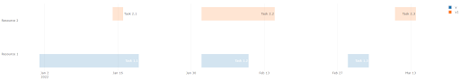

## Gantt charts

Although real Gantt charts are not supported by Plotly, there are ways to display horizontal bar charts with different starting points that can look like a Gantt chart.

### Simple Gantt like chart

Using a horizontal bar chart with different starting points will look like a Gantt chart.
- _type_ property is set to "bar".
- _orientation_ property is set to "h" or "horizontal".

Different resources are displayed by different traces in the same chart.

Here is an example where we represent two resources' tasks, based on the same
_x_ timeline axis:

- The tasks start dates are represented by the _base_ values on the _x_ axis (type is date or datetime ).
- The tasks durations are represented by the _x_ values on the _x_ axis (type is date or datetime). 
  The _x_ values are specified as a time duration ie a date where 0 is January 1st 1970 ie `date(1970, 1, 1)`. for example to specify a duration of 2 days, one would set the value to date(1970, 1, 3)
- The resources names are represented by the _y_ values. To keep the tasks on the same horizontal line, the _y_ value should be the same.
- The tasks names can by specified by the _text_ or _label_ property.

```py
data = pd.DataFrame({
  "x": [dt.date(1970, 1, 20), dt.date(1970, 1, 10), dt.date(1970, 1, 5)],
  "y": ["Resource 1", "Resource 1", "Resource 1"],
  "label": ["Task 1.1", "Task 1.2", "Task 1.3"],
  "base": [dt.date(2022, 1, 1), dt.date(2022, 2, 1), dt.date(2022, 3, 1)],

  "x1": [dt.date(1970, 1, 3), dt.date(1970, 1, 15), dt.date(1970, 1, 5)],
  "y1": ["Resource 2", "Resource 2", "Resource 2"],
  "base1": [dt.date(2022, 1, 15), dt.date(2022, 2, 1), dt.date(2022, 3, 10)],
  "label1": ["Task 2.1", "Task 2.2", "Task 2.3"]
})
```

The chart definition looks like this:

!!! example "Page content"

    === "Markdown"

        ```
        <|{data}|chart|type=bar|orientation=h|x[1]=x|y[1]=y|base[1]=base|text[1]=label|x[2]=x1|y[2]=y1|base[2]=base1|text[2]=label1|>
        ```
  
    === "HTML"

        ```html
        <taipy:chart type="bar" orientation="h" x[1]="x" y[1]="y" base[1]="base" text[1]="label" x[2]="x1" y[2]="y1" base[2]="base1" text[2]="label1">{data}</taipy:chart>
        ```

And the resulting chart is:



