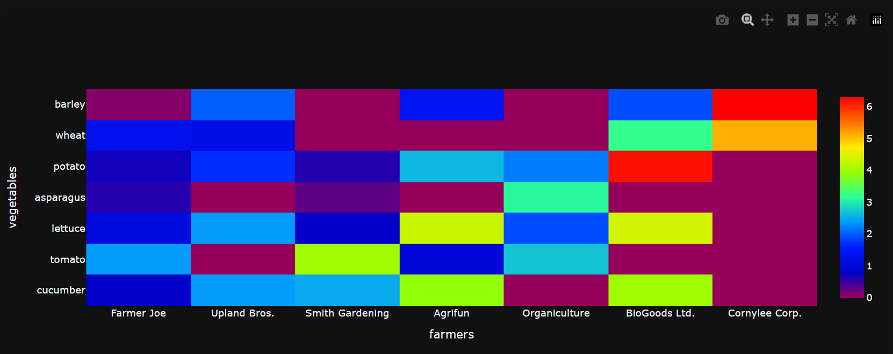
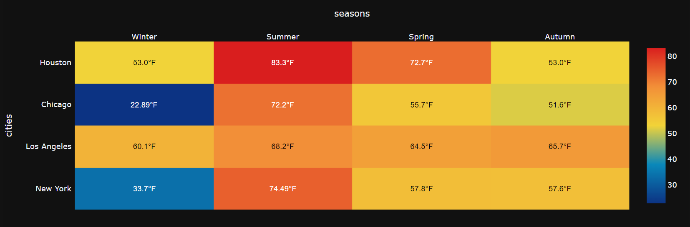
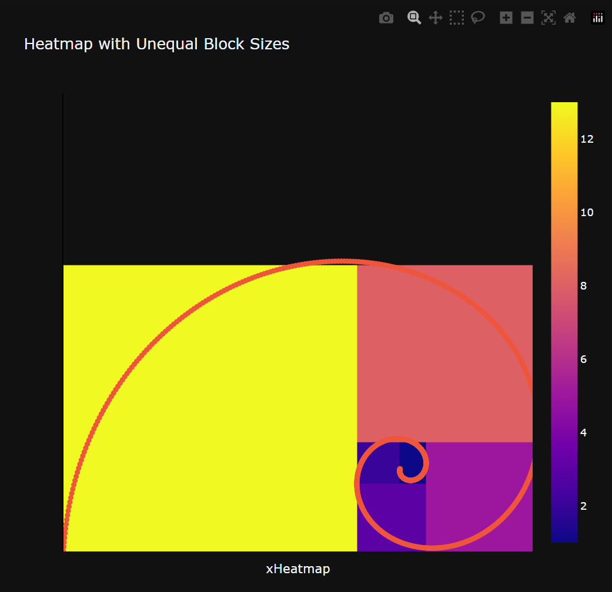

## Heatmap charts

A heatmap depicts values for a main variable of interest across two axis variables as a grid of colored squares. The axis variables are divided into ranges like a bar chart or histogram, and each cell’s color indicates the value of the main variable in the corresponding cell range.

### Typical use of headmaps
- To show user behavior on specific webpages.
- To display the magnitude of a data set over two dimensions.
- In retail matrix, manufacturing diagram, and population maps.
- For marketing goals and analytics, reflecting on user behavior on specific webpages.
- And more

### Basic Heatmap
Actually, a 'Basic Heatmap' is used to show some value based on two axis.
This example displays a heatmaps that represents the temperature of XXXX for each given YYY
```py
data = {
    "temperature": [[10, 20, 30, 50], [20, 10, 60, 40], [30, 60, 10, 60], [20, 30, 50, 20]],
    "city": ["City A", "City B", "City C", "City D"],
    "season": ["Winter", "Summer", "Spring", "Autumn"]
}
```
!!! example "Page content"

    === "Markdown"

        ```
        <|{data}|chart|z=temperature|x=city|y=season|type=heatmap|>
        ```
  
    === "HTML"

        ```html
        <taipy:chart type="heatmap" z="temperature" x="city" y="season" options="options">{data}</taipy:chart>
        ```
<figure>
    
    
    <figcaption>Basic Heatmap</figcaption>
</figure>

### Heatmap with Categorical Axis Labels
In the following example, we have an array which defines the data (harvest by different farmers in tons/year) to color code. We then also need two lists of names of farmers and vegetables cultivated by them.
```py
data = [
    pd.DataFrame({
        'harvest': [
            [0.8, 2.4, 2.5, 3.9, 0.0, 4.0, 0.0],
            [2.4, 0.0, 4.0, 1.0, 2.7, 0.0, 0.0],
            [1.1, 2.4, 0.8, 4.3, 1.9, 4.4, 0.0],
            [0.6, 0.0, 0.3, 0.0, 3.1, 0.0, 0.0],
            [0.7, 1.7, 0.6, 2.6, 2.2, 6.2, 0.0],
            [1.3, 1.2, 0.0, 0.0, 0.0, 3.2, 5.1],
            [0.1, 2.0, 0.0, 1.4, 0.0, 1.9, 6.3]
        ],
        'vegetables': ["cucumber",
                       "tomato",
                       "lettuce",
                       "asparagus",
                       "potato",
                       "wheat",
                       "barley"]
    }),
    pd.DataFrame({
        'farmers': ["Farmer Joe",
                    "Upland Bros.",
                    "Smith Gardening",
                    "Agrifun",
                    "Organiculture",
                    "BioGoods Ltd.",
                    "Cornylee Corp."],
    })
]
options = {'colorscale': 'Rainbow'}
```
!!! example "Page content"

    === "Markdown"

        ```
        <|{data}|chart|type=heatmap|z=0/harvest|x=1/farmers|y=0/vegetables|options={options}|>
        ```
  
    === "HTML"

        ```html
        <taipy:chart type="heatmap" z="0/harvest" x="1/farmers" y="0/vegetables" options="options">{data}</taipy:chart>
        ```
<figure>
    
    
    <figcaption>Heatmap with Categorical Axis Labels</figcaption>
</figure>

### Annotated Heatmap
You may want to display the actual value that is represented, at the appropriate location in the heatmap.

This example creates a heatmap that represents the temperature (in Fahrenheit) for different locations, in different seasons.
```py
data = [
    pd.DataFrame({
        'temperature': [
                            [33.7, 74.49, 57.8, 57.6],
                            [60.1, 68.2, 64.5, 65.7],
                            [22.89, 72.2, 55.7, 51.6],
                            [53.0, 83.3, 72.7, 53.0],
                        ],
        'cities': ['New York', 'Los Angeles', 'Chicago', 'Houston']
    }),
    pd.DataFrame({
        'seasons': ['Winter', 'Summer', 'Spring', 'Autumn'],
    })
]

options = {'colorscale': 'Portland'}

layout = {
    'annotations': [],
    'xaxis': {
        'ticks': '',
        'side': 'top'
    },
    'yaxis': {
        'ticks': '',
        'ticksuffix': ' ',
        'width': 700,
        'height': 700,
        'autosize': False
    }
}

for i in range(len(cities)):
  for j in range(len(seasons)):
    currentValue = temperature[i][j]
    if (currentValue < 40 or currentValue > 70):
        textColor = 'white'
    else:
        textColor = 'black'
    result = {
        'xref': 'x1',
        'yref': 'y1',
        'x': seasons[j],
        'y': cities[i],
        'text': str(temperature[i][j]) + '°F',
        'font': {
            'family': 'Arial',
            'size': 12,
            'color': textColor
        },
        'showarrow': False
    }
    layout['annotations'].append(result)
```
!!! example "Page content"

    === "Markdown"

        ```
        <|{data}|chart|type=heatmap|z=0/temperature|x=1/seasons|y=0/cities|options={options}|layout={layout}|>
        ```
  
    === "HTML"

        ```html
        <taipy:chart type="heatmap" z="0/temperature" x="1/seasons" y="0/cities" options="options" layout="layout">{data}</taipy:chart>
        ```
<figure>
    
    
    <figcaption>Annotated Heatmap</figcaption>
</figure>

### Heatmap with Unequal Block Sizes

```py
from taipy.gui import Gui
import numpy as np
import pandas as pd

# Data for the heatmap
phi = (1 + np.sqrt(5)) / 2.  # golden ratio
xe = [0, 1, 1 + (1 / (phi**4)), 1 + (1 / (phi**3)), phi]
ye = [0, 1 / (phi**3), 1 / phi**3 + 1 / phi**4, 1 / (phi**2), 1]

z = [
        [13, 3, 3, 5 ],
        [13, 2, 1, 5],
        [13, 10, 11, 12],
        [13, 8, 8, 8]
     ]

# Data for the spiral
def spiral(th):
    a = 1.120529
    b = 0.306349
    r = a * np.exp(-b * th)
    return (r * np.cos(th), r * np.sin(th))

theta = np.linspace(-np.pi / 13, 4 * np.pi, 1000)  # angle
(x, y) = spiral(theta)

data = [
    pd.DataFrame({
        'zHeatmap': z,
    }),
    pd.DataFrame({
        'xHeatmap': np.sort(xe),
        'yHeatmap': np.sort(ye)
    }),
    pd.DataFrame({
        'xTrace': -x + x[0],
        'yTrace': y - y[0],
    })
]

axisTemplate = {
    'range': [0, 1.6],
    'autorange': False,
    'showgrid': False,
    'zeroline': False,
    'linecolor': 'black',
    'showticklabels': False,
    'ticks': ''
}

layout = {
    'title': 'Heatmap with Unequal Block Sizes',
    'xaxis': axisTemplate,
    'yaxis': axisTemplate,
    'showlegend': False,
    'with': 700,
    'height': 700,
    'autosize': False
}

# Everything with index [1] is for heatmap
# Everything with index [2] is for scatter
md = """
## Annotated Heatmap
<|{data}|chart|type[1]=heatmap|z[1]=0/zHeatmap|x[1]=1/xHeatmap|y[1]=1/yHeatmap|layout={layout}|type[2]=scatter|x[2]=2/xTrace|y[2]=2/yTrace|>
"""

Gui(md).run()
```

!!! example "Page content"

    === "Markdown"

        ```
       <|{data}|chart|type[1]=heatmap|z[1]=0/zHeatmap|x[1]=1/xHeatmap|y[1]=1/yHeatmap|layout={layout}|type[2]=scatter|x[2]=2/xTrace|y[2]=2/yTrace|>
        ```
  
    === "HTML"

        ```html
        <taipy:chart type[1]="heatmap" z[1]="0/zHeatmap" x[1]="1/xHeatmap" y[1]="1/yHeatmap" layout="layout" type[2]="scatter" x[2]="2/xTrace" y[2]="2/yTrace">{data}</taipy:chart>
        ```
<figure>
    
    
    <figcaption>Heatmap with Unequal Block Sizes</figcaption>
</figure>
