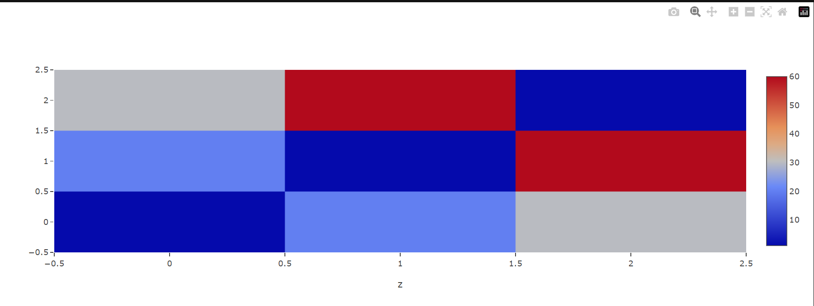
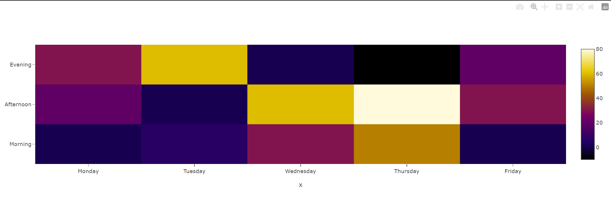
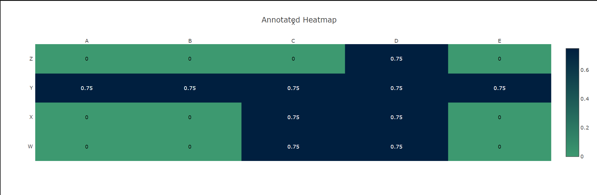

## Heatmap charts

A heatmap depicts values for a main variable of interest across two axis variables as a grid of colored squares. The axis variables are divided into ranges like a bar chart or histogram, and each cell’s color indicates the value of the main variable in the corresponding cell range.

### When to Use?
- To show user behavior on specific webpages.
- To display the magnitude of a data set over two dimensions.
- In retail matrix, manufacturing diagram, and population maps.
- For marketing goals and analytics, reflecting on user behavior on specific webpages.
- And more

### Basic Heatmap
```py
from taipy.gui import Gui

data = {
    "z": [[1, 20, 30], [20, 1, 60], [30, 60, 1]],
  }

md = """
## Basic Heatmap
<|{data}|chart|z=z|type=heatmap|>
"""

Gui(md).run()
```


### Heatmap with Categorical Axis Labels
```py
from taipy.gui import Gui
import pandas as pd

data = [
    pd.DataFrame({
        'z': [
            [0.8, 2.4, 2.5, 3.9, 0.0, 4.0, 0.0],
            [2.4, 0.0, 4.0, 1.0, 2.7, 0.0, 0.0],
            [1.1, 2.4, 0.8, 4.3, 1.9, 4.4, 0.0],
            [0.6, 0.0, 0.3, 0.0, 3.1, 0.0, 0.0],
            [0.7, 1.7, 0.6, 2.6, 2.2, 6.2, 0.0],
            [1.3, 1.2, 0.0, 0.0, 0.0, 3.2, 5.1],
            [0.1, 2.0, 0.0, 1.4, 0.0, 1.9, 6.3]
        ],
        'y': ["cucumber",
              "tomato",
              "lettuce",
              "asparagus",
              "potato",
              "wheat",
              "barley"]
    }),
    pd.DataFrame({
        'x': ["Farmer Joe",
              "Upland Bros.",
              "Smith Gardening",
              "Agrifun",
              "Organiculture",
              "BioGoods Ltd.",
              "Cornylee Corp."],
    })
]

options = {'colorscale': 'Electric'}

md = """
## Heatmap with Categorical Axis Labels
<|{data}|chart|type=heatmap|z=0/z|x=1/x|y=0/y|options={options}|>
"""

Gui(md).run()
```


### Annotated Heatmap
```py
from taipy.gui import Gui
import pandas as pd


xValues = ['A', 'B', 'C', 'D', 'E']

yValues = ['W', 'X', 'Y', 'Z']

zValues = [
    [0.00, 0.00, 0.75, 0.75, 0.00],
    [0.00, 0.00, 0.75, 0.75, 0.00],
    [0.75, 0.75, 0.75, 0.75, 0.75],
    [0.00, 0.00, 0.00, 0.75, 0.00]
]

colorscaleValue = [
    [0, '#3D9970'],
    [1, '#001f3f']
]

data = [
    pd.DataFrame({
        'z': zValues,
        'y': yValues
    }),
    pd.DataFrame({
        'x': xValues,
    })
]

options = {'colorscale': colorscaleValue}

layout = {
    'title': 'Annotated Heatmap',
    'annotations': [],
    'xaxis': {
        'ticks': '',
        'side': 'top'
    },
    'yaxis': {
        'ticks': '',
        'ticksuffix': ' ',
        'width': 700,
        'height': 700,
        'autosize': False
    }
}

for i in range(len(yValues)):
  for j in range(len(xValues)):
    currentValue = zValues[i][j]
    if (currentValue != 0.0):
        textColor = 'white'
    else:
        textColor = 'black'
    result = {
      'xref': 'x1',
      'yref': 'y1',
      'x': xValues[j],
      'y': yValues[i],
      'text': zValues[i][j],
      'font': {
        'family': 'Arial',
        'size': 12,
        'color': 'rgb(50, 171, 96)'
      },
      'showarrow': False,
      'font': {
        'color': textColor
      }
    }
    layout['annotations'].append(result)
  
md = """
## Annotated Heatmap
<|{data}|chart|type=heatmap|z=0/z|x=1/x|y=0/y|options={options}|layout={layout}|>
"""

Gui(md).run()
```

