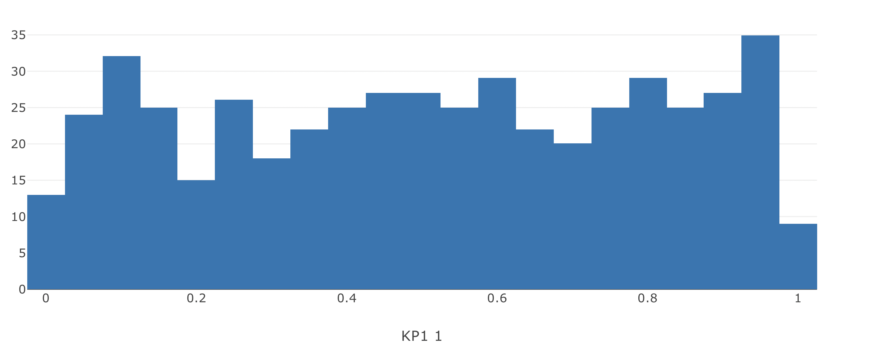
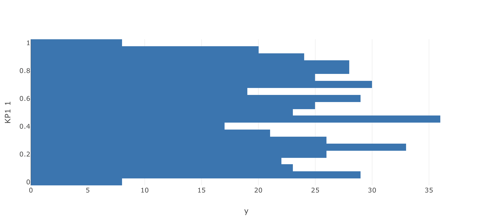
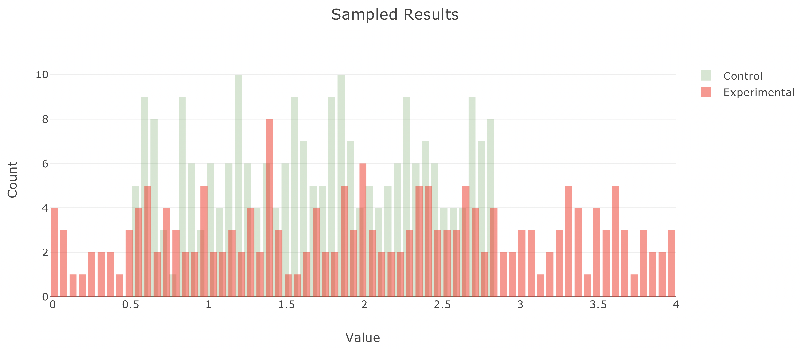
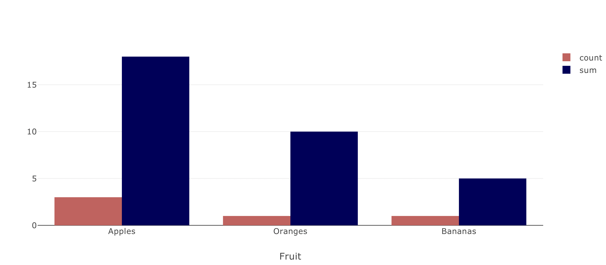
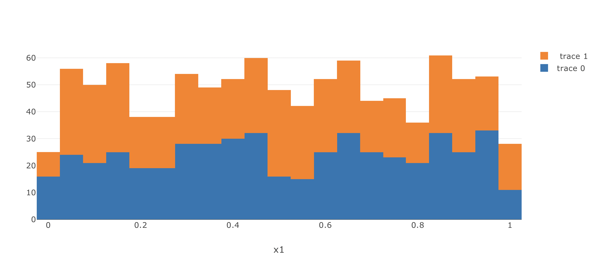
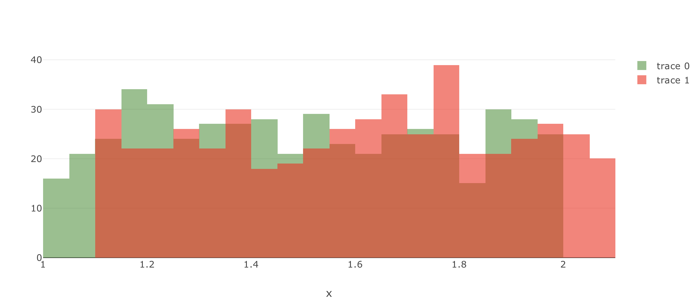
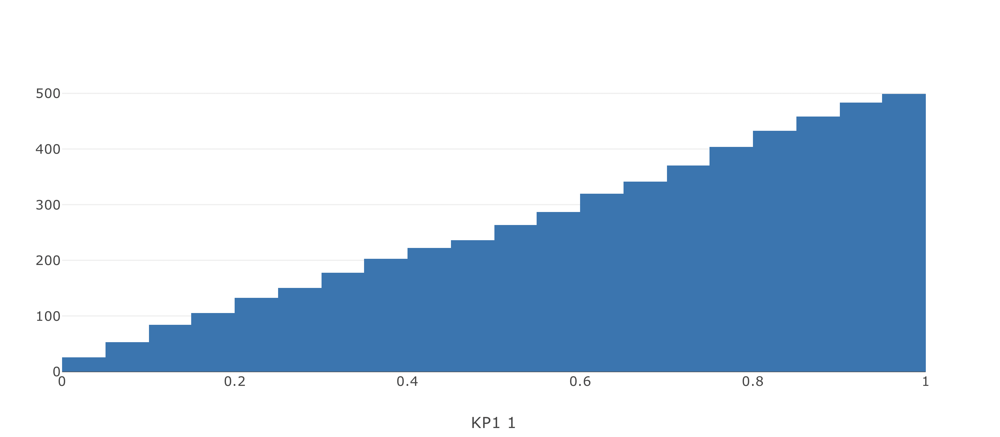
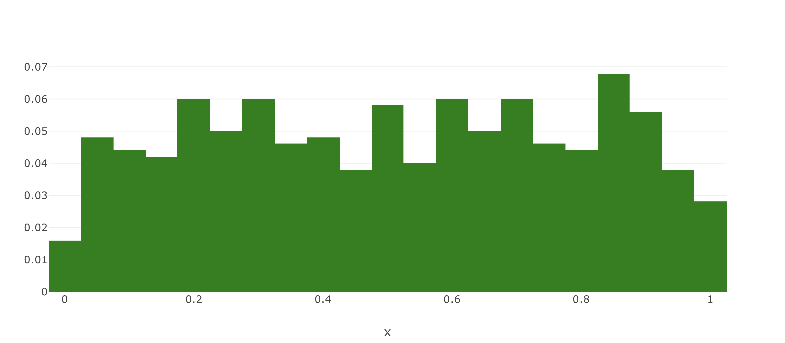

# Histograms

A histogram is a graphical representation that arranges a group of data into user-
specified ranges. Similar to a bar graph, the histogram converts a data series into
an easily interpreted visual by taking many data points and grouping them into
logical ranges or bins.

## Histogram Chart Key Parameters <a id="table"></a>
Explanation of parameters and options relevant to histograms can be found [here](#table). Full details for the Taipy Chart control can be found in the Chart Control section of the [Taipy GUI User Manual](https://docs.taipy.io/en/latest/manuals/gui/viselements/chart/)

| Parameter       | Value Options             | Location           |
| --------------- | ------------------------- | ------------------ |
| barmode          | stack.overlay          | layout |
| nbinsx          | number of bins          | options |
| histfunc          | sum,count,max …          | options |
| xaxis, yaxis | dict | layout

## Basic Histogram Chart

```py
from taipy import Gui
import random
import pandas as pd

x = [random.random() for i in range(500)]
data = pd.DataFrame({"x": x})

layout = {"xaxis": {"title": "KP1 1"}}

page = """
<|{data}|chart|type=histogram|x=x|layout={layout}|>
"""

Gui(page=page).run()
```



## Horizontal Histogram Chart

```py
y = [random.random() for i in range(500)]
data = pd.DataFrame({"y": y})

layout = {"yaxis": {"title": "KP1 1"}}

page = """
<|{data}|chart|type=histogram|y=y|layout={layout}|>
"""
```



## Colored and Styled Histogram Chart

```py
x1 = [random.random() * 5 for i in range(500)]
x2 = [random.random() * 10 for i in range(500)]
y1 = [random.random() for i in range(500)]
y2 = [random.random() * 2 for i in range(500)]

trace1 = pd.DataFrame({"x": x1, "y": y1})
opts1 = {
    "name": "control",
    "autobinx": False,
    "histnorm": "count",
    "xbins": {"end": 2.8, "size": 0.06, "start": 0.5},
    "opacity": 0.2,
}
trace2 = pd.DataFrame({"x": x2, "y": y2})

opts2 = {
    "autobinx": False,
    "xbins": {"end": 4, "size": 0.06, "start": -3.2},
    "opacity": 0.5,
}

data = [trace1, trace2]
layout = {
    "bargap": 0.05,
    "bargroupgap": 0.2,
    "barmode": "overlay",
    "title": "Sampled Results",
    "xaxis": {"title": "Value"},
    "yaxis": {"title": "Count"},
}
props = {
    "color[1]": "green",
    "color[2]": "red",
    "options[1]": opts1,
    "options[2]": opts2,
    "name[1]": "Control",
    "name[2]": "Experimental",
}
page = """
<|{data}|chart|type=histogram|properties={props}|layout={layout}|>
"""
```



## Specify Binning Function

```py
x = ["Apples", "Apples", "Apples", "Oranges", "Bananas"]
y = ["5", "10", "3", "10", "5"]

data = [
    pd.DataFrame(
        {
            "x": x,
            "y": y,
        }
    ),
    pd.DataFrame(
        {
            "x": x,
            "y": y,
        }
    ),
]
opts1 = {"histfunc": "count"}
opts2 = {"histfunc": "sum"}
layout = {"xaxis": {"title": "Fruit"}}

page = """
<|{data}|chart|x[1]=0/x|x[2]=1/x|y[1]=0/y|y[2]=1/y|type=histogram|color[1]=#cd5c5c|\
color[2]=#00005c|name[1]=count|name[2]=sum|options[1]={opts1}|options[2]={opts2}|\
layout={layout}|>
"""
```



## Stacked Histogram Chart

```py
x1 = [random.random() for i in range(500)]
x2 = [random.random() for i in range(500)]


data = [pd.DataFrame({"x1": x1}), pd.DataFrame({"x2": x2})]
print(data)
layout = {"barmode": "stack"}

page = """
<|{data}|chart|type=histogram|x[1]=0/x1|x[2]=1/x2|name[1]=trace 0|\
name[2]= trace 1|layout={layout}|>
"""
```



## Overlaid Histogram

```py
x1 = [random.random() + 1 for i in range(500)]
x2 = [random.random() + 1.1 for i in range(500)]

trace1 = pd.DataFrame(
    {
        "x": x1,
    }
)

opts1 = {
    "opacity": 0.5,
    "marker": {"color": "green"},
}
trace2 = pd.DataFrame(
    {
        "x": x2,
    }
)

opts2 = {
    "opacity": 0.6,
    "marker": {"color": "red"},
}

data = [trace1, trace2]

layout = {
    "barmode": "overlay",
}
props = {
    "options[1]": opts1,
    "options[2]": opts2,
}
page = """
<|{data}|chart|type=histogram|properties={props}|layout={layout}|>
"""
```



## Cumulative Histogram

```py
x = [random.random() for i in range(500)]
data = pd.DataFrame({"x": x})

options = {
    "cumulative": {"enabled": True},
}

layout = {"xaxis": {"title": "KP1 1"}}

page = """
<|{data}|chart|type=histogram|x=x|layout={layout}|options={options}|>
"""
```



## Normalized Histogram

```py
x = [random.random() for i in range(500)]
data = pd.DataFrame({"x": x})

options = {
    "histnorm": "probability",
    "marker": {"color": "green"},
}

page = """
<|{data}|chart|type=histogram|x=x|layout={layout}|options={options}|>
"""
```

