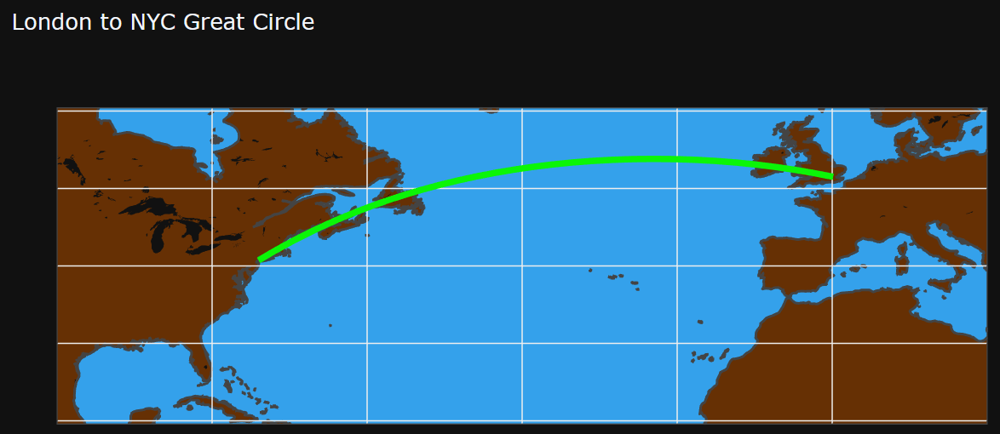
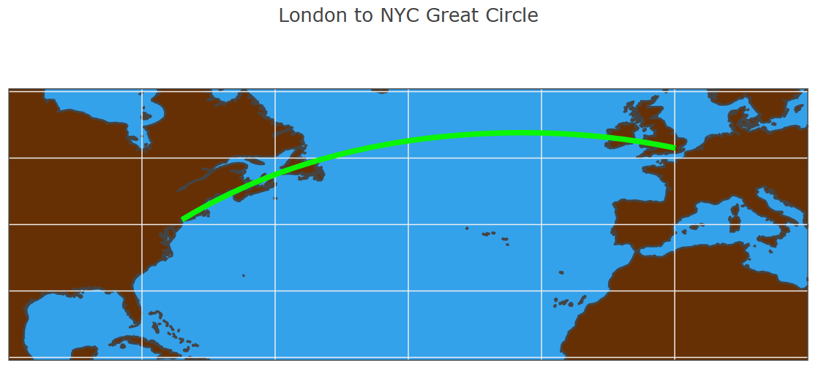
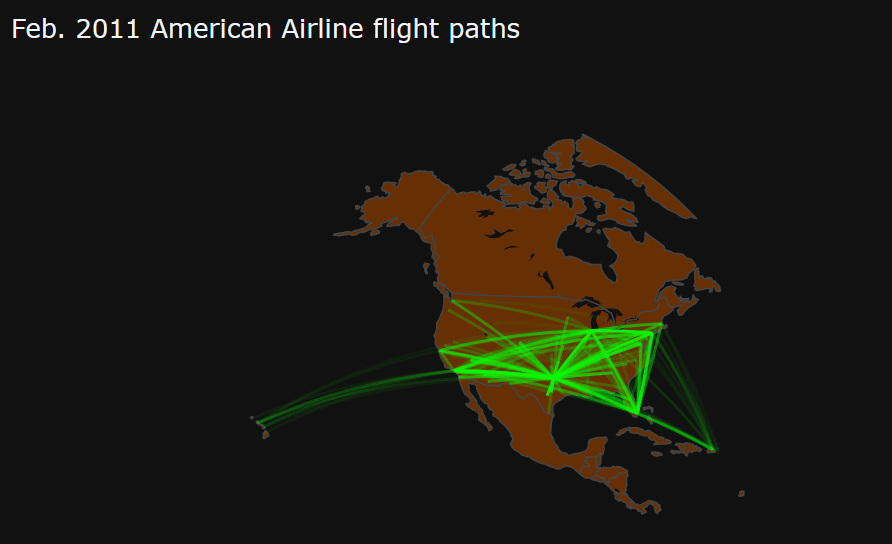
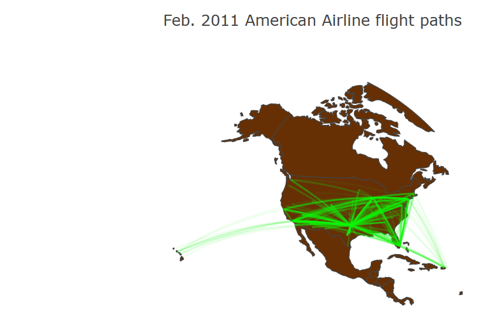
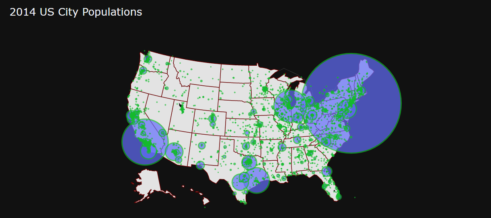
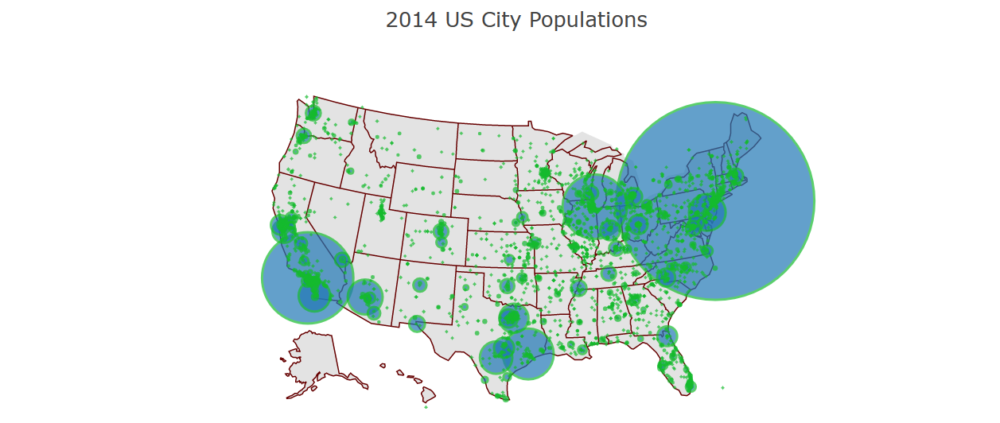

### Maps with lines

Lines on maps can show distance between geographic points or be contour lines (isolines, isopleths, or isarithms).

In this example, we create a line between New York City and London.

```py
# First, we define start and end points
data = {
    "lat": [40.7127, 51.5072], # start latitude, end latitude
    "lon": [-74.0059, 0.1275],  # start longitude, end longitude
}

layout = {
    "title": "London to NYC Great Circle",
    "showlegend": False,
    # Configuration to show a map on the chart
    "geo": {
        "resolution": 50,
        "showland": True,
        "showocean": True,
        "landcolor": "663004",
        "oceancolor": "34a1eb",
        "projection": {
            "type": "equirectangular"
        },
        "coastlinewidth": 2,
        "lataxis": {
            "range": [20, 60],
            "showgrid": True,
            "tickmode": "linear",
            "dtick": 10
        },
        "lonaxis": {
            "range": [-100, 20],
            "showgrid": True,
            "tickmode": "linear",
            "dtick": 20
        }
    }
}
# Style the connect line.
lineOpts = {
    "width": 5,
    "color": "0bf507"
}
```

About geo configuration in layout, you can check [here](https://plotly.com/javascript/reference/layout/geo/#layout-geo)

!!! example "Page content"

    === "Markdown"

        ```
        <|{data}|chart|type=scattergeo|mode=lines|lat=lat|lon=lon|line={lineOpts}|layout={layout}|>
        ```

    === "HTML"

        ```html
        <taipy:chart type="scattergeo" mode="lines" lat="lat" lon="lon" line="lineOpts" layout="layout">{data}</taipy:chart>
        ```

<figure>
    
    
    <figcaption>Maps with lines</figcaption>
</figure>

### US Flight Paths Map

OK, now we come to a complex example, we will visualize the flight paths of American Airline on 02/2011  

```py
data = pd.read_csv(
    "https://raw.githubusercontent.com/plotly/datasets/c34aaa0b1b3cddad335173cb7bc0181897201ee6/2011_february_aa_flight_paths.csv")
data["opacity_value"] = data["cnt"].apply(lambda r: r / data["cnt"].max())

df = []
for i, d in data.iterrows():
    df.append(pd.DataFrame(
        {
            "lat": [d["start_lat"], d["end_lat"]],
            "lon": [d["start_lon"], d["end_lon"]]
        }
    ))

props = {}
for i in range(len(data)):
    props[f"lat[{i+1}]"] = f"{i}/lat"
    props[f"lon[{i+1}]"] = f"{i}/lon"

for i, d in data.iterrows():
    props[f"options[{i+1}]"] = {"opacity": d["opacity_value"]}

lineOpts = {"width": 2, "color": "0bf507"}

layout = {
    "title": "Feb. 2011 American Airline flight paths",
    "geo": {
        "scope": "north america",
        "projection": {
            "type": "azimuthal equal area"
        },
        "showland": True,
        "landcolor": "663004",
    },
    "showlegend": False
}
```

So instead of defining a sing line properties by long and lat like the above example, we can put all "long and lat" in "properties" and the magic happens

!!! example "Page content"

    === "Markdown"

        ```
        <|{df}|chart|type=scattergeo|mode=lines|line={lineOpts}|layout={layout}|properties={props}|>
        ```

    === "HTML"

        ```html
        <taipy:chart type="scattergeo" mode="lines" properties="props" line="lineOpts" layout="layout">{df}</taipy:chart>
        ```
<figure>
    
    
    <figcaption>US Flight Paths Map</figcaption>
</figure>

### Maps with Bubbles

Maps with bubbles can associate quantities with geographic location

We will use this chart to visualize the populations of all cities in US in 2014.

```py
data = pandas.read_csv("https://raw.githubusercontent.com/plotly/datasets/master/2014_us_cities.csv")
scale = 50000
data["citysize"] = data["pop"].apply(lambda p: p / scale)
data["hovertext"] = data.apply(lambda r: f"{r["name"]} pop {r["pop"]}", axis=1)

opts = {
    "locationmode": "USA-states",
    "hoverinfo": "text",
}
# We define bubble size based on city size
marker_opt = {
    "size": "citysize",
    "line": {
        "color": "14ba2d",
        "width": 2
    }
}

layout = {
    "title": "2014 US City Populations",
    "showlegend": False,
    "geo": {
        "scope": "usa",
        "projection": {
            "type": "albers usa"
        },
        "showland": True,
        "landcolor": "e3e3e3",
        "subunitwidth": 1,
        "countrywidth": 1,
        "subunitcolor": "660000"
    },
}
```

!!! example "Page content"

    === "Markdown"

        ```
        <|{data}|chart|type=scattergeo|mode=lines|lat=lat|lon=lon|line={lineOpts}|layout={layout}|>
        ```

    === "HTML"

        ```html
        <taipy:chart type="scattergeo" mode="lines" lat="lat" lon="lon" line="lineOpts" layout="layout">{data}</taipy:chart>
        ```

We can see top crowed cities: New York, Los Angeles and Chicago

<figure>
    
    
    <figcaption>Maps with bubbles</figcaption>
</figure>
