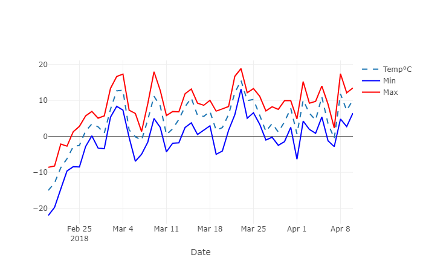
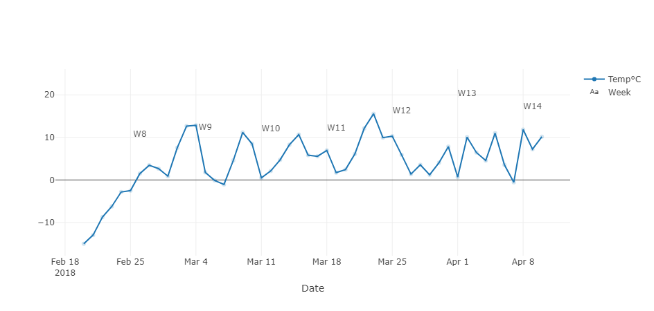

## Line charts

Line plots are a widely-used representation that connects distinct
data points, showing trends.

The [Basics](basics.md) section already shows a handful of examples
showing line charts. This section focuses on customizations that are
relevant for this type of charts only.

### Tracing a series of values

Say you want to create a line chart connecting a series of values.<br/>
The _x_ values will be the index of each plotted value.

Our example would plot the function _y = x * x_ on a small range of _x_ values.
We can do that using inline Python code in the page definition:

!!! example "Page content"

    === "Markdown"

        ```
        <|{[x*x for x in range(0, 9)]}|chart|>
        ```
  
    === "HTML"

        ```html
        <taipy:chart>{[x*x for x in range(0, 9)]}</taipy:chart>
        ```

Here is how this chart is displayed:



### Decorating a chart

In our previous example, you may have noticed the '0' sitting under
the _x_ axis. This is the 'name' of the axis. Because we are not using
any DataFrame where column names could be used, Taipy uses the index
of the data series, which is 0, since we only have one dimension in
our data.

Let's make the chart slightly nicer by adding a real name to the axis.
This involve the use of the _layout_ property of the chart control. This
property must be set to a dictionary (see the
[Ploty Reference](https://plotly.com/javascript/reference/layout/) for
all the details) defined as follows:

```py
layout={
  "xaxis": {
    "title": "Our little range"
  }
}
```

There are several settings that apply to axis. However in our case, we will
only use _title_ 

The control definition is modified to use that dictionary:
!!! example "Page content"

    === "Markdown"

        ```
        <|{[x*x for x in range(0, 9)]}|chart|title=Plotting x squared|layout={layout}|>
        ```
  
    === "HTML"

        ```html
        <taipy:chart title="Plotting x squared" layout="{layout}">
          {[x*x for x in range(0, 9)]}
          </taipy:chart>
        ```

As you can see, we also added a title to the chart.

The result is the following:




(first and second columns will be used for _x_ and _y_ values), you can use the following content:

!!! example "Page content"

    === "Markdown"

        ```
        <|{data}|chart|>
        ```
  
    === "HTML"

        ```html
        <taipy:chart>{data}</taipy:chart>
        ```
