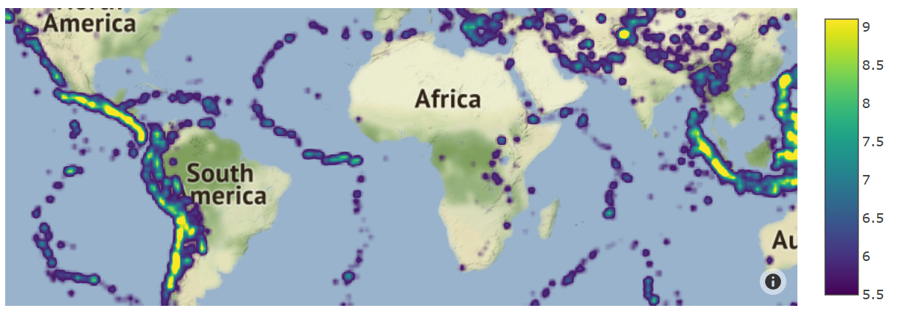

## Mapbox density charts

This type of chart creates maps where density can be displayed. 


### Basic Mapbox Density Chart - Air Quality Index

In this example, we will visualize the air quality index at 3 locations on map. Bigger circle will have worse air quality.

```py
data = {
  "lon": [10, 20, 30], 
  "lat": [15, 25, 35], 
  "air_index": [7, 20, 10]
}

layout = {
  "mapbox": {
      "style": "open-street-map"
  }
}
```
!!! example "Page content"

    === "Markdown"

        ```
        <|{data}|chart|lon=lon|lat=lat|z=air_index|type=densitymapbox|layout={layout}|>
        ```

    === "HTML"

        ```html
        <taipy:chart type="densitymapbox" lon="lon" lat="lat" z="air_index" layout="layout">{data}</taipy:chart>
        ```

<figure>
    
    
    <figcaption>Air Quality Index</figcaption>
</figure>

### World Map with Earthquake Magnitude


```py
df = pandas.read_csv(
    'https://raw.githubusercontent.com/plotly/datasets/master/earthquakes-23k.csv')

opts = {
    "coloraxis": 'coloraxis',
    "hoverinfo": 'skip',
    "radius": 5
}

layout = {
    'mapbox': {
        'style': 'stamen-terrain'
    },
    "coloraxis": {
        "colorscale": "Viridis"
    }, 
    "title": {
        "text": "Earthquake Magnitude"
    }
}
```
!!! example "Page content"

    === "Markdown"

        ```
        <|{df}|chart|type=densitymapbox|lat=Latitude|lon=Longitude|z=Magnitude|options={opts}|layout={layout}|>
        ```

    === "HTML"

        ```html
        <taipy:chart type="densitymapbox" lat="Latitude" lon="Longitude" z="Magnitude" options="opts" layout="layout">{df}</taipy:chart>
        ```

<figure>
    
    
    <figcaption>World Map with Earthquake Magnitude</figcaption>
</figure>

Explanation of parameters and options relevant to Mapbox density charts can be found [here](https://plotly.com/javascript/reference/densitymapbox/). Full details for the Taipy Chart control can be found in the Chart Control section of the [Taipy GUI User Manual](https://docs.taipy.io/en/latest/manuals/gui/viselements/chart/)

### Key parameters
| Parameter       | Value Options             | Location           |
| --------------- | ------------------------- | ------------------ |
| type          | "densitymapbox"          | Control definition |
| lon | Column name for longitudes | Control definition |
| lat | Column name for latitudes | Control definition |
| z | Column name for density | Control definition |
| mapbox | Dictionary of parameters for maps (style). [More details](https://plotly.com/javascript/mapbox-layers/) | Layout |
| radius | int | Options |
| coloraxis | Dictionary (colorscale) | Layout+Options |