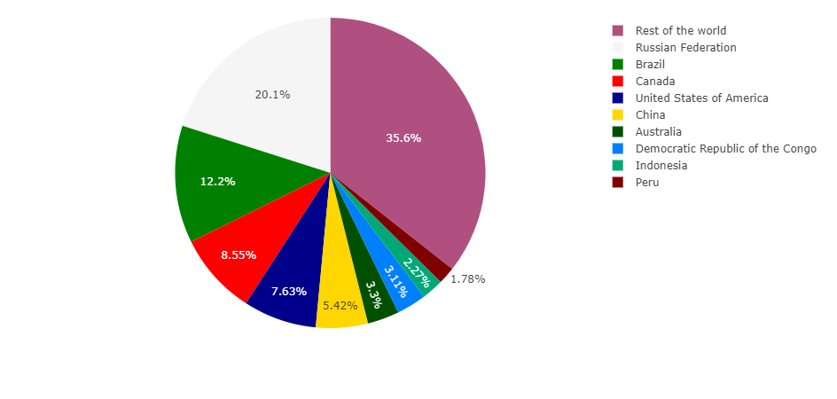

## Other features

### Pie charts

Pie charts is a circular graphic divided into slices that
represent a numerical quantity. The arc length of each slice is
proportional to the quantity it represents.

Here this example, we want to represent how much area is covered
by forest in countries in the world. Only the first few countries are
represented since too many would make the chart unreadable.

Our data set, where the area is provided as thousands of hectares in 2020,
comes from [FAO](https://www.fao.org) and is defined as follows:

```py
data = pd.DataFrame({
  "Country": ["Rest of the world","Russian Federation",...,"Peru"],
  "Area": [1445674.66,815312,...,72330.4]
})
```

We can indicate the color of each individual slice using the
_layout_ property of the chart:

```py
layout = {
  "piecolorway": ["B05080","#f5f5f5",...,"#800000"],
  }
```

And the chart definition is the following:

!!! example "Page content"

    === "Markdown"

        ```
        <|{data}|chart|type=pie|x=Area|label=Country|layout={layout}|>
        ```
  
    === "HTML"

        ```html
        <taipy:chart type="pie" x="Area" label="Country" layout="{layout}">{data}</taipy:chart>
        ```

Here is the resulting chart:



### Multiple charts

You may want to plot different data sets in the same chart.

In the following example, _data_ holds a data frame where two sets of values are stored
in columns _y1_ and _y2_ that you want to represent in a chart where the abscissa
values can be found in column _x_.  
Labels for the charts can be found in columns _l1_ and _l2_.

Furthermore, we want the second dataset to be displayed in red.

!!! example "Page content"

    === "Markdown"

        ```
        <|{data}|chart|x=x|y[1]=y1|label[1]=l1|y[2]=y2|label[2]=l2|color[2]=red|xaxis[2]=x2|>
        ```
  
        Note how we refer to the different y value sources, using indices.

    === "HTML"

        ```html
        <taipy:chart
         x="x"
         y[1]="y1" label[1]="l1"
         y[2]="y2" label[2]="l2"
         mode[2]="markers" color[2]="red" type[2]="scatter"
         xaxis[2]="x2">{data}</taipy:chart>
        ```

### Multiple charts with different lengths

In the following example, the value holds an array of dataframe of different length _[data1, data2]_.
We want to show a first chart with columns _Col A_ and _Col B_ from the first dataframe and a second chart
with columns _Col D_ and _Col F_: the columns names needs to be prefixed by the index of the dataframe in the array.

!!! example "Page content"

    === "Markdown"

        ```
        <|{[data1, data2]}|chart|x[1]=0/Col A|y[1]=0/Col B|x[2]=1/Col D|y[2]=1/Col F|>

        <|{[[26, 34, 46],[34,34],[16, 46, 20, 6]]}|chart|>
        ```
  
        In this second example, we draw 3 charts with _x_ the index of the _y_ value from each array.

    === "HTML"

        ```html
        <taipy:chart
         x[1]="0/Col A" y[1]="0/Col B"
         x[2]="1/Col D" y[2]="1/Col F"
         >{[data1, data2]}</taipy:chart>
        ```


### Tracking selection

If points selection is enabled in the chart, you can keep track of which point indices
are selected in a variable.

!!! example "Page content"

    === "Markdown"

        ```
        <|{data}|chart|selected={selected_indices}|...|>
        ```

    === "HTML"

        ```html
        <taipy:chart selected="{selected_indices}" ...>{data}</taipy:chart>
        ```

### Tracking range

By specifying a function for _on_range_change_, you can be made aware of chart zoom changes.

!!! example "Page content"

    === "Markdown"

        ```
        <|{data}|chart|on_range_change=range_change_function_name|...|>
        ```

    === "HTML"

        ```html
        <taipy:chart on_range_change="range_change_function_name" ...>{data}</taipy:chart>
        ```

### Sampling data

By specifying _limit_rows_ as True, charts will adapt the number of points to the viewable area.
Depending on the algorithm, Some specific points might not be shown on the chart.

!!! example "Page content"

    === "Markdown"

        ```
        <|{data}|chart|limit_rows|...|>
        ```

    === "HTML"

        ```html
        <taipy:chart limit_rows="true" ...>{data}</taipy:chart>
        ```

### Responsive chart

By specifying _plot_config_ responsive key, chart will be responsive ie chart will resize automatically to adapt to its container width (especially usefull on mobile devices).
Please get more information at [Plotly.js responsive](https://plotly.com/javascript/responsive-fluid-layout/).

```py3
pconf = {"responsive": True}
```

!!! example "Page content"

    === "Markdown"

        ```
        <|{data}|chart|plot_config={pconf}|...|>
        ```

    === "HTML"

        ```html
        <taipy:chart plot_config="{pconf}" ...>{data}</taipy:chart>
        ```

