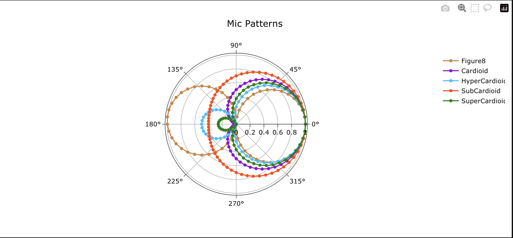
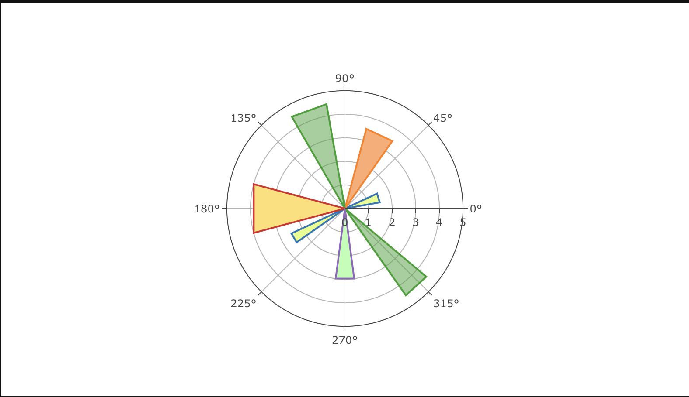
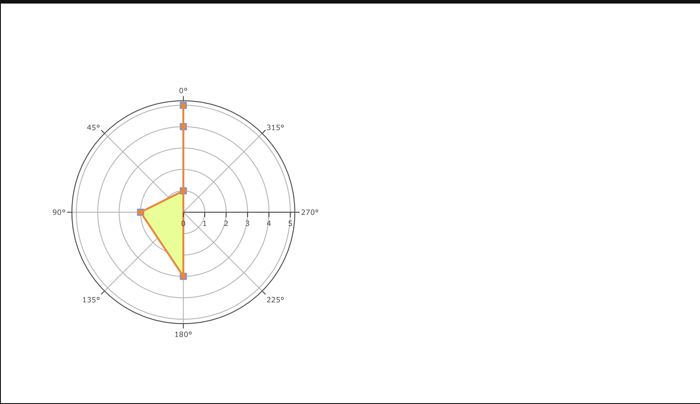
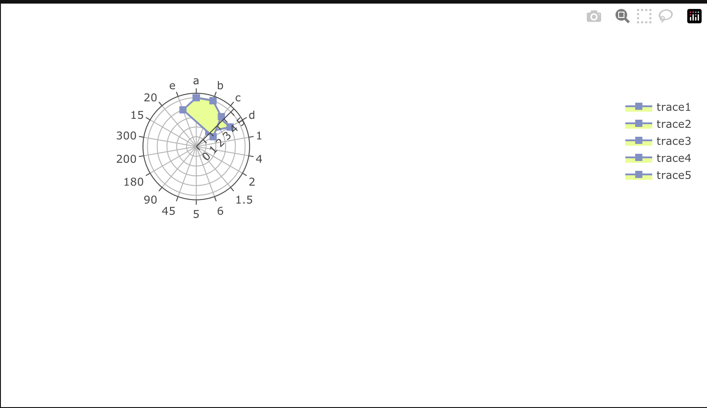
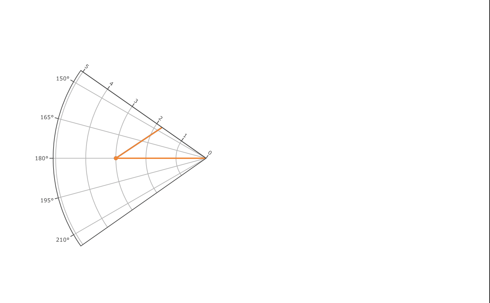
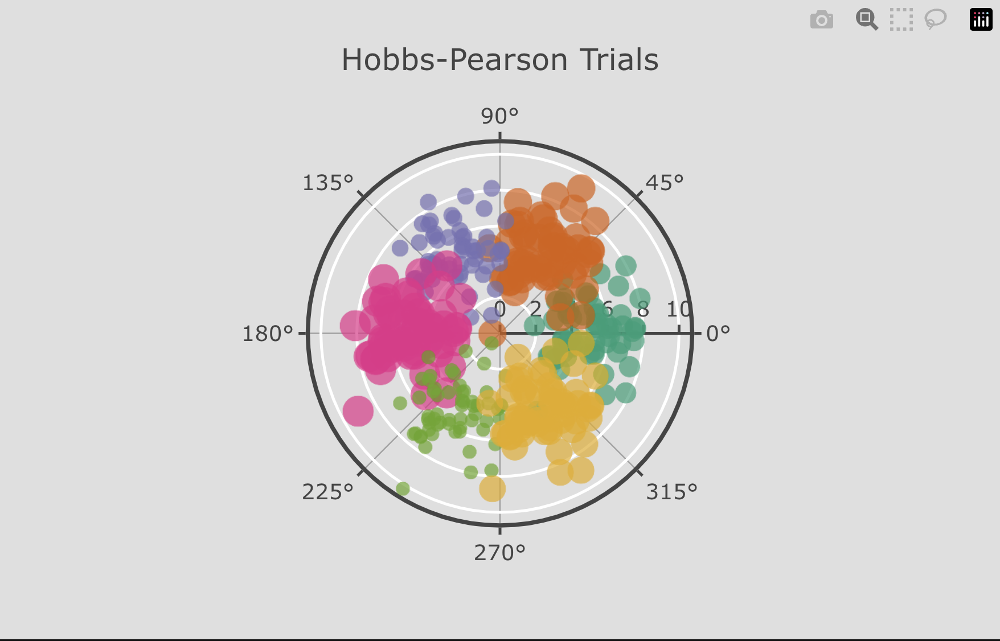

# Polar Charts

Polar Chart is a common variation of circular graphs. It is useful when relationships between data points can be visualized most easily in terms of radiuses and angles.

In Polar Charts, a series is represented by a closed curve that connects points in the polar coordinate system. Each data point is determined by the distance from the pole (the radial coordinate) and the angle from the fixed direction (the angular coordinate).

## Polar Charts Key Parameters <a id="table"></a>

Explanation of parameters and options relevant to radar charts can be found [here](#table). Full details for the Taipy Chart control can be found in the Chart Control section of the [Taipy GUI User Manual](https://docs.taipy.io/en/latest/manuals/gui/viselements/chart/)

| Parameter       | Value Options             | Location           |
| --------------- | ------------------------- | ------------------ |
| `Type`          | Polar Chart type          | Control definition |
| r, theta        | Values to plot            | Control definition |
| axis definition | range, visibility, etc    | layout             |
| fill            | toself, None              | options            |
| fillcolor       | hex of string color value | options            |

## Polar Chart Types

## Line Polar Chart

```py
from taipy.gui import Gui
import pandas as pd
import numpy as np

df = pd.read_csv(
    'https://raw.githubusercontent.com/plotly/datasets/master/polar_dataset.csv')
df.drop(df.columns[6], axis=1, inplace=True)

layout = {
    "title": 'Mic Patterns',
    "font": {
        "family": 'Arial, sans-serif;',
        "size": 12,
        "color": '#000'
    },
    "showlegend": True,
    "orientation": -90
}
# Plotly.newPlot('myDiv', data, layout);
# });
props = {
    "name[1]": "Figure8",
    "name[2]": "Cardioid",
    "name[3]": "HyperCardioid",
    "name[4]": "SubCardioid",
    "name[5]": "SuperCardioid",
    "color[1]": "peru",
    "color[2]": "darkviolet",
    "color[3]": "deepskyblue",
    "color[4]": "orangered",
    "color[5]": "green"
}
md = """
<|{df}|chart|type=scatterpolar|theta=y|r[1]=x1|r[2]=x2|r[3]=x3|r[4]=x4|r[5]=x5|properties={props}|layout={layout}|>
"""
Gui(md).run()
```



## Area Polar Chart

```py
from taipy.gui import Gui
import pandas as pd

data = [
    pd.DataFrame(
        {"r": [0, 1.5, 1.5, 0, 2.5, 2.5, 0], "theta": [0, 10, 25, 0, 205, 215, 0]}
    ),
    pd.DataFrame({"r": [0, 3.5, 3.5, 0], "theta": [0, 55, 75, 0]}),
    pd.DataFrame(
        {"r": [0, 4.5, 4.5, 0, 4.5, 4.5, 0], "theta": [0, 100, 120, 0, 305, 320, 0]}
    ),
    pd.DataFrame({"r": [0, 4, 4, 0], "theta": [0, 165, 195, 0]}),
    pd.DataFrame({"r": [0, 3, 3, 0], "theta": [0, 262.5, 277.5, 0]}),
]

opts1 = {"fillcolor": "#709BFF", "fill": "toself", "line": {"color": "black"}}
opts2 = {"fillcolor": "#E4FF87", "fill": "toself", "line": {"color": "black"}}
opts3 = {"fillcolor": "#FFAA70", "fill": "toself", "line": {"color": "black"}}
opts4 = {"fillcolor": "#FFDF70", "fill": "toself", "line": {"color": "black"}}
opts5 = {"fillcolor": "#B6FFB4", "fill": "toself", "line": {"color": "black"}}


layout = {
    "polar": {"radialaxis": {"visible": True, "range": [0, 5]}},
    "showlegend": False,
}
opts = {"fill": "toself", "line": {"color": "black"}}
props = {
    "options[1]": opts1,
    "options[1]": opts2,
    "options[2]": opts3,
    "options[4]": opts4,
    "options[5]": opts5,
    "theta[1]": "0/theta",
    "r[1]": "0/r",
    "theta[2]": "1/theta",
    "r[2]": "1/r",
    "theta[3]": "2/theta",
    "r[3]": "2/r",
    "theta[4]": "3/theta",
    "r[4]": "3/r",
    "theta[5]": "4/theta",
    "r[5]": "4/r",
    "name[1]": "trace1",
    "name[2]": "trace2",
    "name[3]": "trace3",
    "name[4]": "trace4",
    "name[5]": "trace5",
}
md = """
<|{data}|chart|type=scatterpolar|mode=lines|options={opts}|layout={layout}|properties={props}|>
"""
Gui(md).run()

```



## Polar Chart Directions

```py
from taipy.gui import Gui
import pandas as pd

data = [
    pd.DataFrame(
        {
            "r": [1, 2, 3, 4, 5],
            "theta": [0, 90, 180, 360, 0],
        }
    ),
    pd.DataFrame(
        {
            "r": [1, 2, 3, 4, 5],
            "theta": [0, 90, 180, 360, 0],
        }
    ),
]

opts1 = {
    "fillcolor": "#709BFF",
    "fill": "toself",
    "line": {"color": "#ff66ab"},
    "marker": {"color": "#8090c7", "symbol": "square", "size": 8},
}
opts2 = {
    "fillcolor": "#E4FF87",
    "fill": "toself",
    "line": {
        "color": "#ff66ab",
    },
    "marker": {"color": "#8090c7", "symbol": "square", "size": 8},
}

layout = {
    "polar": {
        "domain": {"x": [0, 0.4], "y": [0, 1]},
        "radialaxis": {"visible": True, "tickfont": {"size": 8}},
        "angularaxis": {
            "tickfont": {"size": 8},
            "rotation": 90,
            "direction": "counterclockwise",
        },
    },
    "polar2": {
        "domain": {"x": [0.6, 1], "y": [0, 1]},
        "radialaxis": {"tickfont": {"size": 8}},
        "angularaxis": {"tickfont": {"size": 8}, "direction": "clockwise"},
    },
    "showlegend": False,
}
props = {
    "options[1]": opts1,
    "options[1]": opts2,
    "theta[1]": "0/theta",
    "r[1]": "0/r",
    "theta[2]": "1/theta",
    "r[2]": "1/r",
    "name[1]": "trace1",
    "name[2]": "trace2",
}
md = """
<|{data}|chart|type=scatterpolar|mode=lines+markers|layout={layout}|properties={props}|>
"""
Gui(md).run()
```


## Polar Chart Subplots

```py
from taipy import Gui
import pandas as pd


data = [
    pd.DataFrame(
        {
            "r": [1, 2, 3],
            "theta": [50, 100, 200],
        }
    ),
    pd.DataFrame(
        {
            "r": [1, 2, 3],
            "theta": [1, 2, 3],
        }
    ),
    pd.DataFrame(
        {
            "r": ["a", "b", "c", "b"],
            "theta": ["D", "C", "B", "A"],
        }
    ),
    pd.DataFrame(
        {
            "r": [50, 300, 900],
            "theta": [0, 90, 180],
        }
    ),
    pd.DataFrame(
        {
            "r": [3, 3, 4, 3],
            "theta": [0, 45, 90, 270],
        }
    ),
]

opts1 = {
    "line": {"color": "#ff66ab"},
    "marker": {"color": "#8090c7", "symbol": "square", "size": 8},
}
opts2 = {
    "line": {
        "color": "rgb(231,41,138)",
    },
    "marker": {"color": "rgb(231,41,138)", "symbol": "square", "size": 8},
}
opts3 = {
    "line": {
        "color": "#ff66ab",
    },
    "marker": {"color": "#8090c7", "symbol": "square", "size": 8},
}
opts4 = {
    "line": {
        "color": "#ff66ab",
    },
    "marker": {"color": "#8090c7", "symbol": "square", "size": 8},
}


layout = {
    "polar": {
        "domain": {"x": [0, 0.46], "y": [0.56, 1]},
        "radialaxis": {"range": [1, 4]},
        "angularaxis": {"thetaunit": "radians"},
    },
    "polar2": {"domain": {"x": [0, 0.46], "y": [0, 0.42]}},
    "polar3": {
        "domain": {"x": [0.54, 1], "y": [0.56, 1]},
        "radialaxis": {"type": "log", "tickangle": 45},
        "sector": [0, 180],
    },
    "polar4": {
        "domain": {"x": [0.54, 1], "y": [0, 0.44]},
        "radialaxis": {"visible": True, "range": [0, 6]},
    },
    "showlegend": False,
}

opts = {"line": {"color": "black"}}
props = {
    "options[1]": opts1,
    "options[2]": opts2,
    "options[3]": opts3,
    "options[4]": opts4,
    "theta[1]": "0/theta",
    "r[1]": "0/r",
    "theta[2]": "1/theta",
    "r[2]": "1/r",
    "theta[3]": "2/theta",
    "r[3]": "2/r",
    "theta[4]": "3/theta",
    "r[4]": "3/r",
    "name[1]": "trace1",
    "name[2]": "trace2",
}
md = """
<|{data}|chart|type=scatterpolar|mode=lines+markers|options={opts}|layout={layout}|properties={props}|>
"""
Gui(md).run()
```


## Categorical Polar Chart

```py
from taipy import Gui
import pandas as pd


data = [
    pd.DataFrame(
        {
            "r": [5, 4, 2, 4, 5],
            "theta": ["a", "b", "c", "d", "a"],
        }
    ),
    pd.DataFrame(
        {
            "r": ["a", "b", "c", "d", "b", "f", "a"],
            "theta": [1, 4, 2, 1.5, 1.5, 6, 5],
        }
    ),
    pd.DataFrame(
        {
            "r": [5, 4, 2, 4, 5],
            "theta": ["a", "b", "c", "d", "a"],
        }
    ),
    pd.DataFrame(
        {
            "r": ["a", "b", "c", "d", "b", "f", "a", "a"],
            "theta": [45, 90, 180, 200, 300, 15, 20, 45],
        }
    ),
    pd.DataFrame(
        {
            "r": [5, 4, 2, 4, 5, 5],
            "theta": ["b", "c", "d", "e", "a", "b"],
        }
    ),
]

opts1 = {
    "fill": "toself",
    "fillcolor": "#E4FF87",
    "line": {"color": "#ff66ab"},
    "marker": {"color": "#8090c7", "symbol": "square", "size": 8},
}
opts2 = {
    "fillcolor": "#E4FF87",
    "fill": "toself",
    "line": {
        "color": "#ff66ab",
    },
    "marker": {"color": "#8090c7", "symbol": "square", "size": 8},
}
opts3 = {
    "fillcolor": "#E4FF87",
    "fill": "toself",
    "line": {
        "color": "#ff66ab",
    },
    "marker": {"color": "#8090c7", "symbol": "square", "size": 8},
}
opts4 = {
    "fillcolor": "#E4FF87",
    "fill": "toself",
    "line": {
        "color": "#ff66ab",
    },
    "marker": {"color": "#8090c7", "symbol": "square", "size": 8},
}
opts5 = {
    "fillcolor": "#E4FF87",
    "fill": "toself",
    "line": {
        "color": "#ff66ab",
    },
    "marker": {"color": "#8090c7", "symbol": "square", "size": 8},
}


layout = {
    "polar": {
        "domain": {"x": [0, 0.46], "y": [0.56, 1]},
        "radialaxis": {"angle": 45},
        "angularaxis": {"direction": "clockwise", "period": 6},
    },
    "polar2": {
        "domain": {"x": [0, 0.46], "y": [0, 0.44]},
        "radialaxis": {"angle": 180, "tickangle": -180},
    },
    "polar3": {
        "domain": {"x": [0.54, 1], "y": [0.56, 1]},
        "sector": [150, 400],
        "radialaxis": {"angle": -45},
        "angularaxis": {"categoryarray": ["d", "a", "c", "b"]},
    },
    "polar4": {
        "domain": {"x": [0.54, 1], "y": [0, 0.44]},
        "radialaxis": {"categoryorder": "category descending"},
        "angularaxis": {"thetaunit": "radians", "dtick": 0.3141592653589793},
    },
    "polar5": {
        "domain": {"x": [0.54, 1], "y": [0, 0.44]},
        "radialaxis": {"categoryorder": "category descending"},
        "angularaxis": {"thetaunit": "radians", "dtick": 0.3141592653589793},
    },
}

props = {
    "options[1]": opts1,
    "options[2]": opts2,
    "options[3]": opts3,
    "options[4]": opts4,
    "options[5]": opts5,
    "theta[1]": "0/theta",
    "r[1]": "0/r",
    "theta[2]": "1/theta",
    "r[2]": "1/r",
    "theta[3]": "2/theta",
    "r[3]": "2/r",
    "theta[4]": "3/theta",
    "r[4]": "3/r",
    "theta[5]": "4/theta",
    "r[5]": "4/r",
    "name[1]": "trace1",
    "name[2]": "trace2",
    "name[3]": "trace3",
    "name[4]": "trace4",
    "name[5]": "trace5",
}
md = """
<|{data}|chart|type=scatterpolar|mode=lines+markers|layout={layout}|properties={props}|>
"""
Gui(md).run()
```



## Polar Chart Sector

```py
from taipy import Gui
import pandas as pd

data = [
    pd.DataFrame(
        {
            "r": [1, 2, 3, 4, 5],
            "theta": [0, 90, 180, 360, 0],
        }
    ),
    pd.DataFrame(
        {
            "r": [1, 2, 3, 4, 5],
            "theta": [0, 90, 180, 360, 0],
        }
    ),
]

opts1 = {
    "line": {"color": "#ff66ab"},
    "marker": {"color": "#8090c7", "symbol": "circle", "size": 8},
}
opts2 = {
    "line": {
        "color": "#ff66ab",
    },
    "marker": {"color": "#8090c7", "symbol": "circle", "size": 8},
}

layout = {
    "showlegend": False,
    "polar": {
        "sector": [145, 215],
        "domain": {"x": [0, 0.4], "y": [0, 1]},
        "radialaxis": {"tickfont": {"size": 8}},
        "angularaxis": {"tickfont": {"size": 8}},
    },
    "polar2": {
        "domain": {"x": [0.6, 1], "y": [0, 1]},
        "radialaxis": {"tickfont": {"size": 8}},
        "angularaxis": {"tickfont": {"size": 8}},
    },
}

props = {
    "options[1]": opts1,
    "options[2]": opts2,
    "theta[1]": "0/theta",
    "r[1]": "0/r",
    "theta[2]": "1/theta",
    "r[2]": "1/r",
    "name[1]": "trace1",
    "name[2]": "trace2",
    "name[3]": "trace3",
    "name[4]": "trace4",
    "name[5]": "trace5",
}
md = """
<|{data}|chart|type=scatterpolar|mode=lines+markers|layout={layout}|properties={props}|>
"""
Gui(md).run()
```



## WebGL Polar Chart

```py
from taipy import Gui
import pandas as pd

rows = pd.read_csv(
    "https://raw.githubusercontent.com/plotly/datasets/master/hobbs-pearson-trials.csv"
)


def unpack(rows, key):
    return list(map(lambda x: x, rows[key]))


data = [
    pd.DataFrame(
        {
            "r": unpack(rows, "trial_1_r"),
            "theta": unpack(rows, "trial_1_theta"),
        }
    ),
    pd.DataFrame(
        {
            "r": unpack(rows, "trial_2_r"),
            "theta": unpack(rows, "trial_2_theta"),
        }
    ),
    pd.DataFrame(
        {
            "r": unpack(rows, "trial_3_r"),
            "theta": unpack(rows, "trial_3_theta"),
        }
    ),
    pd.DataFrame(
        {
            "r": unpack(rows, "trial_4_r"),
            "theta": unpack(rows, "trial_4_theta"),
        }
    ),
    pd.DataFrame(
        {
            "r": unpack(rows, "trial_5_r"),
            "theta": unpack(rows, "trial_5_theta"),
        }
    ),
    pd.DataFrame(
        {
            "r": unpack(rows, "trial_6_r"),
            "theta": unpack(rows, "trial_6_theta"),
        }
    ),
]

opts1 = {
    "line": {"color": "#ff66ab"},
    "marker": {
        "color": "rgb(27,158,119)",
        "size": 15,
        "line": {"color": "white"},
        "opacity": 0.7,
    },
    "cliponaxis": False,
}
opts2 = {
    "marker": {
        "color": "rgb(217,95,2)",
        "size": 20,
        "line": {"color": "white"},
        "opacity": 0.7,
    },
    "cliponaxis": False,
}
opts3 = {
    "marker": {
        "color": "rgb(117,112,179)",
        "size": 12,
        "line": {"color": "white"},
        "opacity": 0.7,
    },
    "cliponaxis": False,
}
opts4 = {
    "marker": {
        "color": "rgb(231,41,138)",
        "size": 22,
        "line": {"color": "white"},
        "opacity": 0.7,
    },
    "cliponaxis": False,
}
opts5 = {
    "marker": {
        "color": "rgb(102,166,30)",
        "size": 10,
        "line": {"color": "white"},
        "opacity": 0.7,
    },
    "cliponaxis": False,
}
opts6 = {
    "marker": {
        "color": "rgb(230,171,2)",
        "size": 19,
        "line": {"color": "white"},
        "opacity": 0.7,
    },
    "cliponaxis": False,
}


layout = {
    "title": "Hobbs-Pearson Trials",
    "font": {"size": 15},
    "showlegend": False,
    "polar": {
        "bgcolor": "rgb(223, 223, 223)",
        "angularaxis": {"tickwidth": 2, "linewidth": 3, "layer": "below traces"},
        "radialaxis": {
            "side": "counterclockwise",
            "showline": True,
            "linewidth": 2,
            "tickwidth": 2,
            "gridcolor": "white",
            "gridwidth": 2,
        },
    },
    "paper_bgcolor": "rgb(223, 223, 223)",
}

props = {
    "options[1]": opts1,
    "options[2]": opts2,
    "options[3]": opts3,
    "options[4]": opts4,
    "options[5]": opts5,
    "options[6]": opts6,
    "theta[1]": "0/theta",
    "r[1]": "0/r",
    "theta[2]": "1/theta",
    "r[2]": "1/r",
    "theta[3]": "2/theta",
    "r[3]": "2/r",
    "theta[4]": "3/theta",
    "r[4]": "3/r",
    "theta[5]": "4/theta",
    "r[5]": "4/r",
    "theta[6]": "5/theta",
    "r[6]": "5/r",
    "name[1]": "Trial 1",
    "name[2]": "Trial 2",
    "name[3]": "Trial 3",
    "name[4]": "Trial 4",
    "name[5]": "Trial 5",
    "name[6]": "Trial 6",
}
md = """
<|{data}|chart|type=scatterpolargl|mode=markers|layout={layout}|properties={props}|>
"""
Gui(md).run()
```

