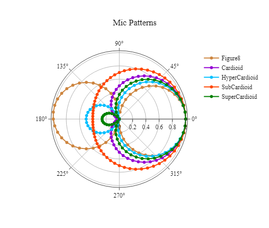
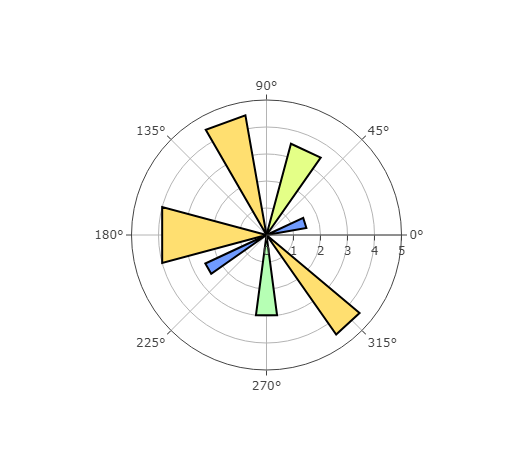
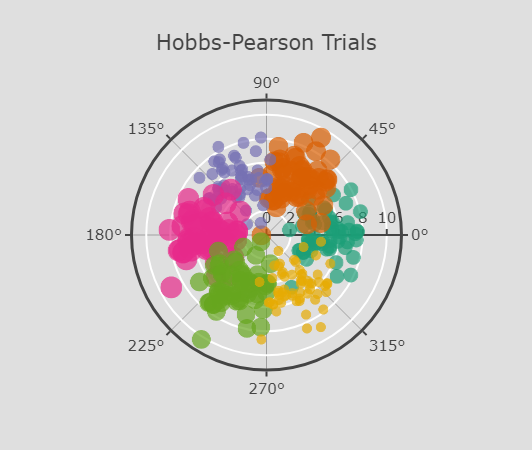

## Polar charts

Polar Chart is a common variation of circular graphs. It is useful when relationships between data points can be visualized most easily in terms of radiuses and angles.
In Polar Charts, a series is represented by a closed curve that connects points in the polar coordinate system. Each data point is determined by the distance from the pole (the radial coordinate) and the angle from the fixed direction (the angular coordinate).

### Line Polar Chart

```py
from taipy.gui import Gui
import pandas as pd
import numpy as np
 
df = pd.read_csv(
    'https://raw.githubusercontent.com/plotly/datasets/master/polar_dataset.csv')
df.drop(df.columns[6], axis=1, inplace=True)
 
layout = {
    "title": 'Mic Patterns',
    "font": {
        "family": 'Arial, sans-serif;',
        "size": 12,
        "color": '#000'
    },
    "showlegend": True,
    "orientation": -90
}

props = {
    "name[1]": "Figure8",
    "name[2]": "Cardioid",
    "name[3]": "HyperCardioid",
    "name[4]": "SubCardioid",
    "name[5]": "SuperCardioid",
    "color[1]": "peru",
    "color[2]": "darkviolet",
    "color[3]": "deepskyblue",
    "color[4]": "orangered",
    "color[5]": "green"
}
md = """
<|{df}|chart|type=scatterpolar|theta=y|r[1]=x1|r[2]=x2|r[3]=x3|r[4]=x4|r[5]=x5|properties={props}|layout={layout}|>
"""
Gui(md).run()
```




### Area Polar Chart

```py
from taipy.gui import Gui, State
import pandas as pd

data = [
  pd.DataFrame({
    "r": [0, 1.5, 1.5, 0, 2.5, 2.5, 0],
    "theta": [0, 10, 25, 0, 205, 215, 0]}), 
  pd.DataFrame({
    "r": [0, 3.5, 3.5, 0],
    "theta": [0, 55, 75, 0]}), 
  pd.DataFrame({
    "r": [0, 4.5, 4.5, 0, 4.5, 4.5, 0],
    "theta": [0, 100, 120, 0, 305, 320, 0]}), 
  pd.DataFrame({
    "r": [0, 4, 4, 0],
    "theta": [0, 165, 195, 0]}), 
  pd.DataFrame({
    "r": [0, 3, 3, 0],
    "theta": [0, 262.5, 277.5, 0]}),
]

options1 = {"fill": "toself", "fillcolor": "#709BFF"}
options2 = {"fill": "toself", "fillcolor": "#E4FF87"}
options3 = {"fill": "toself", "fillcolor": "#FFAA70"}
options4 = {"fill": "toself", "fillcolor": "#FFDF70"}
options5 = {"fill": "toself", "fillcolor": "#B6FFB4"}
line = {"color": "black"}

layout1 = {
    "polar": {
        "radialaxis": {
            "visible": True,
            "range": [0, 5]
        }
    },
    "showlegend": False
}

md = """
# Area Polar Chart

<|{data}|chart|type=scatterpolar|mode=lines|layout={layout1}|line={line}|r[1]=0/r|theta[1]=0/theta|options[1]={options1}|r[2]=1/r|theta[2]=1/theta|options[2]={options2}|r[3]=2/r|theta[3]=2/theta|options[3]={options4}|r[4]=3/r|theta[4]=3/theta|options[4]={options4}|r[5]=4/r|theta[5]=4/theta|options[5]={options5}|>

"""

a_gui = Gui(md)
a_gui.run(use_reloader=False, async_mode="threading")
```


### Webgl Polar Chart

```py
from taipy.gui import Gui, State
import pandas as pd

csv = pd.read_csv("https://raw.githubusercontent.com/plotly/datasets/master/hobbs-pearson-trials.csv")
markers = [
    {"color": "rgb(27,158,119)",
     "size": 15,
     "line": {
        "color": "white"
     },
    "opacity": 0.7
    }, {
    "color": "rgb(217,95,2)",
    "size": 20,
        "line": {
            "color": "white"
        },
    "opacity": 0.7
}, {
    "color": "rgb(117,112,179)",
    "size": 12,
    "line": {
        "color": "white"
    },
    "opacity": 0.7
}, {
    "color": "rgb(231,41,138)",
    "size": 22,
    "line": {
        "color": "white"
    },
    "opacity": 0.7
}, {
    "color": "rgb(102,166,30)",
    "size": 19,
    "line": {
        "color": "white"
    },
    "opacity": 0.7
}, {
    "color": "rgb(230,171,2)",
    "size": 10,
    "line": {
        "color": "white"
    },
    "opacity": 0.7
},
]
layout = {
    "title": "Hobbs-Pearson Trials",
    "font": {
        "size": 15
    },
    "showlegend": False,
    "polar": {
        "bgcolor": "rgb(223, 223, 223)",
        "angularaxis": {
            "tickwidth": 2,
            "linewidth": 3,
            "layer": "below traces"
        },
        "radialaxis": {
            "side": "counterclockwise",
            "showline": True,
            "linewidth": 2,
            "tickwidth": 2,
            "gridcolor": "white",
            "gridwidth": 2
        }
    },
    "paper_bgcolor": "rgb(223, 223, 223)",
}
md = """
# Webgl Polar Chart

<|{csv}|chart|type=scatterpolargl|mode=markers|layout={layout}|r[1]=trial_1_r|theta[1]=trial_1_theta|marker[1]={markers[0]}|r[2]=trial_2_r|theta[2]=trial_2_theta|marker[2]={markers[1]}|r[3]=trial_3_r|theta[3]=trial_3_theta|marker[3]={markers[2]}|r[4]=trial_4_r|theta[4]=trial_4_theta|marker[4]={markers[3]}|r[5]=trial_5_r|theta[5]=trial_5_theta|marker[5]={markers[4]}|r[6]=trial_6_r|theta[6]=trial_6_theta|marker[6]={markers[5]}|>
"""
a_gui = Gui(md)
a_gui.run(use_reloader=False, async_mode="threading")
```

