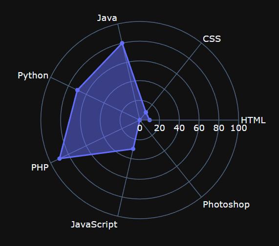
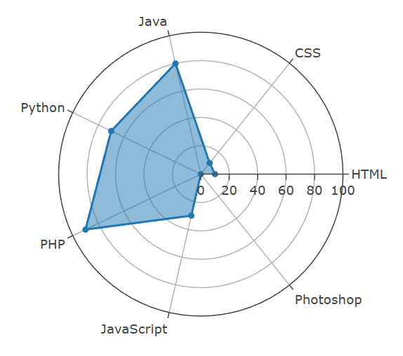
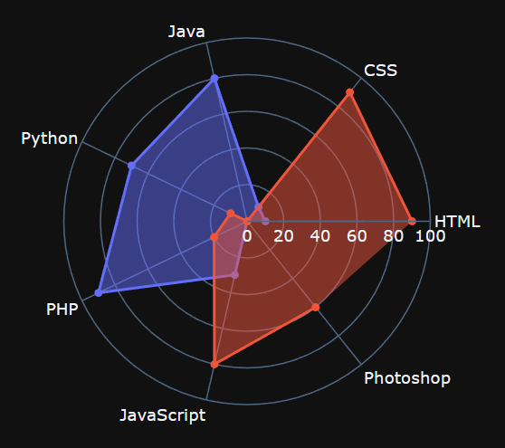
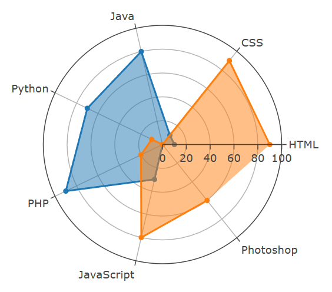

# Radar Chart

 (Spider Web Diagram)
A radar chart is a visualization suited for the display of multiple variables on a two-dimensional plane. Radar charts take advantage of polar coordinates, where, for each observation, each feature is represented by an angle (theta) and the magnitude by the distance from the center.

### Basic Radar Chart
We will show skill diargram for a BE developer in this example

```py
data = {
    "Backend": [10, 10, 80, 70, 90, 30, 0],
    "Skills": ["HTML", "CSS", "Java", "Python", "PHP","JavaScript", "Photoshop"]
}

layout = {
    "polar": {
        "radialaxis": {
            "visible": True,
            "range": [0, 100],
        }
    },
    "showlegend": False
}
opts = {"fill": "toself"}
```
!!! example "Page content"

    === "Markdown"

        ```
        <|{data}|chart|type=scatterpolar|r=Backend|theta=Skills|options={opts}|layout={layout}|>
        ```

    === "HTML"

        ```html
        <taipy:chart type="scatterpolar" r="Backend" theta="Skills" options="opts" layout="layout">{data}</taipy:chart>
        ```

<figure>
    
    
    <figcaption>Basic Radar Chart</figcaption>
</figure>

### Multiple Trace Radar Chart
Now we want show skill diargram for a FE developer in the same chart with BE to get the comparison.

```py
data = [
    {
        "Backend": [10, 10, 80, 70, 90, 30, 0],
        "Skills": ["HTML", "CSS", "Java", "Python", "PHP", "JavaScript", "Photoshop"]
    },
    # We define one more data set for FE
    {
        "Frontend": [90, 90, 0, 10, 20, 80, 60],
        "Skills": ["HTML", "CSS", "Java", "Python", "PHP", "JavaScript", "Photoshop"]
    }
]
```
!!! example "Page content"

    === "Markdown"

        ```
        <|{data}|chart|type=scatterpolar|name[1]=Backend|name[2]=Frontend|r[1]=0/Backend|r[2]=1/Frontend|theta[1]=0/Skills|theta[2]=1/Skills|options={opts}|layout={layout}|>
        ```

    === "HTML"

        ```html
        <taipy:chart type="scatterpolar" name[1]="Backend" name[2]="Frontend" r[1]="0/Backend" r[2]="1/Frontend" theta[1]="0/Skills" theta[2]="1/Skills" options="opts" layout="layout">{data}</taipy:chart>
        ```

<figure>
    
    
    <figcaption>Multiple Trace Radar Chart</figcaption>
</figure>

Explanation of parameters and options relevant to radar charts can be found [here](https://plotly.com/javascript/reference/scatterpolar/). Full details for the Taipy Chart control can be found in the Chart Control section of the [Taipy GUI User Manual](https://docs.taipy.io/en/latest/manuals/gui/viselements/chart/)

