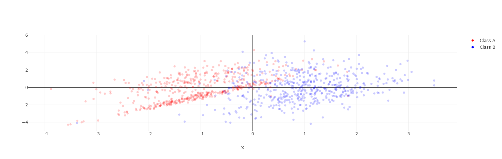
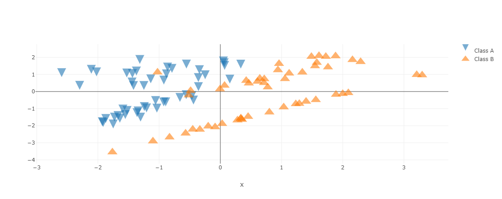
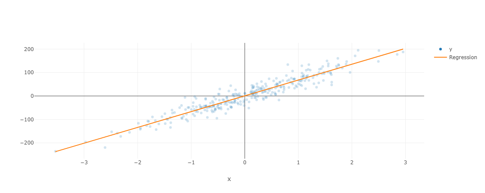
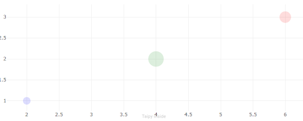

## Scatter charts

Scatter charts represent data points as dots or other symbols.
They are useful to see relationships between groups of data points.

### Classification

Using a scatter chart to represent the result of the classification of
samples is really relevant: you can use different colors to represent
different classes that data points belong to.

Here is an example where we have two series of samples, based on the same
_x_ axis: samples are stored in one series or the other depending on
a classification algorithm. The result is three numerical arrays:

- The values on the _x_ axis.
- The _y_ values for the samples that belong to the class 'A'. The value
  is set to Nan if it does not belong to class 'A'.
- The _y_ values for the samples that belong to the class 'B'. The value
  is set to Nan if it does not belong to class 'B'.

```py
x_range = [ 0.64,  1.05, ...1000 values..., -0.7, -1.2]
a_values = [ nan, nan, 1.04, -1.01, ...1000 values..., 1.6, 1.45, nan ]
b_values = [ -2.1, -0.99, nan, nan, ...1000 values..., nan, nan, 2.12]
data = pd.DataFrame({
  "x" : x_range,
  "Class A" : a_values,
  "Class B" : b_values
})
```

The chart definition looks like this:

!!! example "Page content"

    === "Markdown"

        ```
        <|{data}|chart|mode=markers|x=x|y[1]=Class A|y[2]=Class B|>
        ```
  
    === "HTML"

        ```html
        <taipy:chart mode="markers" x="x" y[1]="Class A" y[2]="Class B">{data}</taipy:chart>
        ```

And the resulting chart is:



### Customizing a scatter chart

A common problem with scatter chart is that individual markers can be displayed
on top of each other. This may result in markers being hidden by others, and
the display may not reflect the density of markers. This is why it
is usually not a good idea to use scatter charts where markers are completely
opaque.

It is easy to change the marker parameters if needed. The available parameters
are listed in the [Plotly scatter](https://plotly.com/python/reference/scatter/#scatter-marker)
documentation page.<br/>
Here is how we can change the size and shape of the markers that are used in
our previous example (with fewer data points). We need to create two
dictionaries that hold the values we want to impact:

```py
marker_A = {
  "symbol": "arrow-down",
  "size": 20
}
marker_B = {
  "symbol": "triangle-up-dot",
  "size": 20
}
```
We are requesting bigger markers, with one shape per series.

To have Taipy use those styles, we must modify the chart definition:
!!! example "Page content"

    === "Markdown"

        ```
        <|{data}|chart|mode=markers|x=x|y[1]=Class A|marker[1]={marker_A}|y[2]=Class B|marker[2]={marker_B}>
        ```
  
    === "HTML"

        ```html
        <taipy:chart mode="markers" x="x"
            y[1]="Class A" marker[1]="{marker_A}" 
            y[2]="Class B" marker[2]="{marker_B}">{data}</taipy:chart>
        ```

That generates the following chart:



### Regression

Regression is an excellent use case for using scatter charts: on top of samples data
points, you can trace the plot of a function that best fits the data points.

Here is an example of linear regression, where we can use a line plot on top of
markers. The chart will represent an array of two Data Frames: one for the
original data points and one for the computed regression line.

Here is the code that defines the source data for the chart:
```py
data = [
  pd.DataFrame({
    "x": [ 0.13, -0.49, ..., 1.89, -0.97 ],
    "y": [ 22.23, -51.77, ..., 135.76, -77.33 ]
  }),
  pd.DataFrame({
    "x": [ -3.53,  2.95 ],
    "Regression": [ -237.48, 200 ]
  })
  ]
```

The chart definition uses the two Data Frames and their columns:

!!! example "Page content"

    === "Markdown"

        ```
        <|{data}|chart|mode[1]=markers|x[1]=0/x|y[1]=0/y|mode[2]=line|x[2]=1/x|y[2]=1/Regression|>
        ```
  
    === "HTML"

        ```html
        <taipy:chart
            mode[1]="markers" x[1]="0/x" y[1]="0/y"
            mode[2]="line"    x[2]="1/x" y[2]="1/Regression">{data}</taipy:chart>
        ```
See how, using the _mode[]_, _x[]_, and _y[]_ properties, the two plots are defined.

The chart representing the linear regression result is the following:



### Bubble charts and Color Dimension

Bubble chart is a specific use case for scatter charts: variable-sized circular markers. 
Marker color can also be defined as an array of values via a column name

Here is an example of setting size and color with column names in a marker definition:
```py
data = pd.DataFrame({
    "x": [ 2, 4, 6 ],
    "y": [ 2, 4, 6 ],
    "Colors": ["blue", "green", "red"],
    "Sizes": [20, 40, 30],
  })
marker = {"size": "Sizes", "color": "Colors"}
```

The chart definition uses the Data Frame with the Sizes and Colors columns via the marker :

!!! example "Page content"

    === "Markdown"

        ```
        <|{data}|chart|x=x|y=y|marker={marker}|mode=markers|>
        ```
  
    === "HTML"

        ```html
        <taipy:chart
            mode="markers" x="x" y="y"
            marker="{marker}">{data}</taipy:chart>
        ```

