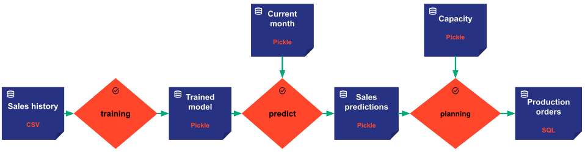

A data node is an important concept in Taipy. It does not contain the data itself but holds all
the necessary information to read and write the actual data. It can be seen as a dataset descriptor or data reference.

A _data node_ can reference any data:

- a text,
- a numeric value,
- a list, tuple, set, dictionary of parameters,
- a custom Python object (a data frame, a data class, etc.),
- the content of a JSON file, a CSV file, a Pickle file, a Parquet file, etc.
- the content of one or multiple database table(s),
- any other data.

It is designed to model any type of data: input, intermediate, or output data, internal or external data, local or
remote data, historical data, a set of parameters, a trained model, etc.

The _data node_ information depends on the data itself, its exposed format, and its storage type.

First example: If the data is stored in a SQL database, the corresponding _data node_ should contain the username,
password, host, port, the queries to read and write the data, as well as the Python class used to represent a
database entry.

Second example: If the data is stored in a CSV file, the corresponding _data node_ should contain, for instance, the
path to the file and the Python class used to represent a CSV line.

!!! example "Let's take a realistic example."

    Let's assume we want to build an application to predict monthly sales in order to adjust production
    planning, constrained by some maximum capacity.

    The flowchart below represents the various data nodes used as input or output of the tasks (in orange).

    { align=left }

    We have six data nodes modeling the data (the dark blue boxes). One each for the _**sales
    history**_, the _**trained model**_, the _**current month**_, the _**sales predictions**_, the production
    _**capacity**_, and the _**production orders**_.

!!! note

    Taipy proposes various predefined _data nodes_ corresponding to the most popular _storage types_. More details on
    the [Data node configuration page](data-node-config.md)

    In our example, the sales history is a CSV file received, for instance, from a company record system. We use
    the predefined CSV data node to model the _**sales history**_.

    As for the _**production orders**_ data node, we write the data into a database shared by other systems.
    We use the predefined SQL data node to model the _**production orders**_.

    We have no particular specifications for the other data nodes. We use the default storage type: Pickle.

A data node's attributes are populated based on its data node configuration `DataNodeConfig^` that must be
provided when instantiating a new data node. (Please refer to the
[`configuration details`](data-node-config.md) documentation for more details on configuration).
