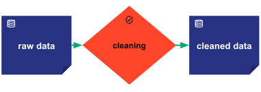
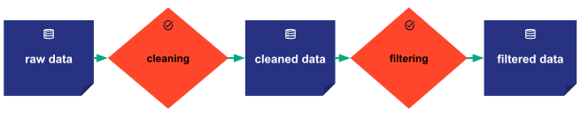
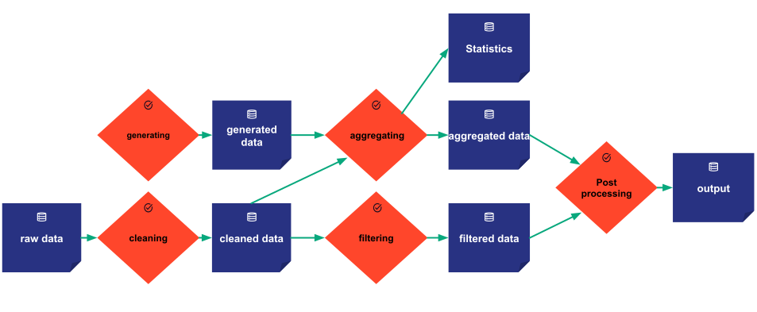
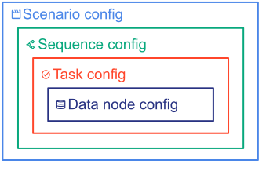

Motivation for scenario management

# Scenario and Data management

Taipy provides the key concept of *Scenario*. Among other functionalities, a *Scenario*
represents an instance of a data science problem with its datasets (modeled as *Data nodes* in Taipy)
and the algorithms to solve the problem. The algorithms are modeled as an execution
graph (a Directed Acyclic Graph or DAG) that can be seen as a succession of functions (or *Tasks* in
Taipy) that exchange data. With Taipy, one can model simple as well as very complex algorithms.

!!! example "Let's take some examples."

    === "Simple single function example"

        The following picture represents a simple scenario made of a single *cleaning* function
        processing a single input, the *raw data*, and returning a single output, the
        *cleaned data*.

        { margin-left=25% width=52%}

    === "Linear example with two functions"

        The second example below is slightly more complex. The first function *cleaning* processes a
        single input, the *raw data*, and returns some intermediate data named *cleaned data*. The
        second function *filtering* reads the same intermediate data *cleaned data* and returns a
        single output *filtered data*.

        

    === "Branching example"

        The third example below introduces some complexity. As you can see in the picture below, the
        function *generating* does not have any input. On the contrary, the function *aggregating*
        takes multiple inputs and returns multiple outputs.

        

A few concepts are essential to use the Scenario management in Taipy.

- A [Data node](data-node.md) (the dark blue boxes) represents a reference to a dataset. A data node
  can be used/shared by multiple tasks as input or output. It can refer to any type of data: a
  built-in Python object (e.g. an integer, a string, a dictionary or list of parameters, ...) or a
  more complex object (e.g. a file, a machine learning model, a list of custom objects, the result
  of a database query, ...). 
  A data node can be shared by multiple tasks as input or output.
- A [Task](task.md) (the orange boxes) can be seen as a function receiving data node(s) as input and
  returning data node(s) as output.
- A [Job](job.md) represents a unique execution of a Task.
- A [Scenario](scenario.md) represents a set of tasks connected through data nodes forming a
  Directed Acyclic Graph, that should be executed as a whole (or as subgraphs via sequences) and
  create a consistent algorithm. It can also contain a set of additional data nodes for related data
  but are not part of the executable graph.
- A [Sequence](sequence.md) represents a set of tasks connected through data nodes, that should be
  executed as a whole and forming a consistent algorithm. A sequence belongs to a scenario and can
  be thought of as a subgraph of the scenario's complete graph.
- A [Cycle](cycle.md) or work cycle is a time period corresponding to an iteration of a recurrent
  business problem. For instance, a company's sales forecast needs to be generated
  *every week*. 
  A cycle is defined thanks to the **_Frequency_** of scenarios. For instance, if scenarios have a
  weekly frequency, then each cycle represents a particular week, and every scenario will be
  attached to a particular cycle (i.e. a week).
- A [Scope](../../data-integration/scope.md) represents the *visibility* of a data node in the graph of entities, and the
  level of its owner (Scenario, Cycle, Global).

# Scenario configuration

- How to configure a scenario? => task configuration and scenario configuration

# Scenario usage

- How to use a Scenario? => usage

# Scenario graphical controls

- How to visualize a data node? => core viz

!!! note "Definition: Config vs Entities"

    Among the concepts described in this section, **data nodes**, **tasks**, and **scenarios** have
    two types of Taipy objects related to them: *configuration* objects and *runtime* objects.

    To differentiate them, the configuration objects are named **_configs_** (`DataNodeConfig`,
    `TaskConfig`, and `ScenarioConfig`). In contrast, the runtime objects (`DataNode`, `Task`, and
    `Scenario`) are called **_entities_**.

    It will benefit the reader to visualize the different Taipy **_configs_** like a set of Russian
    dolls where each **_config_** belongs to a "larger" **_config_**:
    { margin-left=25% width=50%}

    One thing to wrap your head around (it may not be very intuitive for everyone at first) is that
    the **configs** are really just configuration objects describing the characteristics and the
    behaviors of the concepts they relate to. **Configs** can be seen as generators. Indeed, each
    **entity** is instantiated from a **config**. Note also that the same **config** can be used to
    instantiate multiple **entities**.

