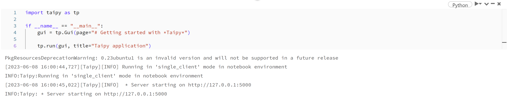
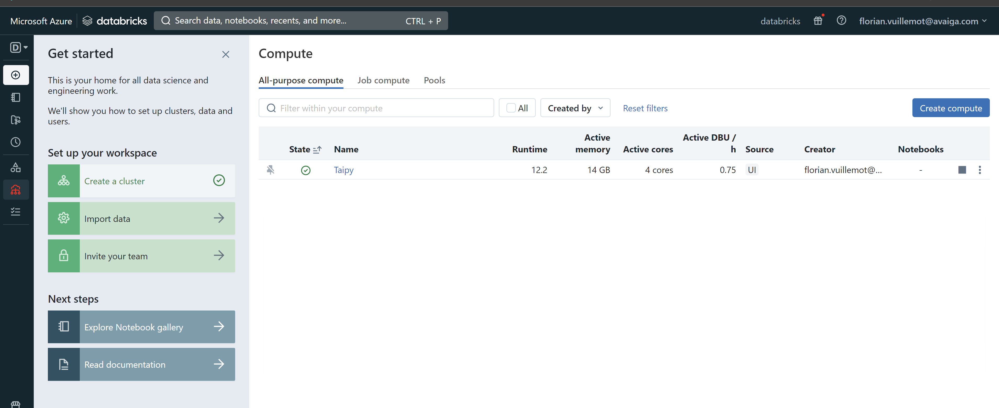
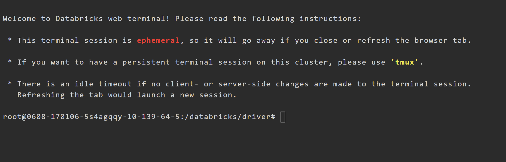
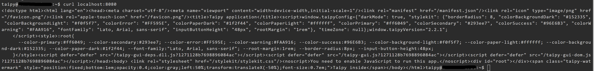

# Deploy on Databricks for development

## Prerequisites

- Knowledge of Databricks.
- Knowledge of SSH.
- A Databricks cluster in operation.
- A Linux-based machine that can communicate with your local machine and Databricks.
- [:material-arrow-right: Running a Taipy application](../run/index.md)

!!! Note

    Taipy is currently only available with Databricks **Standard** runtimes.


!!! Warning

    The following configuration is for development purposes only.


## Running an application

By taking the [application created earlier](../../run/index.md), installing it on Databrick and running it as follows.



But you can't access the application from your computer.

## External access with Databricks

Databricks does not provide external access to notebooks. You can access resources from your notebooks, but the other way is blocked.

We can't change this configuration, but we can remove it using an external component as our application's entry point.

## Connecting Virtual Machine and Databricks

Since we can't connect to the Databricks, we'll use the Linux-based machine as an entry point to the Databricks. To do this, we'll use [SSH](https://www.ssh.com) which is installed by default on Databricks and Linux. It will create a tunnel between the two entities, enabling them to communicate. We'll also install Nginx on the Linux-based machine to link the request to your application.

## Configuring communication

The key point of the architecture is the communication between the Linux-based machine and Databricks. To check connectivity, we'll connect to the Linux-based device via Databricks.

On Databricks, go to compute and select your cluster.



Go to the "Apps" panel and select "Web Terminal". It opens a new tab with a shell. 



In this shell, enter the following command, replacing `username` and `machine-ip` with your values:
```ssh -R 8080:127.0.0.1:5000 <username>@<machine-ip>```

!!! Note

    If your SSH authentication is based on certificates, remember to upload them on Databricks.

You are now on the Linux-based machine, and the communication is verified. You may notice the option `-R 8080:127.0.0.1:5000`. This option starts [port forwarding](https://www.ssh.com/academy/ssh/tunneling-example) from the machine to Databricks. Specifically, it forwards all packets from port 8080 to port 5000 on your Databricks.

Therefore, running `curl localhost:8080` should get your application's output still running on your Databricks notebook!




## Make it accessible from the outside

Communication is now established, but not from the browser's point of view. We'll install and configure Nginx on the Linux-based machine to enable browser-based communication. 

First, install [Nginx](https://www.nginx.com/resources/wiki/start/topics/tutorials/install/).

Now put the following content in `/etc/nginx/sites-enabled/default` :
```
server {
    listen 80;
    location / {
        proxy_pass http://localhost:8080;

        proxy_read_timeout  36000s;
        proxy_http_version          1.1;
        proxy_set_header            Upgrade $http_upgrade;
        proxy_set_header            Connection $connection_upgrade;
        proxy_set_header            Host $host;
        proxy_request_buffering     off;
    }
}
```

Then restart Nginx: `systemctl restart nginx`.

You should be able to access your application with your browser by doing: `http://<machine-ip>:8080`

!!! Note

    Make sure that communication between the remote machine and your browser is open.
