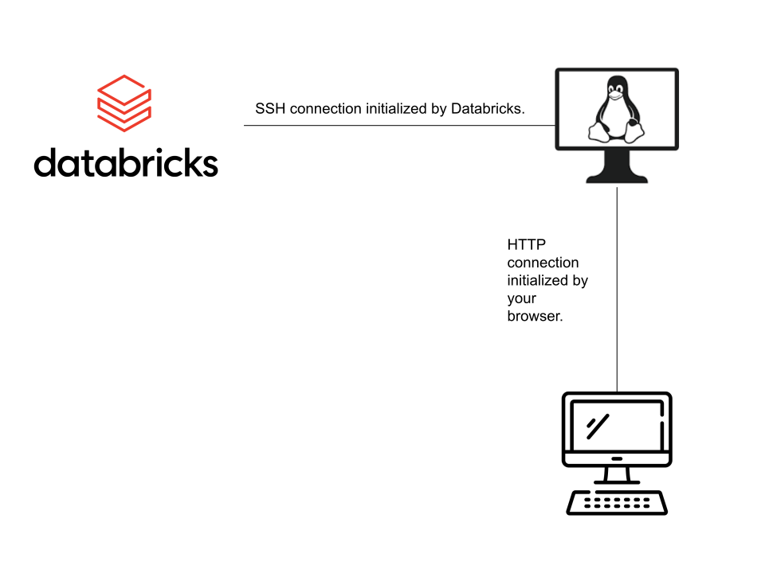
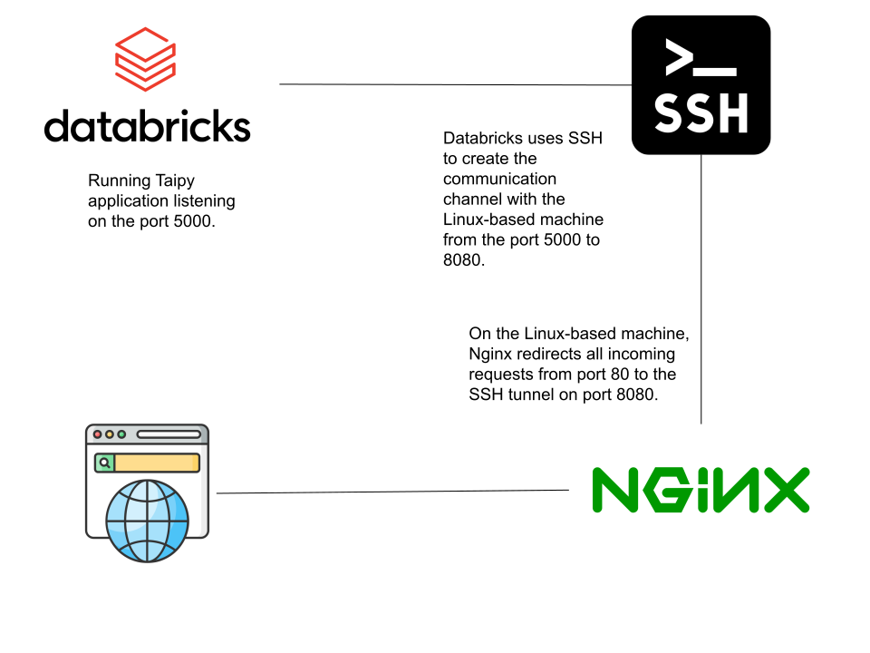

# Deploy on Databricks

!!! Note

    Taipy is currently only available with Databricks **Standard** runtimes.

!!! Warning

    We recommend using Databricks deployments for testing or demonstration purposes only.

In the current section, we consider the following as prerequisites:

- Knowledge of Databricks.
- Knowledge of SSH.
- A Databricks cluster in operation.
- A Linux-based machine that can communicate with your local machine and Databricks.
- [:material-arrow-right: Running a Taipy application](../../run/index.md)

!!! Note

    If you don't have a Linux-based machine, you can use a cloud provider has Azure to [create one](https://learn.microsoft.com/en-us/azure/virtual-machines/linux/quick-create-portal?tabs=ubuntu).

## Running your application on Databricks

The first step consists in running your Taipy application on Databricks.
Let's consider the following application:

```python linenums="1"

```

Connect to Databricks and run the previous code in a Databricks Notebook. You should obtain a similar output:
```
[2023-06-12 17:17:25,611][Taipy][INFO] Running in 'single_client' mode in notebook environment
INFO:Taipy:Running in 'single_client' mode in notebook environment
[2023-06-12 17:17:25,912][Taipy][INFO]  * Server starting on http://127.0.0.1:5000
INFO:Taipy: * Server starting on http://127.0.0.1:5000
```


As you can see on the output, the Taipy application is running on Databricks and listening on `localhost` (127.0.0.1:5000), which is not accessible from your browser. The next section shows you how to expose your application.


## Exposing your application

Here is the global architecture of the solution.


Since we can't connect to Databricks directly, we'll use an SSH tunnel between a proxy machine and the Databricks machine, enabling them to communicate.
We'll also install Nginx on the Linux-based machine to route the request from your browser to your application.

In the end, the browser sends a request to the Nginx on the Linux-based machine; the Nginx will redirect this request to the SSH tunnel, which will redirect to the Taipy application.

Here is the technical architecture of the solution.


!!! Warning

    The Linux-based machine should be accessible from your network and Databricks.

### Configure the proxy using Nginx

We'll install and configure Nginx on the Linux-based machine to enable browser-based communication. Once configured, Nginx will redirect all incoming requests on the port HTTP (80) to port 8080.

First, install [Nginx](https://www.nginx.com/resources/wiki/start/topics/tutorials/install/). Then configure the redirection by putting the following content in `/etc/nginx/sites-enabled/default` :
```
server {
    listen 80;
    location / {
        proxy_pass http://localhost:8080;

        proxy_read_timeout          36000s;
        proxy_http_version          1.1;
        proxy_set_header            Upgrade $http_upgrade;
        proxy_set_header            Connection $connection_upgrade;
        proxy_set_header            Host $host;
        proxy_request_buffering     off;
    }
}
```

And restart Nginx: `systemctl restart nginx`.


### 3 - Connect Databricks to the proxy machine

Open Databricks on a first tab, and go to compute and select your cluster.


Go to the "Apps" panel and select "Web Terminal". It opens a new tab with a shell.


In this shell, enter the following command, replacing `username` and `machine-ip` with your values:
```ssh -R 8080:127.0.0.1:5000 <username>@<machine-ip>```

!!! Note

    If your SSH authentication is based on certificates, remember to upload them on Databricks.

You are now on the Linux-based machine, and the communication is verified. You may notice the option `-R 8080:127.0.0.1:5000`. This option starts
[port forwarding](https://www.ssh.com/academy/ssh/tunneling-example) from the machine to Databricks.
Specifically, it forwards all packets from port 8080 to port 5000 on your Databricks.

Therefore, running `curl localhost:8080` should get your application's output still running on your Databricks notebook!


### 4 - Access your application

While your first Databricks tab is open, you should be able to access your application.
On another tab of your browser, make sure you can access the application at `http://<machine-ip>`
