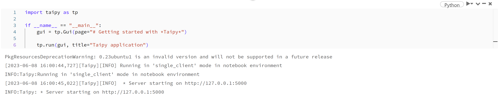
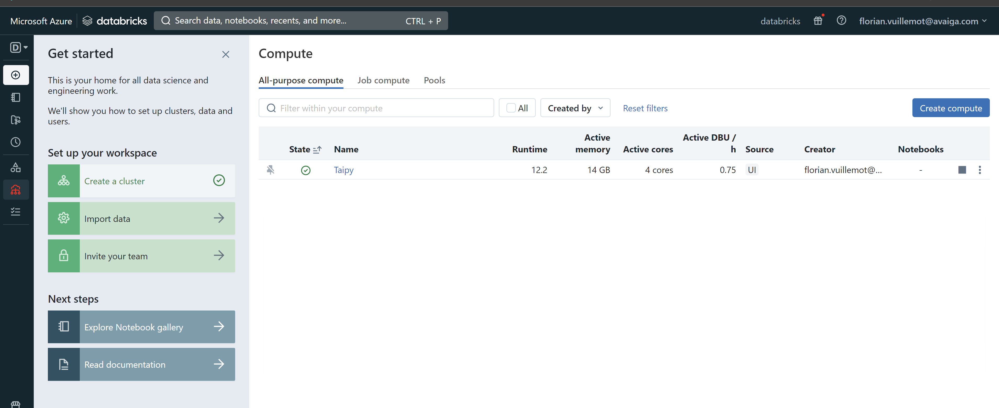
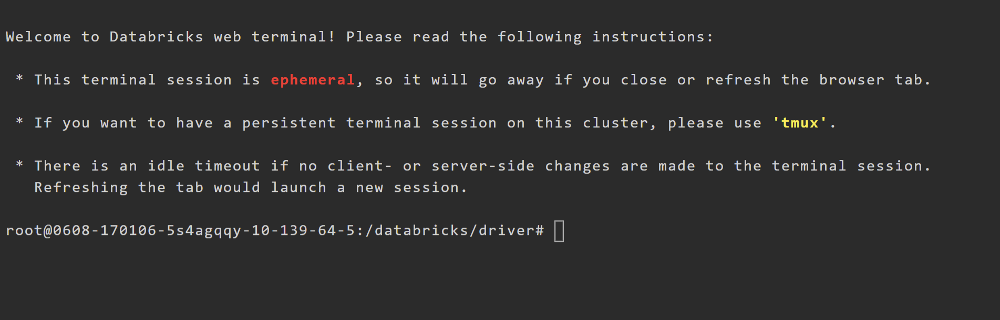
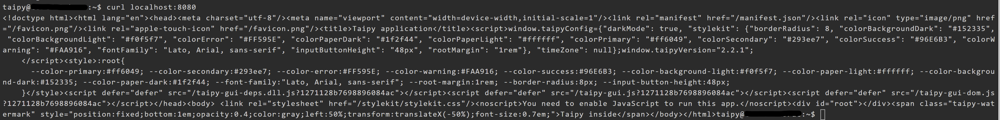

# Deploy on Databricks

!!! Note

    Taipy is currently only available with Databricks **Standard** runtimes.

!!! Warning

    We recommend using Databricks deployments for testing or demonstration purposes only.

In the current section we consider the following as prerequisites:

- Knowledge of Databricks.
- Knowledge of SSH.
- A Databricks cluster in operation.
- A Linux-based machine that can communicate with your local machine and Databricks.
- [:material-arrow-right: Running a Taipy application](../../run/index.md)

## Running your application on Databricks

The first step consist in running your Taipy application on Databricks.
Let's consider the following application:

```python linenums="1"

```

Connect to Databricks and run the previous code in a Databricks Notebook.

TODO: Take a better screenshot or copy/paste the output in a code snippet.



As you can see on the output, the Taipy application is running on the Databricks
localhost (127.0.0.1:5000) which is not exposed. The next section shows you how to
expose your application.


## Exposing your application

TODO global principle with schema. 3 machines.

Since we can't connect to Databricks directly, we'll use an SSH tunnel between a
proxy machine and the Databricks machine, enabling them to communicate.
We'll also install Nginx on the Linux-based machine to route the request from your browser
to your application.

### 1 - Set up a proxy machine

TODO: Any linux based machine with prerequisites

!!! Example

    TODO: Do we want to provide a screenshot of an example ??? using an AZURE VM ?


### 2 - Configure the proxy using Nginx

We'll install and configure Nginx on the Linux-based machine to enable browser-based communication.

First, install [Nginx](https://www.nginx.com/resources/wiki/start/topics/tutorials/install/).

!!! Example

    TODO : Screenshot of an example on AZURE ?

Now put the following content in `/etc/nginx/sites-enabled/default` :
```
server {
    listen 80;
    location / {
        proxy_pass http://localhost:8080;

        proxy_read_timeout  36000s;
        proxy_http_version          1.1;
        proxy_set_header            Upgrade $http_upgrade;
        proxy_set_header            Connection $connection_upgrade;
        proxy_set_header            Host $host;
        proxy_request_buffering     off;
    }
}
```

TODO: Explain briefly what we do here.

And restart Nginx: `systemctl restart nginx`.


### 3 - Connect Databricks to the proxy machine

Open Databricks on a first tab, and go to compute and select your cluster.



Go to the "Apps" panel and select "Web Terminal". It opens a new tab with a shell.



In this shell, enter the following command, replacing `username` and `machine-ip` with your values:
```ssh -R 8080:127.0.0.1:5000 <username>@<machine-ip>```

!!! Note

    If your SSH authentication is based on certificates, remember to upload them on Databricks.

You are now on the Linux-based machine, and the communication is verified. You may notice the
option `-R 8080:127.0.0.1:5000`. This option starts
[port forwarding](https://www.ssh.com/academy/ssh/tunneling-example) from the machine to Databricks.
Specifically, it forwards all packets from port 8080 to port 5000 on your Databricks.

Therefore, running `curl localhost:8080` should get your application's output still running on your Databricks notebook!



### 4 - Access your application

While your first Databricks tab is open, you should be able to access your application.
On another tab of your browser, make sure you can access the application at `http://<machine-ip>:8080`

!!! Example

    TODO : Screenshot of the browser with application at the correct url
