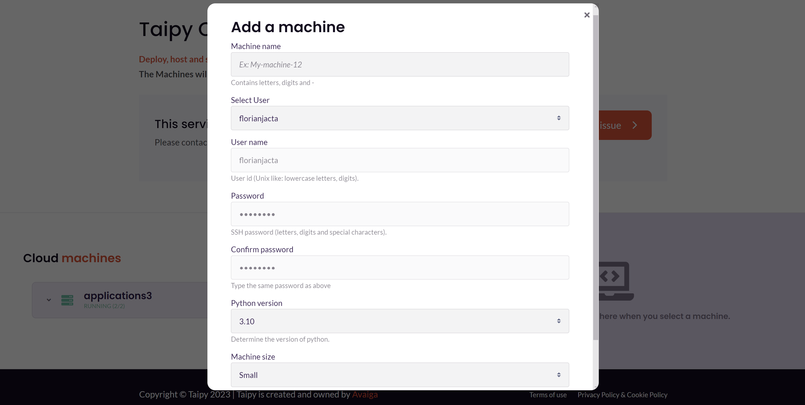
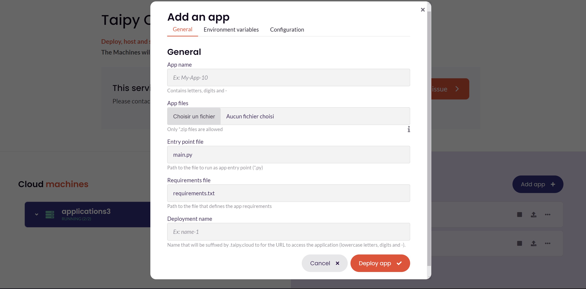
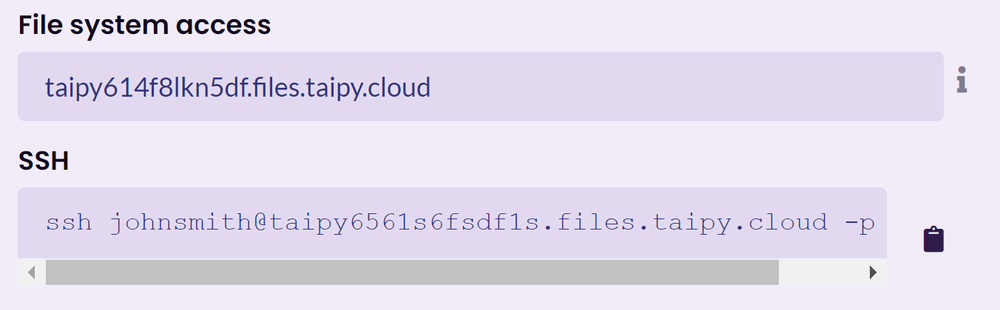

Welcome to Taipy Cloud, the platform designed to make application deployment easier,
ensuring accessibility and stability. In this detailed guide, we will take you through
the process of deploying a Taipy application on Taipy Cloud.

{width=90% : .tp-image }

We'll cover everything from configuration to testing.

## Step 1: Configure Your Application

To deploy your application, you need to prepare a `requirements.txt` file
that lists all the dependencies necessary for your Taipy application.

Here are the steps to create this file:

1. In your project directory, create a new file named `requirements.txt`.
2. List all the dependencies, one per line, as shown in the example below
3. Create a zip archive containing your project folder, including your application’s 
`requirements.txt` and `main.py` files.

```py
taipy
scikit-learn
statsmodels
pandas
```

!!! Warning
    Using Windows-specific libraries is not supported, as the machines operate 
    on a Linux environment.


!!! Note
    For uploading large data sets or sizable files, please use the `/home/user/data`
     directory. This location preserves your data across deployments. To transfer your 
     files, establish a connection to your machine using 
     [SSH or Filezilla](#connect-with-ssh-or-filezilla) and upload your data 
     directly to this directory.

## Step 2: Create an Account on Taipy Cloud

Visit [taipy.io/cloud/](https://www.taipy.io/cloud/) and sign up for an account or sign 
in with your account if it already exists.
This will enable you to deploy applications with ease.

## Step 3: Create a Machine

Before deploying your first application, you need to create a machine on Taipy Cloud.
Machines can be tailored to meet your specific needs, and when you click **Add machine**
on the Taipy Cloud dashboard, you can configure several parameters:

- **Machine name**: Provide a unique name for your machine.
- **Python version**: Choose from a Python version 3.8, 3.9, 3.10, 3.11, or 3.12.
- **Machine size**: Select from Small, Medium, or Large, depending on your application's 
requirements.
  Larger machines can handle more complex applications simultaneously. The default 
  setting is a small-size machine.
  If you're a first-time user of Taipy Cloud, you'll also be prompted to create a 
  username and password.
  This will allow you to access your machine's logs.

These configurations enable you to customize your machine according to your application's
needs and access important information about its performance.

{width=90% : .tp-image-border }

## Step 4: Create an Application

After creating your app, you can select it and see the applications on it.
For now, there is none; let’s make one.

Click **Add App** and upload your Taipy Application’s zip file.
Specify the names of your main script and `requirements.txt` file.

{width=90% : .tp-image-border }

Additionally, you can choose a custom name for your application and URL,
which will be displayed as `<Deployment name>.taipy.cloud`.

The dialog includes two additional sections for further customization:

- **Environment Variables**: This section allows you to inject environment variables 
and secrets into your applications.

- **Configuration**: Additionally, you have the option to modify the configuration of 
your Taipy application. This can be done by uploading or changing a 
[configuration](../../../core/versioning/configuration.md) TOML.

## Step 5: Test Your App

Once your Taipy application is deployed, you can test it to ensure everything is 
functioning correctly.
To do this, access it using the provided URL and run through its features, verifying its 
stability and accessibility.

Additionally, you can access the Console Logs link, which displays application events
such as warnings, errors, and print statements, offering insights into your 
application’s performance.

The Taipy Cloud dashboard provides additional information such as CPU, RAM, and Disk 
usage for each machine and application.

## Connect with SSH or FileZilla

To facilitate the management of your application's files and data, Taipy Cloud supports 
connections via SSH and FileZilla. This allows you to securely transfer files to and from 
your cloud machine, which is particularly useful for handling large data sets or files 
that need to be updated or replaced between deployments.

{width=90% : .tp-image-border }

### Connecting via SSH

- **Connect to Your Machine**: Use the SSH command provided by Taipy Cloud:

   ```bash
   ssh <user>@<machine name>.files.taipy.cloud -p <port>
   ```

- **Username**: Enter your username.

- **Password**: Enter the  password you have provided for the machine.

### Connecting via FileZilla

Open FileZilla and fill in the details as follows:

   - **Host**: `<your-machine-name>.taipy.cloud` - Replace `<your-machine-name>` with the 
   actual name of your machine.
   - **Username**: Enter your username.
   - **Password**: Enter the  password you have provided for the machine.

**Click Quickconnect**: If everything is configured correctly, FileZilla will establish a 
secure connection to your Taipy Cloud machine, and you'll be able to start transferring 
files.

### Best Practices for File Transfer

- **Organize Your Files**: Keep your data organized in the `/home/user/data` directory to 
ensure persistence across deployments.

- **Manage File Sizes**: To optimize performance and deployment times, avoid uploading 
unnecessary large files. Use compression when possible.

- **Security**: Always ensure your SSH keys are secure and not shared with unauthorized 
individuals.

By following these steps, you can securely manage your files and data on Taipy Cloud 
using SSH or FileZilla, facilitating easier updates and managing your application's 
assets. This connectivity ensures that you have the flexibility to maintain and update 
your application efficiently, enhancing its performance and reliability on the Taipy 
Cloud platform.

In conclusion, Taipy Cloud is an easy platform for deploying your Taipy applications 
with ease.
By following these straightforward steps, you can ensure that your application remains 
accessible and stable.
