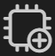
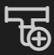

Taipy Studio can create a specific kind of view representing configuration
elements in a directed acyclic graph (DAG) that you can visualize and modify.<br/>
We call these views "Graph Views".

There are two types of elements displayed in these views:

- Nodes:<br/>
    These are rectangular boxes that represent specific configuration elements. All
    elements have an "In" and an "Out" port that lets you connect elements one to
    another.
- Links:<br/>
    These a lines that represent the relation between two elements. All links
    go from the "Out" port of an element to the "In" port of another<br/>
    - A link from a Data Node element to a Task element indicates that
      the Data Node element is one of the input Data Nodes of the Task element.
    - A link from a Task element to a Data Node element indicates that
      the Data Node element is one of the output Data Nodes of the Task element.
    - A link from a Pipeline element to a Task element indicates that
      the Task element is one of the tasks of the Pipeline element.
    - A link from a Scenario element to a Pipeline element indicates that
      the Pipeline element is one of the tasks of the Scenario element.

# Opening a Graph View

A Graph View can be created in three situations:

- To display the entire content of a configuration file.<br/>
    Right-click a configuration file item in the CONFIG FILES section of
    the Taipy Configs pane, and select "Show View".
- To display a Pipeline configuration element.<br/>
    Right-click a Pipeline configuration element in the PIPELINES section of
    the Taipy Configs pane, and select "Show View".
- To display a Scenario configuration element.<br/>
    Right-click a Scenario configuration element in the SCENARIOS section of
    the Taipy Configs pane, and select "Show View".

# The Graph View actions

At the top of a Graph View, there is a row of icons that can be clicked
to trigger actions.

This row is split into three sections:

- Left section: General tools
    - <br/>
       Rearrange the elements, so they look better in the view.
    - <br/>
       Reload the configuration file in case a desynchronization occurs.
    - <br/>
       Displayed as a circle if the configuration file was saved and as a filled disk
       if the file needs saving.<br/>
       This icon is not present when the Graph View represents a whole configuration
       file since this information is already in the tab title.
    - <br/>
       Save the Graph View as an image.
    - :<br/>
       Adjust the panning and zoom factor of the Graph View so the entire graph can be
       represented.
- Center section: Configuration element name and type.<br/>
    This section is empty when the Graph View represents a complete configuration file.<br/>
    If the Graph View represents a pipeline configuration element, this section displays the
    label *PIPELINE.&lt;name&gt;* where *&lt;name&gt;* is the name of the element.<br/>
    If the Graph View represents a scenario configuration element, this section displays the
    label *SCENARIO.&lt;name&gt;* where *&lt;name&gt;* is the name of the element.<br/>
- Right section: Configuration element creation tools.
    - <br/>
       Adds a new Data Node configuration element in the configuration file as well as in the Graph View.
    - <br/>
       Adds a new Task configuration element in the configuration file as well as in the Graph View.
    - <br/>
       Adds a new Task configuration element in the configuration file as well as in the Graph View.<br/>
       This icon appears **only** when the Graph View represents a Scenario configuration element or a configuration file.
    - <br/>
       Adds a new Scenario configuration element in the configuration file as well as in the Graph View.<br/>
       This icon appears **only** when the Graph View represents a full configuration file.


# Editing in a Graph View

To demonstrate the capabilities of the Graph View, we will create the configuration
described in the
[Python code configuration](../../core/config/advanced-config.md#python-code-configuration)
example, using the interactive features that Taipy Studio provides.<br/>
Note that for the sake of conciseness, we will create a Scenario configuration that
holds only one Pipeline configuration. When you understand the process, you will
see that creating the second Pipeline configuration of the example is straightforward.

We are starting from a project where only the Python code was developed:

- `main.py` loads the configuration file and submits a scenario
- `functions.py` defines the functions used by the Task configuration elements.

Note that there is no code for defining the `Config^` object in these source files.

We also start with an empty `config.toml` file, where the configuration elements will
be defined.

## Creating the first configuration elements

We will start by opening a Graph View representing the entire configuration file
then we will create the Data Node and Task configuration elements using the
[Graph View action buttons](#the-graph-view-actions).

<p align="center">
  
</p>

After the Task configuration and all three Data Node configurations are created,
we connect the Out ports to the appropriate In ports by dragging links.

## Creating the Pipeline configuration

The Pipeline configuration element is created similarly. Once the element
appears in the Graph View, we connect its Out port to the In port of the Task
element to indicate that the "planning" task element is part of the
"production" pipeline:

<p align="center">
  
</p>

## Creating the Scenario configuration

Similarly, we create the Scenario configuration element and connect its Out port
to the In port of the "production" pipeline to indicate that this Pipeline
configuration element is part of the "scenario_configuration" scenario:

<p align="center">
  
</p>

## Setting the configuration elements parameters

You can select a configuration element from the Graph View and use the Details
section of the Taipy Configs pane.<br/>
From there, you can set the properties of the selected element.

Here is how we can set the function used in the Task configuration we have created above.
Note that Taipy Studio can locate the functions module and name, so it is easy to spot the
one you want to use.<br/>
In our example, we want our Task configuration to use the function called `plan` from the
`functions` module (the `functions.py` source file):

<p align="center">
  
</p>

After this final step, the configuration file can be saved from the Graph View
itself (pressing the `Ctrl-S` key combination). The generated configuration file can be
used by the Taipy Core application: in the source file `main.py`, you can load this
configuration file and submit an entity created from the scenario configuration you just
have designed:

```py
import taipy.core as tp
from taipy import Config


if __name__ == "__main__":
    Config.load("config.toml")
    tp.Core().run()

    # Retrieve the scenario configuration from the Config
    scenario_cfg = Config.scenarios["scenario_configuration"]
    # Create a scenario entity
    scenario = tp.create_scenario(scenario_cfg)
    # Submit the scenario
    tp.submit(scenario)
```

## Changing the links

- To add a control point on a link, click the link where you want to create
    the control point, then drag the point where you want it. Release the
    mouse button when you are done.
- To remove a control point, select it (its color changes when you click on it),
  then press the `<DEL>` key.
- To remove a link, select it while pressing the `<SHIFT>` key, then press the `<DEL>`
  key.<br/>
  Note that the source element of the link is removed from the Graph View but not
  from the configuration file.
