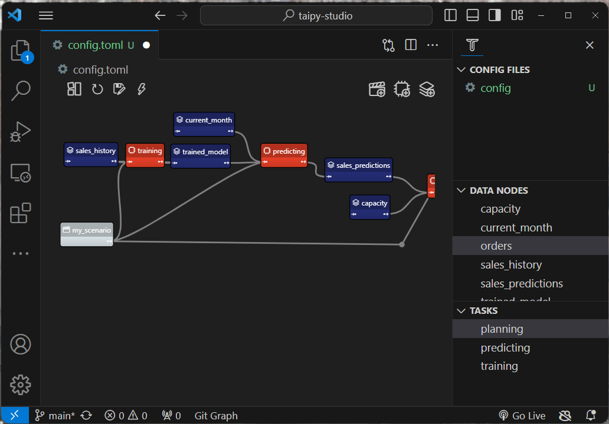
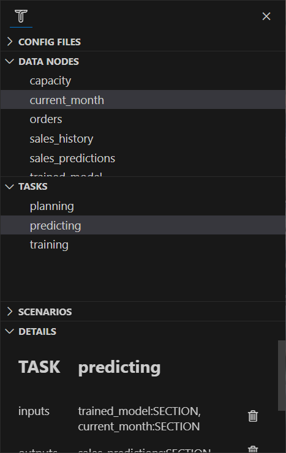

# Building configurations

Applications that rely on [Taipy Core](../../core/index.md) need to define
a [Configuration](../../core/config/index.md) where the data flow is
described. 
This configuration can be coded in Python and tuned using environment variables
(as described in the
[advanced configuration](../../core/config/advanced-config.md#Python-code-configuration)
section).

Taipy Studio provides ways to design graphically Taipy application configurations.
Within the Visual Studio Code environment, you can create configuration elements (for
Data Nodes, Tasks, Pipelines, and Scenarios), specify the properties for those elements,
and use a visual representation of those configuration elements as a graph.

  

Taipy Studio stores those configurations in TOML files. These files can be used at
runtime by Taipy applications as described in the
[note on Studio](../../core/config/advanced-config.md#studio).

## Introduction

Taipy Studio has a dedicated panel called "Taipy Configs", where mostly everything
happens. To open this panel, use the "View > Open View..." menu option and search
for the view called "Taipy Configs".

The view appears like this:

  

This panel is split into several sections that let the user access all the
configuration elements:

- Config Files: holds a list of configuration files (`*.toml`) that exist in the
    project. 
    The user can select a configuration file in this list to populate the other
    sections of the Taipy Configs view.
- Data Nodes: holds the list of
    [Data Node configurations](../../core/config/data-node-config.md) defined
    in the selected configuration file. 
    The user can select a Data Node configuration in this list to access all its
    properties in the Details section (see below).
- Tasks: holds the list of
    [Task configurations](../../core/config/task-config.md) defined
    in the selected configuration file. 
    The user can select a Task configuration in this list to access all its
    properties in the Details section (see below).
- Pipelines: holds the list of
    [Pipeline configurations](../../core/config/pipeline-config.md) defined
    in the selected configuration file. 
    The user can select a Pipeline configuration in this list to access all its
    properties in the Details section (see below).
- Scenarios: holds the list of
    [Scenario configurations](../../core/config/scenario-config.md) defined
    in the selected configuration file. 
    The user can select a Scenario configuration in this list to access all its
    properties in the Details section (see below).
- Details: When a configuration element is selected, the Details section displays
    all the properties of this configuration element and allows the user to
    modify these properties.

Using these different sections, you can add, rename or remove configuration
elements, as well as change their properties in the "Details" section.

All your actions impact the selected configuration file;
you can use Visual Studio Code's undo/redo feature if needed.
