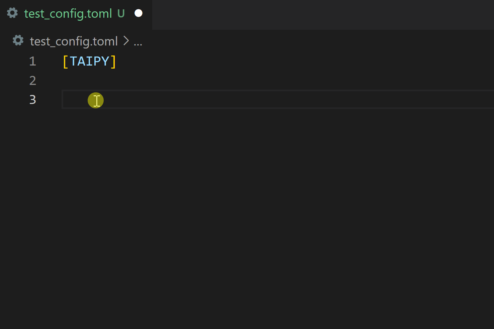
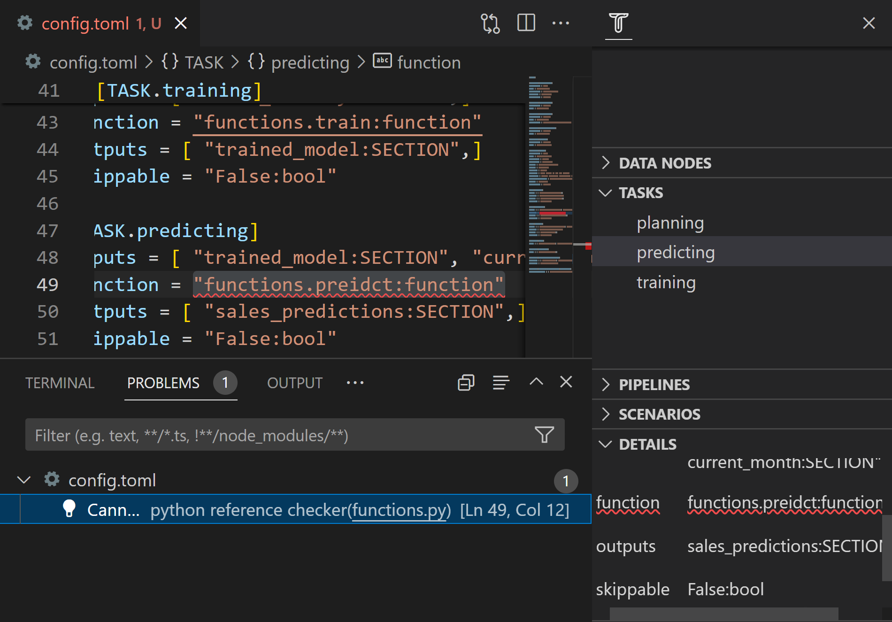

A configuration file is a standard text file with the '`.toml`' extension. Visual Studio
Code lets you edit it manually, as any other text file. 
Taipy Studio provides some support for identifying problems in configuration
files and accelerating typing thanks to auto-completion features.

## Auto-completion

If you are entering text in a configuration section ([DATA_NODE.*id*], [TASK.*id*], etc.),
you can press the `Ctrl-<SPACE>` key combination: Taipy Studio will then suggest relevant
fragments that would prevent you from typing them entirely.

Those suggestions include property names and values, as demonstrated in the following animation,
showing how we could create a new Data Node configuration in the body of a configuration file:

  

You will also get support for auto-completion in other contexts, such as a reference
to another configuration element.

## Spotting problems

Taipy Studio helps point out potential problems in your configuration files that are
indicated in the body of the file content, in the Problems pane, and in the **Details**
section of the **Taipy Configs** pane.

  

Here are the problems that Taipy Studio identifies:

- General TOML syntax errors from the "Even Better TOML" extension.
- "No reference to element 'XXX'." (Warning) 
    The configuration element (Data Node or Task) is not referenced by any other element.
- "Element 'XXX' does not exist." (Error) 
    A configuration element identifier that does not exist is referenced by this
    configuration element (Data Node, Task, or Scenario).
- "Cannot find Python function: 'XXX'." (Error) 
    This Task configuration element uses a function name that does not exist. 
    A Quick Fix can create that function for you.
