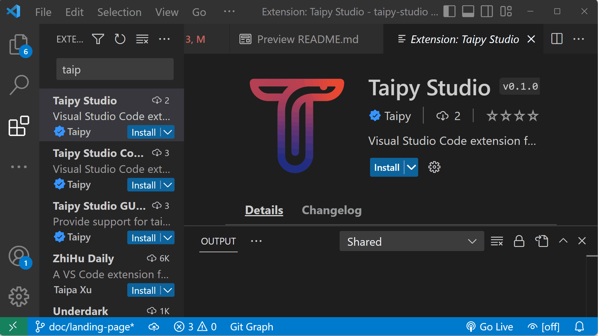

# Taipy Studio

Taipy Studio is an extension to [Visual Studio Code](https://code.visualstudio.com/)
that significantly accelerates the development of Taipy applications.

This tool addresses two major areas:

- Building configurations. 
    An application that relies on [Taipy Core](../core/) needs to build a Taipy
    [configuration](../core/config/) where DataNodes, Tasks, etc. are declared.
    Running the application usually starts by creating [entities](../core/entities/),
    which depend on configuration elements.

    Taipy Studio provides a graphical editor where you can create and configure
    the elements of your configurations stored in toml files that the
    application can use at run-time. The editor can represent pipelines and
    scenarios as graphs, where nodes are DataNodes or Tasks.

    You may want to learn more about Taipy configuration files edition by navigating
    to the [Configuration files edition](config.md) page.

- Defining Taipy GUI page content with Markdown 
    Taipy GUI exposes an augmented implementation of the
    [Markdown syntax](../gui/pages.md#using-markdown) that allows
    for defining visual elements you want to display on your applications'
    pages.

    Because there are many available visual elements to choose from and
    because each element type has its own set of properties, it can be
    cumbersome to type everything manually. Taipy Studio provides a sort
    of code completion facility that helps you fill the element definition
    text fragments.

    It is also tricky to locate typos and errors in the Markdown text.
    Taipy Studio will spot these problems for you and report them in the
    *Problems* view. It can often provide a *Quick Fix* action that can solve
    your syntactic problem in no time.

    For more information on these features, please refer to the
    [Taipy Markdown syntax support](gui.md) page.

## Installation

You can install the
[Taipy Studio](https://marketplace.visualstudio.com/items?itemName=Taipy.taipy-studio)
extension using the
[Extension Marketplace](https://code.visualstudio.com/docs/editor/extension-marketplace).
Look for extensions whose names contain "Taipy".

  

Once installed, Taipy Studio is activated when:

- the current project contains any file with a `.toml` extension (then
  these files are presumed to be Taipy configuration files);
- the current project contains any file with a `.md` extension (then
  these files are presumed to be Taipy GUI page definition pages);
- the current project contains any file with a `.py` extension (then
  these Python source files may contain strings that define Taipy GUI
  pages);
- you explicitly open the *Taipy Configs* view (using the "View > Open View..."
  menu option).

Depending on your task at hand, you may want to read more on
[building Taipy configurations](config.md) or on [Taipy GUI Markdown support](gui.md).

## [:material-arrow-right: Building Taipy configurations](config.md)

## [:material-arrow-right: Taipy GUI Markdown support](gui.md)
