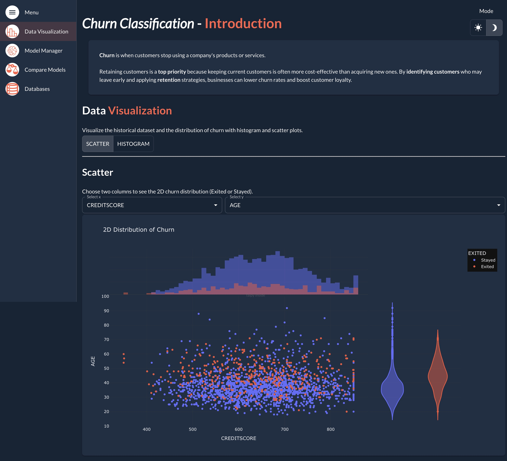
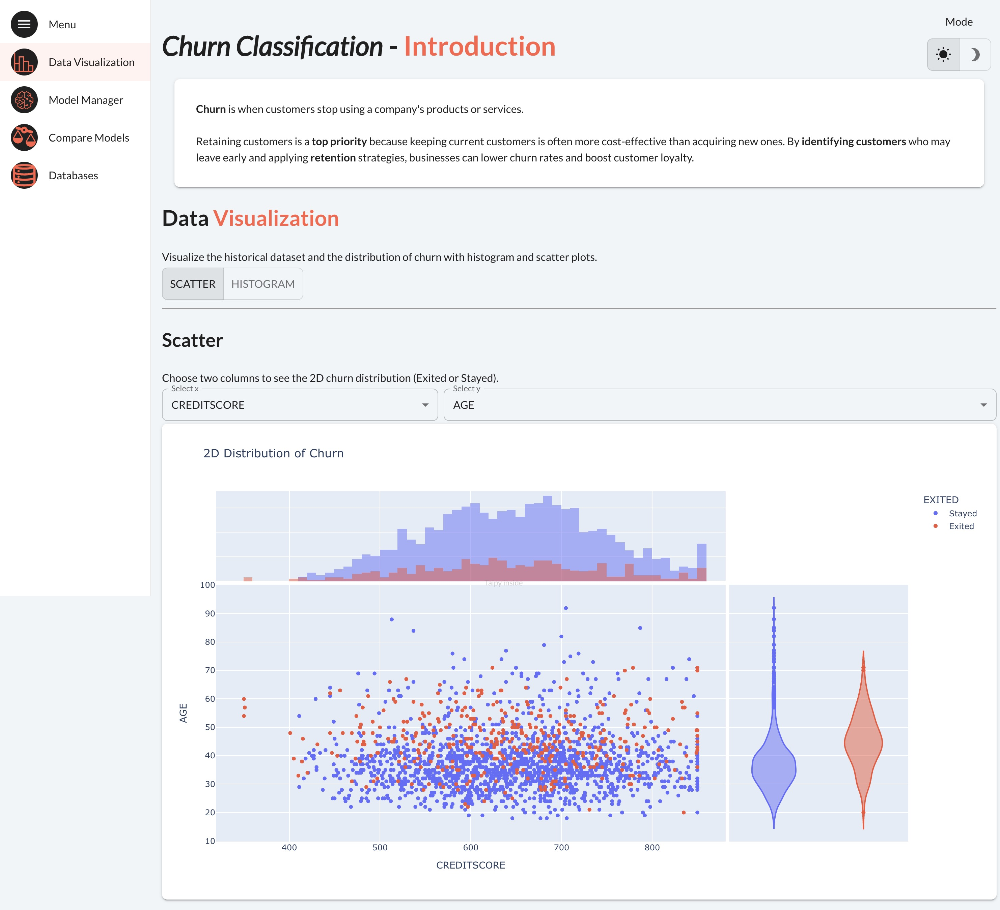
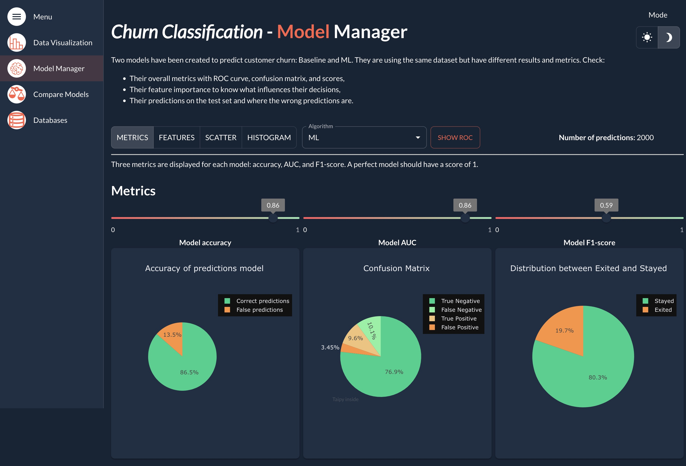
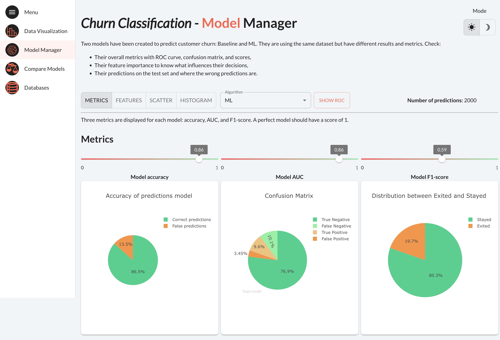
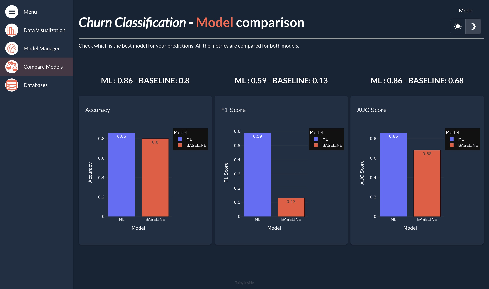
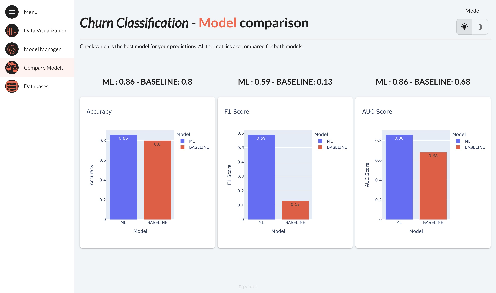
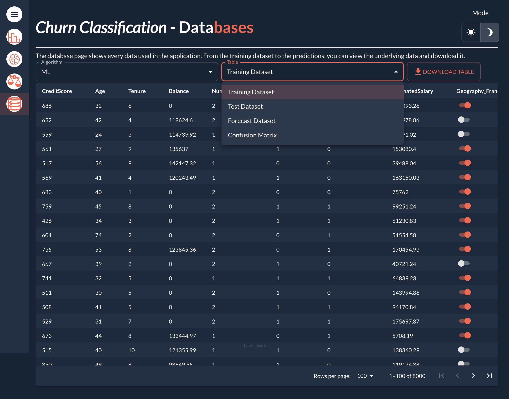
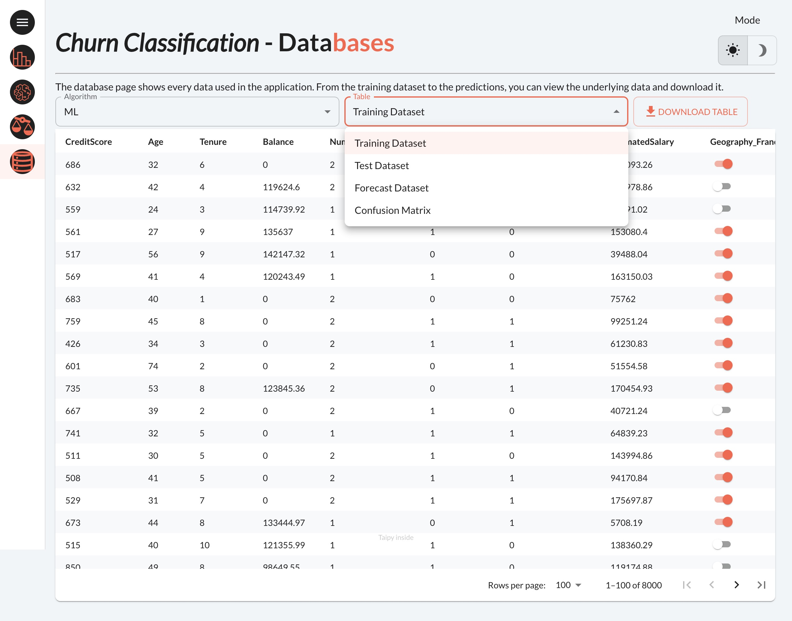

The classification template provides a foundational structure for applications that predicts the
customer churn for a company. Predicting which customers are likely to stop using the company's
services has become an essential process.

Out of the box, the template provides a multi-page application structure:

- A visualization page to visualize different fields of the dataset for exploratory data analysis.
- A model manager page to review the performance of different models, including different metrics
  of each classification model, the ROC curve, and feature importance.
- A model comparison page to compare the performance of different models side by side.
- A databases page to view and manage the training and testing datasets for the models.

<figure>
  
  
  <figcaption>Data visualization with the Taipy classification application template</figcaption>
</figure>

<figure>
  
  
  <figcaption>Manage models with the Taipy classification application template</figcaption>
</figure>

<figure>
  
  
  <figcaption>Compare models with the Taipy classification application template</figcaption>
</figure>

<figure>
  
  
  <figcaption>Manage datasets with the Taipy classification application template</figcaption>
</figure>

The template also provides support for a wide range of functionalities, including:

- Data visualization
- Authentication support
- Git repository setup
- Docker setup

# How to create an application

To create the application from the classification template, change to the folder in which you want
to create the application and run the command `taipy create --application classification`. Then
answer a few questions to customize your application.

```console
[1/6] Application root folder (taipy_application):
[2/6] Application main Python file (main.py):
[3/6] Application title (Taipy Application):
[4/6] With Authentication? (No):
[5/6] With a new Git repository? (No):
[6/6] Select With Docker deployment
    1 - No
    2 - For development
    3 - For production
    Choose from [1/2/3] (1):
New Taipy application has been created at taipy_application

To start the application, change directory to the newly created folder:
        cd taipy_application

You can then run the application as follows:
        taipy run main.py
```

??? info "Default answers"

    In the CLI, the default answer for each question is displayed in the square brackets.
    You can provide an answer or press Enter to use the default value.

Each question in the CLI corresponds to a specific aspect of the application. The following
sections describe each question in detail.

!!! note "Available in Taipy Enterprise edition"

    Questions 6 is only relevant to the [Taipy Enterprise Edition](https://taipy.io/enterprise)

    [Contact us](https://taipy.io/book-a-call){: .tp-btn .tp-btn--accent target='blank' }

1. Application root folder

- Specifies the root folder of the application.
- The default value is "taipy_application".

2. Application main Python file

- Sets the name of the main Python file (entry point) of the application.
- The default value is "main.py".

3. Application title

- Specifies the title displayed in the web application.
- The default value is "Taipy Application".

4. With Authentication

- Indicates whether the application includes authentication.
- If the answer is "yes" or "y", a login page and a basic setup for configuring authentication is included
  in the application.
    - A login page is created in `pages/login.py`, which uses the
      [Taipy login control](../../refmans/gui/viselements/generic/login.md).
    - A basic authentication configuration is added to the `configuration/auth_config.py` file.
      By default, the authentication uses the
      [Taipy protocol](../../userman/advanced_features/auth/authentication.md#taipy-protocol).
      You can customize the authentication method as needed.
- The default value is "No".

5. With a new Git repository

- Specifies whether the application directory should be initialized as a new Git repository.
- The default value is "No".

6. With Docker deployment

- Specifies Docker support for the application.
- Options:
    - "No": No Docker support.
    - "For development": Add a minimal version of `Dockerfile` and `docker-compose.yml` for development.
    - "For production": Add a production-ready `Dockerfile` and `docker-compose.yml`.
- The default value is "No".

# Application description

The generated application has the following folder structure:

```plaintext
taipy_application/
├──── algos/
│   ├──── __init__.py
│   └──── algos.py
│
├──── config/
│   ├──── __init__.py
│   ├──── auth_config.py
│   └──── config.py
│
├──── data/
│   └──── dataset.csv
│
├──── images/
│
├──── pages/
│   ├──── __init__.py
│   ├──── compare_model/
│   ├──── data_visualization/
│   ├──── databases/
│   ├──── login/
│   ├──── model_manager/
│   └──── root.py
│
├──── .taipyignore
├──── .gitignore
├──── docker-compose.yml
├──── Dockerfile
├──── main.py
└──── requirements.txt
```

Your application's folder structure may vary depending on the options you selected during the
creation process. Here is a brief overview of the folder structure:

- `algos/`: Contains the `algos.py` file, designed to contain Python functions used to configure
    tasks.
- `config/`:
    - `config.py` contains the configuration for the application.
    - `auth_config.py` contains the configuration for the authentication feature.
- `pages/`: Contains the application pages.
    - `root.py` is the root page of the application, which layouts the application.
    - `compare_model/`, `data_visualization/`, `databases/`, `login/`, and `model_manager/` are
        the pages of the application, which contain the visual elements and the logic of the
        respective pages.
- `data/`: Contains the dataset used by the application.
- `images/`: Contains the images used by the application.
- `.gitignore`: Specifies files to be ignored by Git.
- `.taipyignore`: Specifies files to be protected when running the web server. Please refer to the
  [Protect private files](../../userman/operations/running/protect-files.md) page for more
    information.
- `docker-compose.yml` and `Dockerfile`: The Docker configuration for building and running the
    application as a Docker container.
- `main.py`: The main Python file of the application.
- `requirements.txt`: Contains the Python dependencies required by the application.

# How to customize the application

Everything in the generated application can be updated to fit your needs. It includes
the configuration, the pages, and any other resources.

## Data

The `data/` folder contains the dataset used by the application. You can replace the
`dataset.csv` file with your own dataset. The dataset is used to train and test the models
in the application.

Out-of-the-box, the dataset contains information about customers of a company. The dataset
contains 10,000 records, and the key features include Credit Score, Age, Tenure, and others.
The target variable is a boolean field named "Exited", indicating whether a customer has churned.

## Configuration

The `config/config.py` file contains the *scenario_cfg*, which is imported in the main
application file to create the scenarios of the application.

Out-of-the-box, the scenario is configured with two classification models:

- A Logistic Regression model, referred to as the "Baseline".
- A Random Forest model, referred to as "ML".

The functions used to configure tasks are stored in the `algos/` folder, which includes data
processing, model training, and model evaluation functions. You can customize the configuration
by adding more model training functions, or modifying the evaluation metrics to fit your specific
requirements.

## Authentication

For the authentication feature, the `configuration/auth_config.py` file is designed to contain the
configuration of the authentication protocol.

By default, the authentication uses the
[Taipy protocol](../../userman/advanced_features/auth/authentication.md#taipy-protocol). You can
customize the authentication protocol by editing the placeholder list of users and roles, or use a
different supported protocols.

The role required to access the pages of the application is defined in the *on_navigate()* function.
Out-of-the-box, the application requires the user to logged-in to access any of the pages. You can
customize the behavior of the *on_navigate()* function to allow access to certain pages, or limit
access based on certain role.

# How to run the application

To run the application, change to the newly created folder and run the application using
`taipy run main.py`.

```console
$ cd taipy_application
$ taipy run main.py
```

If the newly created application supports Docker, you can also run the application using `docker-compose`.

```console
$ cd taipy_application
$ docker-compose up --build -d
```

You can now access the application in your browser at `http://localhost:5000`.
