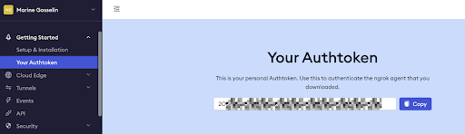

For people who want to create strong graphical interfaces without needing to be an expert in GUI
(Graphical User Interface), Taipy is definitely the solution.

In addition to coding with Python scripts, Taipy works seamlessly in
[Notebook environments](../jupyter_notebooks/index.md). You can use Notebooks on your computer
and on platforms like:

- [Google Colab](https://colab.google/)
- [Kaggle](https://www.kaggle.com/)
- [Databricks](https://www.databricks.com/)
- [Amazon SageMaker](https://aws.amazon.com/fr/sagemaker/)
- [IBM Watson Studio](https://www.ibm.com/products/watson-studio)

In this article, we will demonstrate how to put a Taipy application on Notebooks that are hosted
on the Google Colab platform. We will achieve this by creating a public URL using
[Ngrok](https://ngrok.com/).

{width=90% : .tp-image }

To begin, let's briefly explain what Ngrok and Google Colab are.

# What is Google Colab?

[Google Colab](https://colab.google/) is a preferred tool for Data Scientists. It offers an
advanced Notebook environment that provides access to powerful hardware,
including CPUs and GPUs, essential for tasks like deep learning, without the need to buy
physical machines.

However, Google Colab is cloud-based, so you can't directly see the graphical user interface
of your web application. But don't worry, we'll show you how Ngrok can help solve this issue.

# What is Ngrok?

Ngrok enables you to share your application directly on the internet. It sets up a connection
from your computer to the outside world through a public URL.

Please note that the URL is temporary when using the free version of Ngrok, but you can make it
permanent by opting for a paid solution.

# Taipy on Google Colab

**Step 1: Put your Taipy application on Google Colab.**

Now, let's begin! For our example, we will use a Sentiment Analysis Application from
[Demo sentiment analysis](https://github.com/Avaiga/demo-sentiment-analysis) guide. This
application showcases multiple pages with a feature-rich graphical user interface.

Copy the Taipy Sentiment Analysis code into a Google Colab Notebook.

When you run the Taipy code (please note the instruction: `Gui.run(...)^` which initiates a web
server), it will start a web application with a local URL. However, keep in mind that
this URL is only accessible locally and cannot be accessed from the internet. As mentioned
earlier, Google Colab is hosted on a server, not on your local machine.

**Step 2: Get your Authtoken on Ngrok**

On the Ngrok website (create a hyperlink to Ngrok website), create a free account.

{width=50% : .tp-image-border }

After you've created your account, you can obtain your personal AuthToken. We require this
AuthToken to establish the tunnel for our Taipy application.

{width=60% : .tp-image-border }

Head to Ngrok website and obtain your tunnel Authtoken.

# Sharing with Ngrok

First, let's install the Ngrok Python wrapper called **pyngrok**.

- `pip install pyngrok`

The next step takes place in the `Gui.run()^` call. Taipy has an in-built Ngrok Authtoken reader.
We just have to add the *ngrok_token* parameter to the `run()` function and set it to the Authtoken
provided by Ngrok.

```python
    Gui(pages=pages).run(ngrok_token=<Authtoken>)
```

Executing this last step will generate a public URL from Ngrok in the terminal.

{width=70% : .tp-image-border }

{width=70% : .tp-image-border }

Now, please click on the Ngrok Public URL link to access our application.

{width=90% : .tp-image-border }

Congratulations! You have successfully created and launched our multi-page Taipy application
from Colab!

On the first page, you can enter a word or sentence and see its scores determined by an NLP
algorithm. The results are displayed in a table and a graph. On the second page, you can upload
a file and see the analysis of an entire text.

# Update the delay parameter

Our application, accessed through Ngrok, is updated at intervals determined by a delay parameter.
When we input a word or sentence, you may notice that it's not always registered correctly
because the page refreshes several times. This happens because of the time it takes for data to
travel over the internet, causing delays.

To address this issue, you can modify the *change_delay* parameter in one of the following ways:

- **Locally**: You can make changes to this parameter locally, directly within the Taipy visual
  element.

=== "Markdown" 
   ```python
   <|{text}|input|change_delay=800|>
   ```
=== "Python"
   ```python
   tgb.input("{text}", change_delay=800)
   ```

- **Globally**: To adjust the delay for all of Taipy's visual elements.

```python
Gui(pages=pages).run(change_delay=800, ngrok_token=<Authtoken>)
```

# Reload after modification

As it stands, when you make changes to a cell, there's no need to restart the kernel. You can
simply rerun the Notebook to see your changes in action. However, in Ngrok's free version, you
are restricted to three re-executions, which might require a kernel restart.

Nevertheless, Taipy offers built-in functions that enhance the notebook experience with Taipy.
This eliminates the limitations of the Ngrok free version and enables easy updates with fewer
re-executions required. You can learn more about this in the
[linked article](../jupyter_notebooks/index.md).

## Modification of the Markdown with `Page.set_content`

Here are the new cells to add:

1. Import Markdown:
   ```python
   from taipy.gui import Gui, Markdown
   ```

2. Create an empty new page:
   ```python
   new_page = Markdown("")
   ```

3. Set the page content:
   ```python
   new_page.set_content(page)
   ```

4. Update the `pages` definition:
   ```python
   pages = {"/":"<|toggle|theme|>\n<center>\n<|navbar|>\n</center>",
            "line":new_page,
            "text":page_file}
   ```

## Variable modification with `gui.reload`

1. Add this step:
   ```python
   gui=Gui(pages=pages)
   ```

2. Update your `tp.run(gui)`:
   ```python
   gui.run()
   ```

3. Add the `gui.reload` function:
   ```python
   gui.reload()
   ```

After you've made your modifications, just rerun the cell where you made the changes and
activate the reload function. Refresh your application page to view the updates you've made.

# Conclusion

To sum it up, deploying a Taipy application on Google Colab with Ngrok offers a convenient way
to share graphical interfaces and applications on the internet.

Google Colab provides access to high-performance hardware without the need for physical machines.
Ngrok, on the other hand, offers a temporary or permanent public URL for your application,
making it accessible to anyone. By following the steps outlined in this article, you can easily
set up your Taipy application on Google Colab and share it with others. Additionally, adjusting
the delay parameter can enhance the user experience for your application.

In general, this approach is an excellent choice for those looking to develop and deploy
powerful graphical user interfaces in the cloud without excessive complexity.
