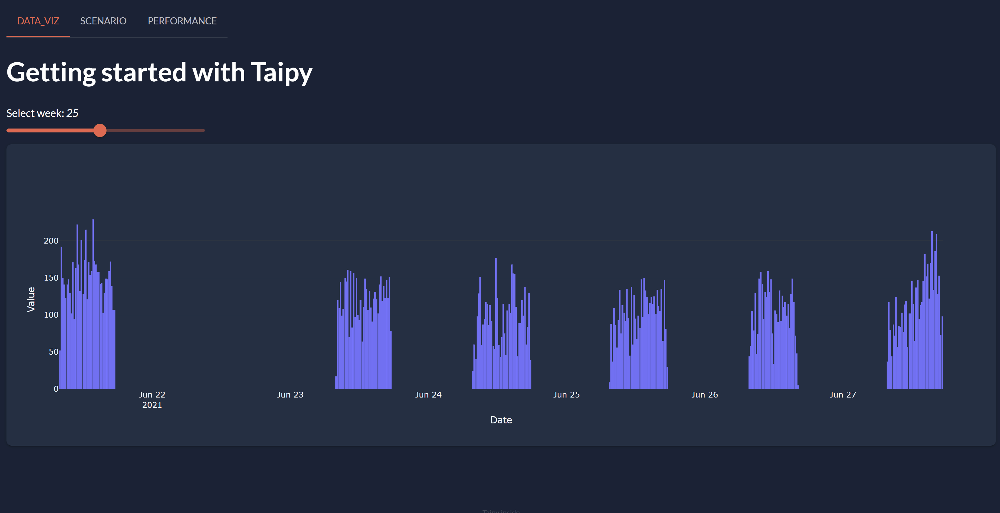

!!! note "Supported Python versions"

    Taipy requires **Python 3.9** through **3.12**.

This tutorial guide will walk you through creating a complete application from the front end to
the back end. You don't need any prior knowledge to complete this tutorial.

{ width=90% : .tp-image-border }

Each step concentrates on fundamental ideas about *Taipy*.

## Objective of the Application

You are about to create a comprehensive multi-page application designed for data visualization,
predictive analytics, and comparative assessment. This app processes sales figures for display.
One of its dedicated pages allows you to use two predictive models where predictions can be
fine-tuned through some parameters. To round it off, the performance page offers a graphical
comparison of various predictive outcomes.

## Before we begin

Three packages have to be installed:

 1. **Taipy** package, it requires Python 3.9 through 3.12;

 2. **scikit-learn**: A Machine-Learning package that will be used in the Tutorial user code;

 3. **statsmodels**: Another package for statistics also used in the user code.

``` console
$ pip install taipy
$ pip install scikit-learn
$ pip install statsmodels
```

!!! info

    `pip install taipy` is the preferred method to install the latest stable version of Taipy.

    If you don't have [pip](https://pip.pypa.io) installed, this
    [Taipy installation guide](../../getting_started/installation.md)
    can guide you through the process.


Once Taipy is installed, you can use the Taipy CLI to scaffold an application folder. Run
the create command line with default application template and answer basic questions as
follows:

``` console
> taipy create --application default
[1/9] Application root folder [taipy_application]:
[2/9] Application main Python file [main.py]:
[3/9] Application title [Taipy Application]:
[4/9] With multi-pages?
        Enter the page names separated by a space ():
[5/9] With Authentication? (No):
[6/9] With scenario management? (No):
[7/9] With a Rest API? (No):
[8/9] With a new Git repository? (No):
[9/9] Select With Docker deployment
    1 - No
    2 - For development
    3 - For production
    Choose from [1/2/3] (1):
```

For more details on the available application templates, please refer to the
[Templates](../../../tp_templates/index.md) documentation.

So, without further delay, let's begin to code!

## Steps

1. [Data Visualization page](step_01/step_01.md)

2. [Algorithms used](step_02/step_02.md)

3. [Scenario Configuration](step_03/step_03.md)

4. [Scenario page](step_04/step_04.md)

5. [Performance page](step_05/step_05.md)
