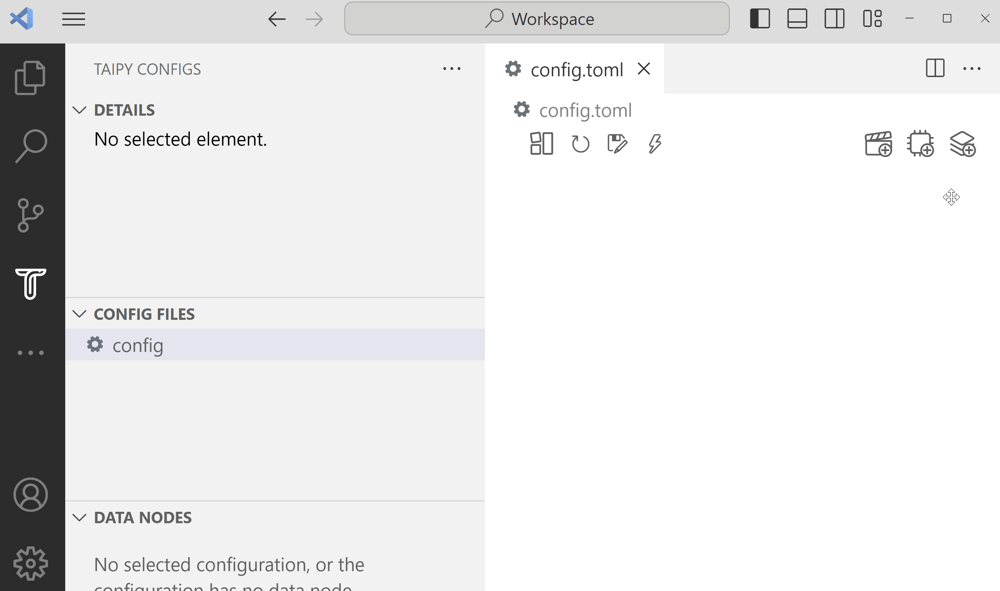
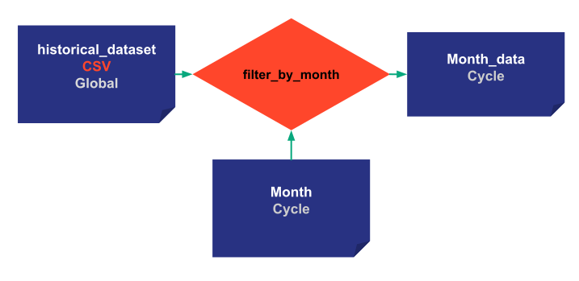
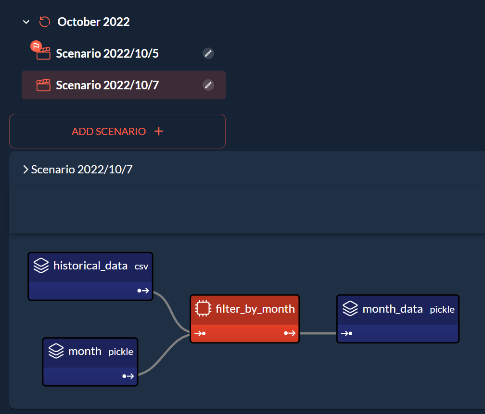

*Estimated Time for Completion: 30 minutes; Difficulty Level: Intermediate*

In this section, we will explore the intricate relationship between
[Scopes](../../../userman/scenario_features/what-if-analysis/scenarios-and-cycles.md#what-is-a-data-node-scope)
and [Cycles](../../../userman/scenario_features/what-if-analysis/scenarios-and-cycles.md#what-is-a-cycle),
two important concepts that help manage data nodes and scenarios effectively in Taipy.

[Download the code](./src/scope_and_cycle.zip){: .tp-btn target='blank' }

# Cycles

Using [Cycles](../../../userman/scenario_features/what-if-analysis/scenarios-and-cycles.md#what-is-a-cycle)
allow you to:

- Share variables between scenarios in the same time frame

For example, if I have three sales prediction scenarios for the month of June, I do
not have to duplicate the data for each scenario. I can share the June sales data
between the three scenarios.

- Better organize the data nodes in your application

{ width=30% : .tp-image-border }


Here we have a single month_data node for all scenarios of October 2022 and it
is part of the October 2022 cycle. I do not need to create a new data node for each scenario and clutter my application.


## Example: Filtering by Month

```python
def filter_by_month(df, month):
    df['Date'] = pd.to_datetime(df['Date'])
    df = df[df['Date'].dt.month == month]
    return df
```


{ width=80% : .tp-image }

## Configuration

!!! example "Configuration"

    === "Taipy Studio"

        { width=90% : .tp-image-border }

        - Construct the configuration

        - Add the frequency property for the scenario and put "MONTHLY:FREQUENCY" (DAYLY, WEEKLY, MONTHLY, YEARLY)

        - Load the new [configuration](./src/config.toml) in the code

    === "Python configuration"

        A parameter is added in the scenario configuration for the frequency.

        ```python
        from taipy.common.config import Frequency

        historical_data_cfg = Config.configure_csv_data_node(id="historical_data",
                                                             default_path="time_series.csv")

        month_cfg =  Config.configure_data_node(id="month")
        month_values_cfg =  Config.configure_data_node(id="month_values")

        task_filter_cfg = Config.configure_task(id="filter_by_month",
                                                function=filter_by_month,
                                                input=[historical_data_cfg, month_cfg],
                                                output=month_values_cfg)


        scenario_cfg = Config.configure_scenario(id="my_scenario",
                                                 task_configs=[task_filter_cfg],
                                                 frequency=Frequency.MONTHLY)

        ```


Since we have specified `frequency=Frequency.MONTHLY`, the corresponding scenario when created,
is automatically attached to the correct period (month).

The Cycle which a Scenario belongs to is based on the _creation_date_ of the scenario. It can be
"attached" to a specific cycle by manually setting its _creation_date_, as we are doing in the
following example.


```python
tp.Orchestrator().run()

scenario_1 = tp.create_scenario(scenario_cfg,
                                creation_date=dt.datetime(2022,10,7),
                                name="Scenario 2022/10/7")
scenario_2 = tp.create_scenario(scenario_cfg,
                                creation_date=dt.datetime(2022,10,5),
                                name="Scenario 2022/10/5")
```

Scenario 1 and Scenario 2 are two separate scenario entities created using the same scenario
configuration. They are part of the same `Cycle` but have different data nodes. By default, each
scenario instance has its own data node instances, and they are not shared with any other scenario.

## Interplay between Scopes and Cycles

Cycles are generated according to the _creation_date_ of scenarios. The scope, on the other
hand, determines how data nodes are shared within these cycles and scenarios.

# Scopes

Sharing data nodes between entities allows you to organize and manage your data better.
It avoids data duplications and allows Taipy to better manage execution (see
[skippable tasks](../skippable_tasks/index.md)).
The developer may decide:

- `Scope.SCENARIO` (_default_): Having one data node for each scenario.
- `Scope.CYCLE`: Extend the scope by sharing data nodes across all scenarios of a given cycle.
- `Scope.GLOBAL`: Expand the scope globally, applying it across all scenarios in all cycles.

Modifying the scope of a Data Node is straightforward.
Let's change the configuration of our data nodes:

- *historical_data*: is a Global data node. It will be shared by every cycle and scenario.

- *month*: is a Cycle data node. All scenarios of the same month will share this data.

- *month_values*: same for *month_values*.

{ width=90% : .tp-image }

!!! example "Configuration"

    === "Taipy Studio"

        { width=80% : .tp-image-border }

        - Change the Scope of historical_data to be global

        - Change the Scope of month_data and month to be Cycle

    === "Python configuration"

        The configuration is the same as the last step except for the data node
        configurations. New parameter are added for scopes.

        ```python
        from taipy.common.config import Frequency, Scope

        historical_data_cfg = Config.configure_csv_data_node(id="historical_data",
                                                             default_path="time_series.csv",
                                                             scope=Scope.GLOBAL)

        month_cfg =  Config.configure_data_node(id="month", scope=Scope.CYCLE)
        month_values_cfg =  Config.configure_data_node(id="month_values", scope=Scope.CYCLE)

        ```


Defining the *month* of scenario 1 will also determine the *month* of scenario 2 since they
share the same Data Node.

```python
scenario_1.month.write(10)


print("Month Data Node of Scenario 1:", scenario_1.month.read())
print("Month Data Node of Scenario 2:", scenario_2.month.read())

scenario_1.submit()
scenario_2.submit()
```

Results:
```
Month Data Node of Scenario 1: 10
Month Data Node of Scenario 2: 10
```

In this unusual example where both scenarios are in the same cycle and all their data nodes
are at least with a `Cycle` Scope, executing one is the same as executing the other as they share
all their data nodes.

# Going further into Cycles

## Primary scenarios

In each `Cycle`, there is a primary scenario. A primary scenario is interesting because
it represents the important scenario of the `Cycle`, the reference. By default, the
first scenario created for a cycle is primary.


### Python code associated to primary scenarios

[`tp.set_primary(<Scenario>)`](../../../userman/scenario_features/sdm/scenario/index.md#promote-a-scenario-as-primary)
allows changing the primary scenario in a `Cycle`.

`<Scenario>.is_primary` identifies as a Boolean value whether the scenario is primary or not.

```python
before_set_1 = scenario_1.is_primary
before_set_2 = scenario_2.is_primary

tp.set_primary(scenario_2)

print('Scenario 1: Primary?', before_set_1, scenario_1.is_primary)
print('Scenario 2: Primary?', before_set_2, scenario_2.is_primary)
```

Results:

```
Scenario 1: Primary? True False
Scenario 2: Primary? False True
```

## Useful functions on cycles

- `tp.get_primary_scenarios()`: returns a list of all primary scenarios.

- `tp.get_scenarios(cycle=<Cycle>)`: returns all the scenarios in the Cycle.

- `tp.get_cycles()`: returns the list of Cycles.

- `tp.get_primary(<Cycle>)`: returns the primary scenario of the Cycle.


### Scenario management visual elements

You can use Scenario management visual elements to control Cycles. Cycles can be seen in either the
 `scenario_selector` or `data_node_selector`. Additionally, it's possible to designate a scenario
as primary directly through the `scenario` visual element.

=== "Markdown"
    ```python
    data_node = None
    scenario = None

    tp.Gui("""<|{scenario}|scenario_selector|>
            <|{scenario}|scenario|>
            <|{scenario}|scenario_dag|>
            <|{data_node}|data_node_selector|>""").run()
    ```
=== "Python"
    ```python
    import taipy.gui.builder as tgb

    data_node = None
    scenario = None

    with tgb.Page() as page:
        tgb.scenario_selector("{scenario}")
        tgb.scenario("{scenario}")
        tgb.scenario_dag("{scenario}")
        tgb.data_node_selector("{data_node}")
        tgb.data_node("{data_node}")

    tp.Gui(page).run()
    ```


{ width=60% : .tp-image-border }

# Conclusion

By understanding the dynamics between scopes and cycles, developers can effectively manage
data nodes and scenarios to suit specific business needs and scenarios. Experiment with
different configurations to gain deeper insights into their functionalities and applications.


# Entire code

```python
import datetime as dt

import pandas as pd

import taipy as tp
from taipy.common.config import Config, Frequency, Scope


def filter_by_month(df, month):
    df['Date'] = pd.to_datetime(df['Date'])
    df = df[df['Date'].dt.month == month]
    return df

if __name__ == '__main__':
    historical_data_cfg = Config.configure_csv_data_node(id="historical_data",
                                                        default_path="time_series.csv",
                                                        scope=Scope.GLOBAL)
    month_cfg =  Config.configure_data_node(id="month",
                                            scope=Scope.CYCLE)
    month_values_cfg =  Config.configure_data_node(id="month_data",
                                                scope=Scope.CYCLE)


    task_filter_cfg = Config.configure_task(id="filter_by_month",
                                            function=filter_by_month,
                                            input=[historical_data_cfg, month_cfg],
                                            output=month_values_cfg)


    scenario_cfg = Config.configure_scenario(id="my_scenario",
                                            task_configs=[task_filter_cfg],
                                            frequency=Frequency.MONTHLY)

    tp.Orchestrator().run()

    scenario_1 = tp.create_scenario(scenario_cfg,
                                    creation_date=dt.datetime(2022,10,7),
                                    name="Scenario 2022/10/7")
    scenario_2 = tp.create_scenario(scenario_cfg,
                                    creation_date=dt.datetime(2022,10,5),
                                    name="Scenario 2022/10/5")

    scenario_1.month.write(10)

    print("Month Data Node of Scenario 1:", scenario_1.month.read())
    print("Month Data Node of Scenario 2:", scenario_2.month.read())

    scenario_1.submit()

    before_set_1 = scenario_1.is_primary
    before_set_2 = scenario_2.is_primary

    tp.set_primary(scenario_2)

    print('Scenario 1: Primary?', before_set_1, scenario_1.is_primary)
    print('Scenario 2: Primary?', before_set_2, scenario_2.is_primary)

    scenario = None
    data_node = None

    tp.Gui("""<|{scenario}|scenario_selector|>
              <|{scenario}|scenario|>
              <|{scenario}|scenario_dag|>
              <|{data_node}|data_node_selector|>""").run()
```
