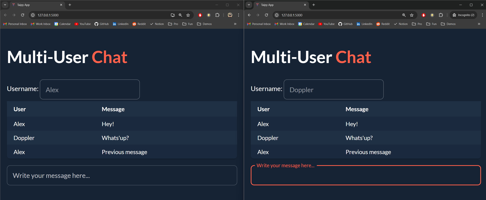

This tutorial will illustrate how to share variables between users and send messages
between them using a simple two-user chat application.

{width=90% : .tp-image-border }


# Sharing variables

In Taipy, you can specify a variable as shared between users using
`gui.add_shared_variable("variable_name")`. This variable will become global and
can be changed and accessed by all users ignoring the user's state.

For example, the following code creates a two-user chat application. You can run
this code in both a browser tab and an incognito window to simulate two users.

=== "Markdown"
    ```python
    
    ```
=== "Python"
    ```python
    
    ```

Here, in the second to last line, we specify
`gui.add_shared_variable("conversation")` to share the `conversation` variable
between users. This allows both users to see the same conversation.

Also note that when a new user connects, he has access to the previous messages
since conversation is a shared variable.

{width=90% : .tp-image-border }

# Sending messages

Another approach to this application would be, instead of setting conversation as
a shared variable, to broadcast the new message to all current users. Here is how
you can code it:

```python
from taipy.gui import Gui, State
import pandas as pd

timer_status = "Timer stopped"

client_index = 1
user_name = ""
conversation = pd.DataFrame(
    {"User": ["Alex", "Doppler"], "Message": ["Hey!", "Whats'up?"]}
)
current_message = ""
new_message = ""
new_sender = ""
selected_row = [2]


def on_init(state: State):
    global client_index
    if client_index == 1:
        state.user_name = "Alex"
    else:
        state.user_name = "Doppler"
    client_index += 1


# Start or stop the timer when the button is pressed
def send_message(state):
    state.broadcast("new_message", state.current_message)
    state.broadcast("new_sender", state.user_name)
    state.current_message = ""


def on_change(state, var_name, value):
    if var_name == "new_message":
        # Check if the last row is not already the user's message
        if (
            state.conversation.iloc[-1]["User"] != state.user_name
            or state.conversation.iloc[-1]["Message"] != state.new_message
        ):
            state.conversation = pd.concat(
                [
                    state.conversation,
                    pd.DataFrame(
                        {"User": [state.user_name], "Message": [state.new_message]}
                    ),
                ],
                ignore_index=True,
            )
        state.selected_row = [len(state.conversation["User"]) + 1]


page = """# Multi-User **Chat**{: .color-primary}

Username: <|{user_name}|input|active=false|>

<|{conversation}|table|rebuild|show_all|class_name=table|selected={selected_row}|>

<|{current_message}|input|label=Write your message here...|on_action=send_message|class_name=fullwidth|change_delay=-1|>
"""

gui = Gui(page)
gui.run(dark_mode=True)
```

Here, in the `send_message` function, we broadcast the new message and the sender
to all users. The `on_change` function listens to the `new_message` variable and
updates the conversation accordingly.

Note that in this example, when a new user connects, he does not have access to the
previous messages since conversation is not a shared variable.

{width=90% : .tp-image-border }