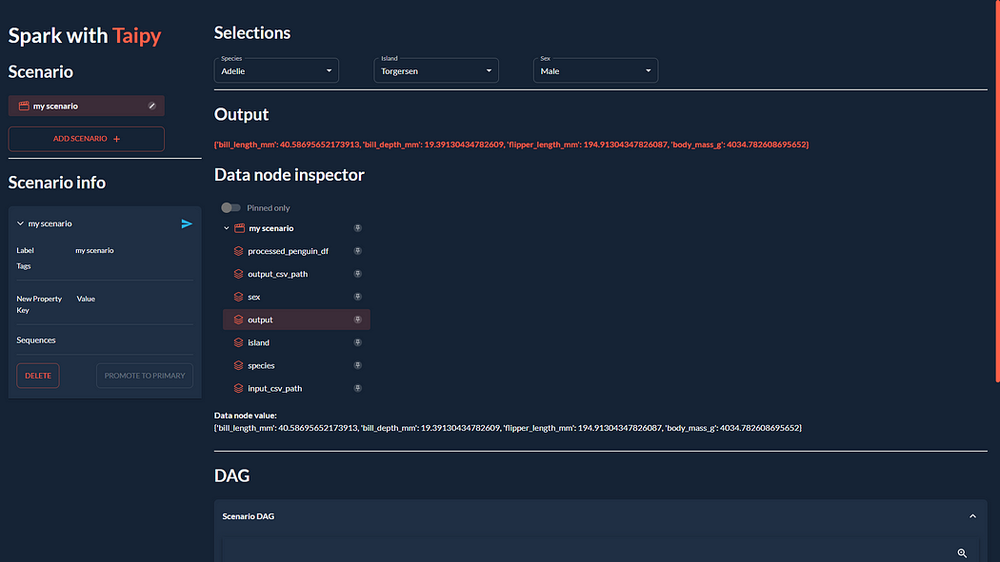

Taipy is a powerful workflow orchestration tool with an easy-to-use framework to
apply to your existing data applications with little effort. Taipy is built on a
solid foundation of concepts - Scenarios, Tasks, and Data Nodes - which are robust
in allowing developers to easily model their pipelines, even when using 3rd party
packages without explicit support.


> If you're already familiar with PySpark and Taipy, you can skip ahead to "The
Taipy configuration". That section dives right into defining a
function for a Taipy task to run a PySpark application. Otherwise, read on!

{width=90% : .tp-image-border }


This article will employ a simple example to demonstrate how we can integrate
PySpark with Taipy to couple your big data processing needs with smart job
execution.

[Get it on GitHub](https://github.com/Avaiga/demo-pyspark-penguin-app){: .tp-btn .tp-btn--accent target='blank' }

# A Simple Example: palmerpenguins

Let's use the [palmerpenguins](https://allisonhorst.github.io/palmerpenguins/) dataset as an example:

```
>>> penguin_df
____________________________________________________________________________________________________________________
| index | species |  island   | bill_length_mm | bill_depth_mm | flipper_length_mm | body_mass_g |  sex   | year |
____________________________________________________________________________________________________________________
|     0 | Adelie  | Torgersen | 39.1           | 18.7          | 181.0             | 3750.0      | male   | 2007 |
|     1 | Adelie  | Torgersen | 39.5           | 17.4          | 186.0             | 3800.0      | female | 2007 |
|     2 | Adelie  | Torgersen | 40.3           | 18.0          | 195.0             | 3250.0      | female | 2007 |
|     3 | Adelie  | Torgersen | NaN            | NaN           | NaN               | NaN         | NaN    | 2007 |
|     4 | Adelie  | Torgersen | 36.7           | 19.3          | 193.0             | 3450.0      | female | 2007 |
|   ... | ...     | ...       | ...            | ...           | ...               | ...         | ...    |  ... |
____________________________________________________________________________________________________________________
```

This dataset only contains 344 records - hardly a dataset that requires Spark for
processing. However, this dataset is accessible, and **its size is irrelevant for
demonstrating Spark's integration with Taipy**. You may duplicate the data as many
times as you need if you must test this with a larger dataset.

{width=90% : .tp-image-border }

We'll design a workflow which performs **two main tasks**:

**1. Spark task (spark_process):**

- Load the data;
- Group the data by "*species*", "*island*" and "*sex*";
- Find the mean of the other columns ("*bill_length_mm*", "*bill_depth_mm*",
"*flipper_length_mm*", "*body_mass_g*");
- Save the data.

**2. Python task (filter):**

- Load the output data saved previously by the Spark task;
- Given a "*species*", "*island*" and "*sex*", return the aggregated values.
- Our little project will comprise of 4 files:


```
app/
- penguin_spark_app.py  # the spark application
- config.py  # the configuration for our taipy workflow
- main.py  # the main script (including our application gui)
- penguins.csv  # the data as downloaded from the palmerpenguins git repo
```

You can find the contents of each file (other than *penguins.csv*, which you can
get from [palmerpenguins repository](https://github.com/allisonhorst/palmerpenguins/blob/main/inst/extdata/penguins.csv)) in code blocks within this article.

# The Spark Application

Usually, we run PySpark tasks with the `spark-submit` command line utility. You can read
more about the what and the why of submitting Spark jobs in their documentation
[here](https://spark.apache.org/docs/latest/submitting-applications.html).

We can continue doing the same thing when using Taipy for our workflow orchestration. The
only difference is that instead of running a command in the command line, we have our
workflow pipeline spawn a [subprocess](https://docs.python.org/3/library/subprocess.html)
which runs the Spark application using `spark-submit`.

Before getting into that, let's first **take a look at our Spark application**. Glance
through the code, then **continue reading on for a brief explanation** of what this
script does:

```python title="app/penguin_spark_app.py"
import argparse
import os
import sys

parser = argparse.ArgumentParser()
parser.add_argument("--input-csv-path", required=True, help="Path to the input penguin CSV file.")
parser.add_argument("--output-csv-path", required=True, help="Path to save the output CSV file.")
args = parser.parse_args()

import pyspark.pandas as ps
from pyspark.sql import SparkSession

def read_penguin_df(csv_path: str):
    penguin_df = ps.read_csv(csv_path)
    return penguin_df

def clean(df: ps.DataFrame) -> ps.DataFrame:
    return df[df.sex.isin(["male", "female"])].dropna()

def process(df: ps.DataFrame) -> ps.DataFrame:
    """The mean of measured penguin values, grouped by island and sex."""

    mean_df = df.groupby(by=["species", "island", "sex"]).agg("mean").drop(columns="year").reset_index()
    return mean_df

if __name__ == "__main__":
    spark = SparkSession.builder.appName("Mean Penguin").getOrCreate()

    penguin_df = read_penguin_df(args.input_csv_path)
    cleaned_penguin_df = clean(penguin_df)
    processed_penguin_df = process(cleaned_penguin_df)
    processed_penguin_df.to_pandas().to_csv(args.output_csv_path, index=False)

    sys.exit(os.EX_OK)
```

We can submit this Spark application for execution by entering a command into the
terminal like:


```
spark-submit --master local[8] app/penguin_spark_app.py \
--input-csv-path app/penguins.csv \
--output-csv-path app/output.csv
```


Which would do the following:

1. Submits the *penguin_spark_app.py* application for local execution on 8 CPU cores;
2. Loads data from the *app/penguins.csv* CSV file;
3. Groups by "*species*", "*island*" and "*sex*", then aggregates the remaining columns
by mean;
4. Saves the resultant DataFrame to *app/output.csv*.

Thereafter, the contents of *app/output.csv* should be exactly as follows:

{width=90% : .tp-image-border }

Also, note that we have coded the **Spark application to receive two command line
parameters**:

- *input-csv-path*: Path to the input penguin CSV file; and
- *output-csv-path*: Path to save the output CSV file after processing by the Spark app.

# The Taipy configuration

At this point, we have our *penguin_spark_app.py* PySpark application and need to create
**a Taipy task to run this PySpark application**.

Again, take a quick glance through the *app/config.py* script and then continue reading
on:


```python title="app/config.py"
import datetime as dt
import os
import subprocess
import sys
from pathlib import Path

import pandas as pd
import taipy as tp
from taipy import Config

SCRIPT_DIR = Path(__file__).parent
SPARK_APP_PATH = SCRIPT_DIR / "penguin_spark_app.py"

input_csv_path = str(SCRIPT_DIR / "penguins.csv")

# -------------------- Data Nodes --------------------

input_csv_path_cfg = Config.configure_data_node(id="input_csv_path", default_data=input_csv_path)
# Path to save the CSV output of the Spark app
output_csv_path_cfg = Config.configure_data_node(id="output_csv_path")

processed_penguin_df_cfg = Config.configure_parquet_data_node(
    id="processed_penguin_df", validity_period=dt.timedelta(days=1)
)

species_cfg = Config.configure_data_node(id="species")  # "Adelie", "Chinstrap", "Gentoo"
island_cfg = Config.configure_data_node(id="island")  # "Biscoe", "Dream", "Torgersen"
sex_cfg = Config.configure_data_node(id="sex")  # "male", "female"

output_cfg = Config.configure_json_data_node(
    id="my_output",
)

# -------------------- Tasks --------------------

def spark_process(input_csv_path: str, output_csv_path: str) -> pd.DataFrame:
    proc = subprocess.Popen(
        [
            str(Path(sys.executable).with_name("spark-submit")),
            str(SPARK_APP_PATH),
            "--input-csv-path",
            input_csv_path,
            "--output-csv-path",
            output_csv_path,
        ],
        stdout=subprocess.PIPE,
        stderr=subprocess.PIPE,
    )

    try:
        outs, errs = proc.communicate(timeout=15)
    except subprocess.TimeoutExpired:
        proc.kill()
        outs, errs = proc.communicate()

    if proc.returncode != os.EX_OK:
        raise Exception("Spark training failed")

    df = pd.read_csv(output_csv_path)

    return df

def filter(penguin_df: pd.DataFrame, species: str, island: str, sex: str) -> dict:
    df = penguin_df[(penguin_df.species == species) & (penguin_df.island == island) & (penguin_df.sex == sex)]
    output = df[["bill_length_mm", "bill_depth_mm", "flipper_length_mm", "body_mass_g"]].to_dict(orient="records")
    return output[0] if output else dict()

spark_process_task_cfg = Config.configure_task(
    id="spark_process",
    function=spark_process,
    skippable=True,
    input=[input_csv_path_cfg, output_csv_path_cfg],
    output=processed_penguin_df_cfg,
)

filter_task_cfg = Config.configure_task(
    id="filter",
    function=filter,
    skippable=True,
    input=[processed_penguin_df_cfg, species_cfg, island_cfg, sex_cfg],
    output=output_cfg,
)

scenario_cfg = Config.configure_scenario(
    id="scenario", task_configs=[spark_process_task_cfg, filter_task_cfg]
)
```


You can also **build the Taipy configuration using
[Taipy Studio](../../../userman/ecosystem/studio/index.md)**, a Visual Studio Code extension that
provides a graphical editor for building a Taipy *.toml* configuration file.

## The PySpark task in Taipy

We are particularly interested in the code section which produces this part of the DAG:

{width=90% : .tp-image-border }


Let's extract and examine the relevant section of the *config.py* script which creates
the "*spark_process*" Spark task (and its three associated data nodes) as shown in the
image above:

```python
### Code snippet: Spark task in Taipy

# -------------------- Data Nodes --------------------

input_csv_path_cfg = Config.configure_data_node(id="input_csv_path", default_data=input_csv_path)
# Path to save the CSV output of the Spark app
output_csv_path_cfg = Config.configure_data_node(id="output_csv_path")

processed_penguin_df_cfg = Config.configure_parquet_data_node(
    id="processed_penguin_df", validity_period=dt.timedelta(days=1)
)

# -------------------- Tasks --------------------

def spark_process(input_csv_path: str, output_csv_path: str) -> pd.DataFrame:
    proc = subprocess.Popen(
        [
            str(Path(sys.executable).with_name("spark-submit")),
            str(SPARK_APP_PATH),
            "--input-csv-path",
            input_csv_path,
            "--output-csv-path",
            output_csv_path,
        ],
        stdout=subprocess.PIPE,
        stderr=subprocess.PIPE,
    )

    try:
        outs, errs = proc.communicate(timeout=15)
    except subprocess.TimeoutExpired:
        proc.kill()
        outs, errs = proc.communicate()

    if proc.returncode != os.EX_OK:
        raise Exception("Spark training failed")

    df = pd.read_csv(output_csv_path)

    return df

spark_process_task_cfg = Config.configure_task(
    id="spark_process",
    function=spark_process,
    skippable=True,
    input=[input_csv_path_cfg, output_csv_path_cfg],
    output=processed_penguin_df_cfg,
)
```

Since we designed the *penguin_spark_app.py* Spark application to receive two parameters
(*input_csv_path* and *output_csv_path*), we chose to represent these two parameters as
Taipy data nodes. Note that **your use case may differ, and you can (and should!) modify
the task, function, and associated data nodes** according to your needs. For example, you
may:

1. Have a Spark task that performs some routine ETL and returns nothing;
2. Prefer to hard code the input and output paths instead of persisting them as data nodes; or
3. Save additional application parameters as data nodes and pass them to the Spark application.

Then, we run `spark-submit` as a Python subprocess like so:

```python
subprocess.Popen(
    [
        str(Path(sys.executable).with_name("spark-submit")),
        str(SPARK_APP_PATH),
        "--input-csv-path",
        input_csv_path,
        "--output-csv-path",
        output_csv_path,
    ],
)
```

Recall that the order of the list elements should retain the following format as if they were executed on the command line:


```
$ spark-submit [spark-arguments]  [application-arguments]
```

Again, depending on our use case, we could specify a different `spark-submit` script
path, Spark arguments (we supplied none in our example), or different application
arguments based on our needs.

## Reading and returning *output_csv_path*

Notice that the *spark_process* function ended like so:

```python
def spark_process(input_csv_path: str, output_csv_path: str) -> pd.DataFrame:
    ...

    df = pd.read_csv(output_csv_path)

    return df
```

In our case, we want our Taipy task to output the data after it is processed by Spark -
so that it can be written to the *processed_penguin_df_cfg*
[Parquet data node config](../../../userman/scenario_features/data-integration/data-node-config.md#parquet). We
can do this by manually reading from the output target (in this case, *output_csv_path*)
and then returning it as a Pandas DataFrame.

However, if you don't need the return data of the Spark application, you can simply have
your Taipy task (via the *spark_process* function) return None.

## Caching the Spark Task

Since we configured *spark_process_task_cfg* with the **_skippable_ property** set to
True, when re-executing the scenario, Taipy will **skip the re-execution of the
_spark_process_ task** and reuse the persisted task output: the *processed_penguin_df*
Pandas DataFrame.

However, we also defined a *validity_period* of 1 day for the *processed_penguin_df* data
node, so Taipy will still re-run the task if the DataFrame was last cached more than a
day ago.

# Building a GUI

We'll complete our application by **building the GUI** which we saw at the beginning of
this article:

{width=90% : .tp-image-border }


If you're unfamiliar with Taipy's GUI capabilities, you can find a quickstart
[here](../../articles/understanding_gui/index.md). In any case, you can copy and paste
the following code for *app/main.py* since it isn't our focus:


=== "Markdown"
    ```python title="app/main.py"
    
    ```
=== "Python"
    ```python title="app/main.py"
    
    ```
Then, from the project folder, you can run the main script like so:

```
taipy run app/main.py
```

# Conclusion

Now that you've seen an example of using PySpark with Taipy, try using these two tools to
**enhance your data applications**!

If you've struggled with other workflow orchestration tools slowing down your work and
getting in your way, don't let it deter you from trying Taipy. Taipy is easy to use and
strives not to limit itself to which 3rd party packages you can use it with - **its
robust and flexible framework makes it easy to adapt it to any data application**.
