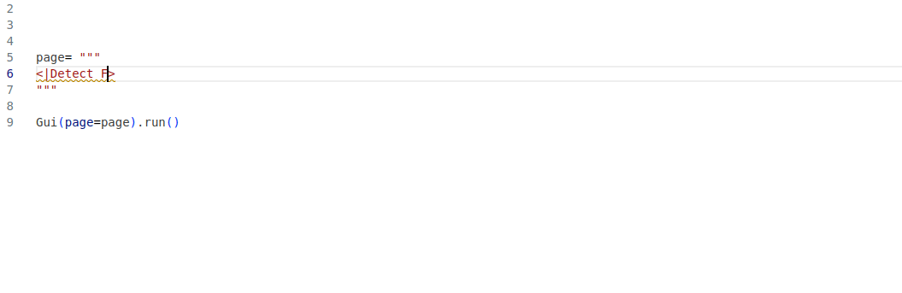

!!! note "Supported Python versions"
    Taipy requires **Python 3.9** or newer.

Welcome to the **Taipy Tutorial**! Learn to build interactive web applications
effortlessly.

This tutorial focuses on creating an application that analyses the sentiment behind words
and sentences. While creating this application, you'll learn all the Taipy basic
principles.

{width=90% .tp-image-border}


### Why Taipy?

- **Speed:** Quickly develop robust applications.
- **Simplicity:** Easy management of variables and events.
- **Visualization:** Intuitive and clear visual elements.

Each step in this **Tutorial** builds on the previous one. By the end, you'll be ready to
create your own Taipy applications.

## Getting Started

This tutorial is for Python scripts (*.py*). If you prefer **Jupyter Notebooks**, read
this [documentation](../../../userman/run-deploy/notebooks.md) and follow the tutorial
accordingly.

### Installation

Ensure you have Python 3.9 or newer, then install Taipy:

```bash
pip install taipy
```

For the NLP feature (Python 3.9 to 3.10), install:

```bash
pip install torch transformers scipy
```

!!! info
    Use `pip install taipy` for the latest stable version. Need help with pip? Check out
    the [installation guide](http://docs.python-guide.org/en/latest/starting/installation/).

## Taipy Studio

[Taipy Studio](../../../userman/ecosystem/studio/index.md) is a VS Code extension for
auto-completing Taipy visual elements. It makes creating applications faster and easier.

{width=90% .tp-image-border}

So, without further delay, let's begin to code!

## Tutorial Steps

1. [First Web page](step_01/step_01.md)
2. [Visual elements](step_02/step_02.md)
3. [Interaction](step_03/step_03.md)
4. [Charts](step_04/step_04.md)
5. [Python expressions in properties](step_05/step_05.md)
6. [Page layout](step_06/step_06.md)
7. [Multi-pages, navbars, and menus](step_07/step_07.md)
