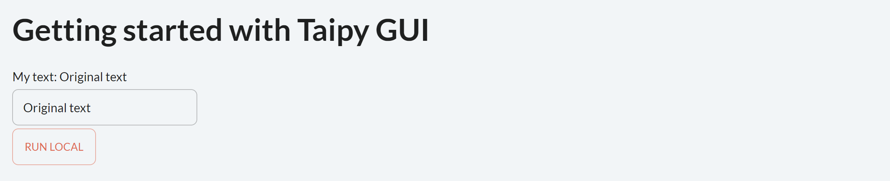

[Download Step 3](./../src/step_03.zip){: .tp-btn target='blank' }
[Download the entire code](./../src/src.zip){: .tp-btn .tp-btn--accent target='blank' }


Now, the page has several visual elements:

- A text connected to the Python variable *text*;

- An input that changes the *text* value automatically.

Taipy manages everything in the background.

To go further with Taipy, let's introduce the **state** concept. Thanks to this **state**
concept, Taipy natively provides multi-user GUI apps.

## Multi-user - state

Try to open a few clients with the same URL and different browsers. You will see that every
client is independent of each other; you can change *text* on a client, and *text* will
not change in other clients. This is due to the concept of **state**.

The state holds the value of all the variables used in the user interface for one specific
connection.

For example, in the beginning, `state.text = 'Original text'`. When *text* is modified by the
input (through a given graphical client), this is, in fact, *state.text* that is modified, not
*text* (the global Python variable). Therefore, if you open two different clients, *text* will
have two state values (*state.text*), one for each client.

In the code below, this concept will be used to:

- Notify the user when the button is pressed;

- Reset the input when the text equals "Reset".

## How to connect two variables - the [`on_change`](../../../../userman/gui/callbacks.md) callback

The `on_change()` function is a "special" function. **Taipy** checks if you
have created it. Whenever the state of a variable is modified,
the `on_change()` function is called with three parameters:

- *state* (the *state* object containing all the variables);

- The name of the modified variable;

- The new value for this variable.

Here, *on_change()* is called whenever the text's value (*state.text*) changes. If a
variable is changed in this function, Taipy propagates this change automatically to the
associated visual elements.

Other callbacks specific to visual elements exist. They are named `on_change` or `on_action`.
For example, a button has an _on_action_ property. When the button is pressed, Taipy calls
the callback function referenced in the `on_action` property.


=== "Markdown"
    ```python
    from taipy.gui import Gui, notify


    def on_button_action(state):
        notify(state, 'info', f'The text is: {state.text}')
        state.text = "Button Pressed"

    def on_change(state, var_name, var_value):
        if var_name == "text" and var_value == "Reset":
            state.text = ""
            return

    if __name__ == "__main__":
        text = "Original text"

        # Definition of the page
        page = """
        # Getting started with Taipy GUI

        My text: <|{text}|>

        <|{text}|input|>

        <|Run local|button|on_action=on_button_action|>
        """

        Gui(page).run(debug=True)
    ```
=== "Python"
    ```python
    import taipy.gui.builder as tgb
    from taipy.gui import Gui, notify
    import taipy.gui.builder as tgb


    def on_button_action(state):
        notify(state, 'info', f'The text is: {state.text}')
        state.text = "Button Pressed"

    def on_change(state, var_name, var_value):
        if var_name == "text" and var_value == "Reset":
            state.text = ""
            return

    if __name__ == "__main__":
        text = "Original text"

        # Definition of the page
        with tgb.Page() as page:
            tgb.text("# Getting started with Taipy GUI", mode="md")
            tgb.text("My text: {text}")

            tgb.input("{text}")
            tgb.button("Run local", on_action=on_button_action)

        Gui(page).run(debug=True)
    ```


{ width=90% : .tp-image-border }

[`notify()`](../../../../refmans/reference/pkg_taipy/pkg_gui/notify/index.md) is a Taipy function that creates a
[notification](../../../../userman/gui/notifications.md) with some information. The user can pass
multiple parameters, including the *state*, the *notification_type*, and the *message*.
